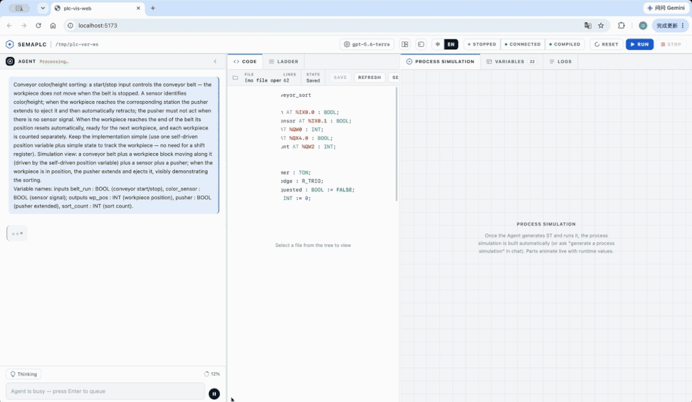

<p align="center">
  
</p>

<p align="center">
  <em>An Agent-driven IDE for industrial PLC programming — describe a control task in natural language, watch it become a running IEC 61131-3 program.</em>
</p>

<p align="center">
  <a href="https://arxiv.org/abs/2608.18565"></a>
  <a href="LICENSE"></a>
  <a href="https://nodejs.org"></a>
  
</p>

<p align="center">
  <strong>English</strong> | <a href="./README.zh-CN.md">简体中文</a>
</p>

---

## 📖 Overview

**Sema PLC** turns a natural-language control requirement into a running PLC program. Type a task into the chat panel — *"latch a motor when the start button is pressed and a 3-second timer elapses"* — and an embedded [sema-core](https://github.com/midea-ai/sema-code-core) Agent writes IEC 61131-3 Structured Text, compiles it, deploys it to a live [OpenPLC Runtime](https://openplcproject.com/), behavior-verifies it (force inputs, trace variables), and renders the result as a ladder diagram + live variable values + a process simulation.

**[📚 View Documentation](https://midea-ai.github.io/SemaPLC/#/en/)** — architecture, toolchain reference, and Web IDE internals (English / 中文).

<p align="center">
  
</p>

The repository ships two products that work together:

| Package | Role |
|:--------|:-----|
| **[`sema-plc-web`](sema-plc-web/)** | The Agent-driven IDE. A localhost web app (React + Vite frontend, Node backend) that embeds the sema-core Agent and visualizes ST → ladder + live vars + process simulation + tool-call log. |
| **[`sema-plc-tools`](sema-plc-tools/)** | The PLC toolchain that makes the IDE work. Usable two ways — as an **MCP server** an agent drives, or as a **standalone CLI** you run from the terminal — it covers the full loop (syntax-check → compile → upload → run → read / force / trace variables), and ships the OpenPLC Runtime Docker environment. |

## ✨ Features

| Feature | Description |
|:--------|:------------|
| **Natural-language → running PLC** | Describe control logic in plain language; the Agent generates, compiles, deploys, and verifies the ST program end-to-end. |
| **Live ladder diagram** | Generated ST is transformed into a ladder-logic view (React Flow) that reflects live runtime variable values. |
| **Behavior verification** | The Agent forces `%I` inputs and traces variables over time to prove timers / state-machines / counters actually behave as specified — not just that the code compiles. |
| **Process simulation** | A native Scene-Spec simulation animates a plant model (conveyors, tanks, motors) driven by live PLC values. |
| **MCP server + CLI** | 16 composable tools (`plc_check`, `plc_compile`, `plc_buildAndRun`, `plc_readVariables`, `plc_forceVariables`, `plc_trace`, …) — usable by any MCP-capable agent, or directly from the terminal via the `sema-plc-tools` CLI. |
| **OpenPLC Runtime v4** | Real IEC 61131-3 execution via OpenPLC + matiec, packaged as a one-command Docker environment. |

## 🏗 Architecture

```
Browser (Vite + React 18, :5173)
  │  /api/* (proxied to :3001)        WebSocket → ws://localhost:3002
  ▼
sema-plc-web backend (:3001 HTTP + :3002 WS)
  ├── sema-bridge      embeds SemaCore, runs the Agent
  ├── plc-controller   user-triggered Run / Stop
  └── plc-monitor      live variable polling
          │  direct import
          ▼
sema-plc-tools (dist/)  ──MCP/REST──►  OpenPLC Runtime v4  (Docker, :8443)
   ST → matiec → C → GCC → .so → execution
```

The Agent reasons over the MCP tools in `sema-plc-tools`; the same tools back the IDE's Run/Stop buttons and live-variable panel. Everything runs on `localhost` — your code and your LLM key never leave your machine except for the model API calls you configure.

## ⌨️ Standalone CLI

Beyond the MCP server, `sema-plc-tools` is a full command-line tool for driving OpenPLC from the terminal — no agent required (run `npm run build` in `sema-plc-tools/` first, and have the runtime container up):

```bash
cd sema-plc-tools
node dist/cli.js status                                # runtime status
node dist/cli.js compile program.st                    # compile, print structured result JSON
node dist/cli.js buildAndRun program.st                # compile → upload → start
node dist/cli.js trace --names led --durationMs 3000   # sample a variable over time
node dist/cli.js force --set start_btn=true            # simulate an input
node dist/cli.js waitFor red_led eq true               # poll until a condition holds
node dist/cli.js verify plan.json                      # run a declarative verify plan
node dist/cli.js serve                                 # run as an MCP stdio server instead
```

See [`sema-plc-tools/README.md`](sema-plc-tools/README.md) for the full command and tool reference.

## 🚀 Quick Start

### Prerequisites

- **Node.js ≥ 18** and **npm**
- **Docker** (Docker Desktop on macOS / Windows) — for the OpenPLC Runtime container
- An **LLM API key** (DeepSeek recommended; Anthropic and OpenAI-compatible providers such as MiniMax / Gemini / OpenAI / xAI / Groq / OpenRouter / Qwen / Kimi are also supported)

### Setup

```bash
# 1. Clone
git clone https://github.com/midea-ai/SemaPLC.git
cd SemaPLC

# 2. Build the toolchain (the web app direct-imports its dist/)
cd sema-plc-tools && npm install && npm run build && cd ..

# 3. Build the OpenPLC runtime base image (first time only; needs Docker + network)
#    Upstream openplc-runtime's main moved to STruC++; this pins a MatIEC-era commit.
( cd sema-plc-tools/runtime && ./scripts/build-matiec-base.sh )

# 4. Install the web app (sema-core is vendored in sema-plc-web/vendor/, installed via a file: dep)
cd sema-plc-web && npm install

# 5. Configure your LLM key
cp .env.example .env
#   edit .env and fill in one key, e.g. DEEPSEEK_API_KEY=sk-...
```

### Run

One command brings up everything — starts the OpenPLC container, rebuilds the toolchain, and launches the dev server (frontend + backend):

```bash
# from sema-plc-web/
./dev.sh                       # default: deepseek
PLC_MODEL=minimax-m2.7 ./dev.sh
PLC_MODEL=openai ./dev.sh
```

When it's up you'll see:

```
[SERVER] HTTP ready on http://127.0.0.1:3001
[SERVER] WS ready on ws://127.0.0.1:3002
[SERVER] [plc-tools] MCP server ready
[VITE]   ➜  Local:   http://localhost:5173/
```

Open **<http://localhost:5173>** and describe a control requirement in the chat panel. For manual step-by-step startup, model options, supported providers, and configuration, see **[sema-plc-web/README.md](sema-plc-web/README.md)**.

> First run builds the OpenPLC Docker image (incl. the `rusty` checker from source), which can take several minutes. The container exposes its REST API on `https://localhost:8443` with a self-signed certificate. The image is self-contained — no private images required.

## 📂 Project Structure

```
.
├── sema-plc-web/         # Agent-driven IDE (React + Vite frontend, Node backend)
│   ├── server/           # HTTP + WS backend: sema-bridge / plc-controller / plc-monitor
│   ├── src/              # React UI: chat, ladder view, vars, process simulation
│   ├── templates/        # workspace seed: AGENTS.md + .sema skills + .mcp.json
│   └── dev.sh            # one-command launcher (Docker → build → dev server)
│
└── sema-plc-tools/       # MCP toolchain + OpenPLC runtime
    ├── src/              # 16 tools, exposed via MCP server + CLI (check/compile/run/read/force/trace/…)
    └── runtime/          # OpenPLC Runtime v4 Docker environment
        ├── docker-compose.yml
        ├── Dockerfile.plc-dev
        └── samples/      # example ST programs
```

## 🧪 Tests

```bash
cd sema-plc-tools && npm test     # no Docker needed
cd sema-plc-web   && npm test     # server: vitest/node, frontend: vitest/jsdom
```

## 🤝 Acknowledgments

- Built on [OpenPLC](https://openplcproject.com/) Runtime v4 + the [matiec](https://github.com/nucleron/matiec) IEC 61131-3 compiler.
- The embedded LLM Agent runtime is [sema-code-core](https://github.com/midea-ai/sema-code-core); WebSocket-gateway and embedded-Agent patterns are adapted from [SemaClaw](https://github.com/midea-ai/SemaClaw).
- The ladder-diagram renderer is lifted from [cdilga/ladder-logic-editor](https://github.com/cdilga/ladder-logic-editor) (MIT) — see `sema-plc-web/LICENSE`.

## 📜 License

Sema PLC's own code is released under the [MIT License](LICENSE).

It drives a GPL/LGPL PLC toolchain (matiec, rusty, OpenPLC) as **separate command-line
binaries built into the Docker image** — arm's-length process invocation, so their copyleft
does not extend to this MIT source. Component licenses, the aggregation rationale, and Docker
image redistribution obligations are documented in [THIRD_PARTY_NOTICES.md](THIRD_PARTY_NOTICES.md).
