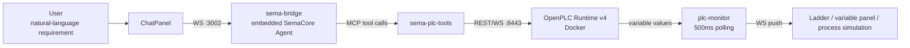

# Architecture

## Overall Structure

```
Browser (Vite + React 18, :5173)
  │  /api/* (proxied to :3001)        WebSocket → ws://localhost:3002
  ▼
sema-plc-web backend (:3001 HTTP + :3002 WS)
  ├── sema-bridge      embeds SemaCore, runs the Agent
  ├── plc-controller   user-triggered Run / Stop
  └── plc-monitor      live variable polling
          │  direct import
          ▼
sema-plc-tools (dist/)  ──MCP/REST──►  OpenPLC Runtime v4  (Docker, :8443)
   ST → matiec → C → GCC → .so → execution
```

## Data Flow



## Key Design Points

**One set of tools, two consumers.** The Agent reasons over the MCP tools in `sema-plc-tools`; the same tools (`dist/tools/*`) are also imported directly by the backend `plc-controller` to back the IDE's Run/Stop buttons and live-variable panel. Tool behavior is implemented only once.

**Compile pipeline.** ST source is converted to C by matiec (iec2c), then compiled by GCC inside the OpenPLC Runtime into a `.so` that is dynamically loaded and executed. `plc_compile` returns structured errors with line/column numbers and the offending source line, enabling the Agent to self-repair.

**Behavior verification first.** The toolchain's design philosophy is "prove behavior, not just compilation": `plc_forceVariables` simulates inputs, `plc_trace` samples over time to verify timing shapes, `plc_record` provides per-scan-cycle (20ms/frame) recording, and `plc_verifyBehavior` makes "force → wait for a downstream condition → auto-release" an atomic operation. There is also a declarative verify plan (`plc-tools verify plan.json`) that runs a full set of verification cases.

**Ports at a glance**

| Port | Service |
|---|---|
| `:5173` | Vite dev server (frontend) |
| `:3001` | Backend HTTP (express, bound to 127.0.0.1) |
| `:3002` | Backend WebSocket (ws) |
| `:8443` | OpenPLC Runtime REST API (Docker, self-signed certificate) |

## Layer Responsibilities

| Layer | Location | Responsibility |
|---|---|---|
| Frontend UI | `sema-plc-web/src/` | Chat, code editing (CodeMirror + ST syntax), ladder diagram (React Flow), variable monitoring, process simulation |
| WS gateway | `sema-plc-web/server/ws-gateway.ts` | JSON-over-WS, with cached replay (sticky) for key state types |
| sema-bridge | `sema-plc-web/server/sema-bridge.ts` | Embeds sema-core; manages sessions, workspace, model registry |
| plc-controller | `sema-plc-web/server/plc-controller.ts` | UI-triggered Run/Stop, calls plc-tools directly |
| plc-monitor | `sema-plc-web/server/plc-monitor.ts` | Polls status and variables every 500ms, pushes diffs; auto-starts/stops based on client count |
| Toolchain | `sema-plc-tools/src/` | 16 MCP tools + CLI + verify runner |
| Runtime | `sema-plc-tools/runtime/` | OpenPLC v4 Docker environment (matiec + rusty) |

For deeper dives see [Backend Architecture](en/wiki/web/backend), [MCP Tool Reference](en/wiki/tools/mcp-tools), and [OpenPLC Runtime Environment](en/wiki/tools/runtime).
