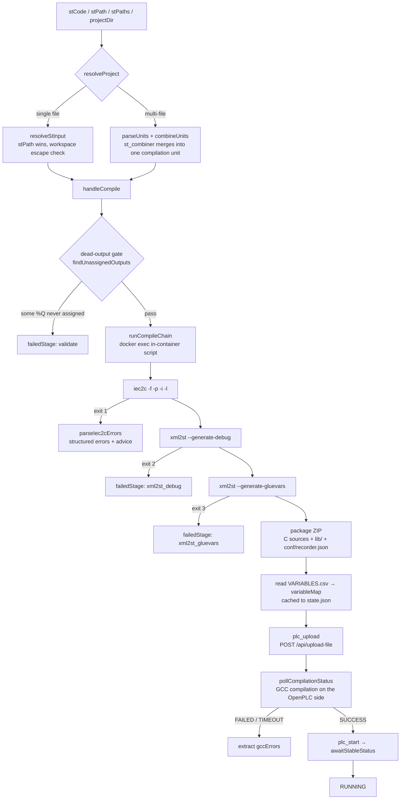

# Compile and Deployment Pipeline

This page covers the full chain in `sema-plc-tools` from ST source to a running OpenPLC program: input resolution (single-file / multi-file merge) → in-container matiec compilation → ZIP packaging → upload and GCC compilation → start. For the tool entry points see [MCP Tools Reference](en/wiki/tools/mcp-tools); for the runtime environment see [OpenPLC Runtime Environment](en/wiki/tools/runtime).



## ST Input Resolution: Three Layers of Responsibility

| Module | File | Responsibility |
|---|---|---|
| `resolveStInput` | `src/tools/resolveStInput.ts` | Single file: takes source from `stCode` (inline) or `stPath` (file), with **stPath taking precedence**; relative paths are rooted at `PLC_WORKSPACE`, and when a workspace is set the resolved absolute path must stay inside it (blocks `../../` escapes) |
| `resolveProject` | `src/tools/resolveProject.ts` | Unified entry point: takes the multi-file branch when `stPaths` is non-empty or `projectDir` is non-empty, otherwise falls back to `resolveStInput`; `projectDir` picks only top-level `*.st` files in alphabetical order, `stPaths` are used in the given order; each file is UTF-8 validated (rejected if the re-encoded byte count differs); all failures go through the `error` field, never throw |
| `stCombiner` | `src/tools/stCombiner.ts` | Pure function (no fs/docker): merges the POU units of multiple files into a single compilation unit |

`plc_compile` / `plc_buildAndRun` / `plc_detectIO` / `plc_buildSimulation` all go through `resolveProject` in `src/server.ts`; `plc_check` only takes the single-file `resolveStInput` path.

### stCombiner's Merge Strategy

`parseUnits` first uses `stripComments` to blank out comments (`(* *)`, `//`) and string literals **with equal-length padding** (preserving byte count and newlines), then locates the boundaries of `TYPE / FUNCTION / FUNCTION_BLOCK / PROGRAM / CONFIGURATION` on the masked text — fake keywords inside comments cannot mistrigger — and finally slices the POU text out of the original source. When an opening block keyword has no matching `END_*`, it fails safe: that file contributes 0 units and records an error, and the caller treats it as "unmergeable".

`combineUnits` concatenates in layers ordered `TYPE → FUNCTION → FUNCTION_BLOCK → PROGRAM → CONFIGURATION` (matiec is a multi-pass compiler, so ordering carries no weight; the layering is purely for readability, annotated SPIKE-1 in the source comments), and enforces **exactly one CONFIGURATION and exactly one PROGRAM** — multiple PROGRAMs would collide with each other in `normalizeCsv`'s short-name truncation and be silently misread (SPIKE-2). A `(* SOURCE: path *)` anchor line is inserted before each unit, and `spans` (a mapping from merged line numbers to source file + local line number) are recorded alongside.

Error traceback: matiec reports merged line numbers; `applyErrorTraceback` in `server.ts` uses `translateErrorLine(e.line, spans)` to **additively** attach two fields, `sourceFile` / `localLine`, to each error (see `Iec2cError` in `src/types.ts`), while the merged line number is preserved as-is.

## The Full compile Flow

Entry point `handleCompile` (`src/tools/compile.ts`), in four steps:

**1. Dead-output semantic gate (before matiec).** `findUnassignedOutputs` (`src/tools/detectIO.ts`) finds outputs declared with `AT %Q*` for which no `<name> :=` exists anywhere in the program body — matiec would compile it, but at runtime the actuator would stay frozen at its initial value forever. On a hit it returns `failedStage: 'validate'` directly, without entering the compiler. The check is extremely conservative: a single lvalue assignment in any branch lets the output pass; only **zero assignments** are flagged, pushing false positives close to zero.

**2. In-container compile chain.** `runCompileChain` (`src/compiler.ts`) `docker cp`s the ST source and a bash script into the container and executes it (30 s timeout, so a hung container cannot drag down the whole buildAndRun). Script stages and exit codes:

| Stage | Command | Failure exit code → failedStage | Artifacts |
|---|---|---|---|
| matiec | `iec2c -f -p -i -l program.st` | 1 → `iec2c` | `Config0.c/h`, `Res0.c`, `POUS.c/h`, `LOCATED_VARIABLES.h`, `VARIABLES.csv` (missing any one also counts as failure) |
| Debug stubs | `xml2st --generate-debug program.st VARIABLES.csv` | 2 → `xml2st_debug` | `debug.c` (the debug channel for online variable reads/writes) |
| Glue layer | `xml2st --generate-gluevars LOCATED_VARIABLES.h` | 3 → `xml2st_gluevars` | `glueVars.c` (binding of located variables ↔ Modbus buffers) |
| Packaging | `zip -r` | — | `/tmp/plc_compile_XXXXXX/plc_program_<ts>.zip` |

The ZIP also carries two kinds of "non-compile artifacts": placeholder `c_blocks_code.cpp` / `c_blocks.h` stubs, plus `conf/recorder.json` (contents `{}`). The latter is critical: on every upload OpenPLC runs `update_plugin_configurations()`, scanning the filename stems of `conf/*.json` for matches against plugin names — **a plugin without a corresponding json gets disabled** — so a ZIP without `conf/recorder.json` would silently switch off the flight-recorder plugin at upload time (`plc_record` depends on it). stdout only echoes the ZIP path; matiec's warnings go to stderr and, even on success, are parsed into `iec2c.warnings`.

**3. Variable table normalization.** matiec's `VARIABLES.csv` is a semicolon-separated hierarchical format (`index;kind;fullpath;fullpath;type;nativeType;debug_idx;`). `normalizeCsv` does three things: skips `FB` rows (program instances do not enter the `debug_vars[]` array in `debug.c`), **renumbers debug indices from 0** to align with the debug protocol, and joins the segments after the `CONFIG0.RES0.INST0.` prefix with `.` lowercased as the short name — a program-level variable yields `hb_out`, while an FB output keeps its instance prefix and yields `timer1.q` (avoiding collisions between the `.Q` of multiple TONs). Afterwards `buildAtLocationMap` uses a regex over the ST source to backfill `AT` addresses missing from the CSV.

**4. State caching.** On success, `{ timestamp, stCode, zipPath, variableMap }` is written into `lastCompile` of `~/.plc-tools/state.json` — both `plc_upload` and `plc_readVariables` read from there, which is why upload needs no parameters at all. Also: when `PLC_MODBUS_PORT` is set, compile appends `conf/modbus_slave.json` into the ZIP (see the Modbus section of [Syntax Check and IO Detection](en/wiki/tools/check-and-io)).

## Structured Parsing of iec2c Errors

`parseIec2cErrors` (`src/compiler.ts`) accepts both of matiec's diagnostic formats (`file:line-col..line-col:` and the older `file:line:col-line:col:`) with a single regex:

```ts
const pattern = /^\S+:(\d+)[-:](\d+)(?:\.\.|-)\d+[-:]\d+:\s+(error|warning):\s+(.+)$/gm
```

Each error carries `line` / `col` / `severity` / `message`, and the corresponding `sourceLine` is extracted from the supplied ST source by line number — the agent fixing the error never has to resolve line numbers itself. Then `adviceForIec2cError` (`src/tools/iec2cErrorParser.ts`) matches the message against a pattern table and attaches `advice` on a hit. The pattern table comes from empirical statistics over 325 benchmark sessions; the top categories:

| matiec error | Advice highlights |
|---|---|
| `';' missing at the end of statement` | The #1 most frequent error. matiec requires block terminators to carry a semicolon too (`END_IF;`); the error lands on the terminator's **own line**, but agents often wrongly edit the previous line — the advice checks whether `sourceLine` is exactly a bare terminator like `END_IF` and gives a targeted hint |
| `invalid variable(s) declaration` family | The most opaque family: a variable name collides with a matiec internal reserved identifier, or AT located variables are mixed with ordinary variables in the same `VAR` block; and matiec often reports on the line **after** the true cause |
| `bit size ... incompatible with ... location` | Type width mismatched with address class (BOOL↔%IX/%QX, INT/WORD↔%IW/%QW, etc.) |
| `type mismatch` family | matiec performs no implicit conversions; the hint is to add explicit conversions like `INT_TO_REAL()` |

About 31% of real-world failures (matiec hitting a fatal syntax error and going straight to `Bailing out`) produce no line-level diagnostics at all, leaving `errors[]` empty — `runCompileChain` then stuffs the truncated raw stderr into `errorSummary` and gives dedicated troubleshooting hints for `Parsing failed|Bailing out` (misspelled keywords, missing/extra `END_*`), so the agent never has to fix blindly from an empty error list.

## upload: The GCC Stage on the OpenPLC Side

`handleUpload` (`src/tools/upload.ts`) takes no input parameters; it reads `lastCompile.zipPath` from `state.json`. The ZIP is produced inside the container, so if the path does not exist on the host it is first copied out via `docker cp`, then POSTed to `/api/upload-file` through `RuntimeClient.uploadZip`.

A successful upload is only step one: after receiving the ZIP, OpenPLC must compile the C sources into the runtime program with GCC. `pollCompilationStatus` (`src/client/runtime.ts`) polls `/api/compilation-status` every 2 s with a default budget of 55 s, converging the status to `SUCCESS / FAILED / TIMEOUT`; error extraction is a one-line filter — log lines containing `error` (lowercased match) and not containing `[INFO]` go into `gccErrors`:

```ts
gccErrors: (logs as string[]).filter((l: string) =>
  l.toLowerCase().includes('error') && !l.includes('[INFO]'),
)
```

This step catches problems matiec lets through but GCC rejects (at the generated-C-code level). Note the distinction: GCC-stage errors live in `UploadResult.gccErrors`; errors from **after the program starts running** (watchdog, segfault, division by zero, scan overrun) are pulled by `plc_getLogs` from `/api/runtime-logs` and recognized against a pattern table by `parseRuntimeLogs` (`src/tools/runtimeLogParser.ts`), each entry carrying `type + advice` (e.g. `div_by_zero` → "guard the divisor with `IF divisor <> 0`"). `getLogs` also enforces a hard 8000-byte truncation cap on its output (dropping from the head, keeping the newest) — OpenPLC routinely retains hundreds of KB of WebSocket connection logs, and without truncation a single call could eat most of a small-context model's window.

## buildAndRun: Staged Results and Failure Short-Circuiting

`handleBuildAndRun` (`src/tools/buildAndRun.ts`) is pure orchestration with three injected dependencies (compile / upload / start), and short-circuits strictly:

| failedStage | Trigger condition | What the result retains |
|---|---|---|
| `compile` | `compile.success === false` (including the dead-output gate) | `compile`; `upload`/`start` are `null` |
| `gcc` | Upload succeeded but `gccStatus` is `FAILED` or `TIMEOUT` | `compile` + `upload` (with the first 2 `gccErrors` entries in `agentSummary`) |
| `upload` | The upload itself failed (HTTP/file layer) | Same as above, with detail taken from `uploadError` |
| `start` | The PLC failed to stably enter RUNNING | All three stages + `finalStatus` set to the actual status |
| `null` | Everything succeeded | `finalStatus: 'RUNNING'` |

Every return carries a one-sentence `agentSummary` conclusion, embedding the first actionable error on failure — weaker models can locate it without digging through nested structures. The start stage itself is not trivial either: OpenPLC's `/api/start-plc` is an async acknowledgment, and the actual scan-loop switchover takes 200 ms–1 s. `awaitStableStatus` (`src/tools/start.ts`) requires reading the target status **2 consecutive times** before considering it stable, and start is sent at most 3 times; 32 consecutive reads of a non-canonical status (such as "No response from runtime") mark the runtime as hung and fail fast — otherwise 3×15 s of retries would drag buildAndRun past the 60 s MCP request timeout.

For post-deployment verification (reading variables, driving inputs, asserting behavior) see [Verify Runner](en/wiki/tools/verify-runner) and [Runtime Client](en/wiki/tools/runtime-client).
