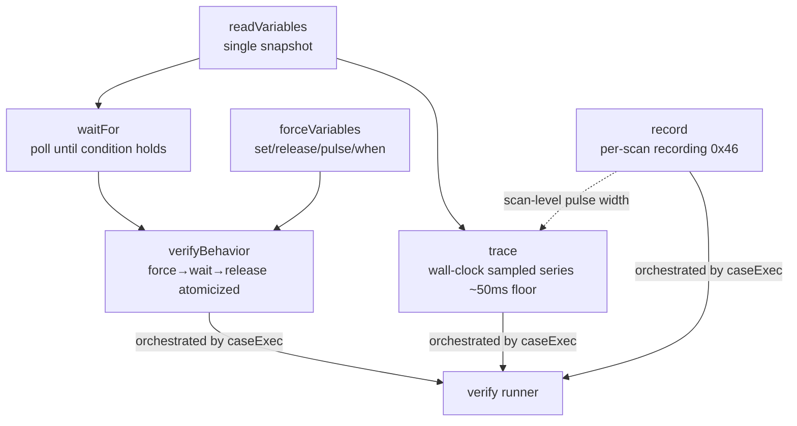

# Observation and Verification Tool Semantics

This page walks through the precise semantics and design intent of the six runtime observation/verification tools, with the corresponding implementations under `src/tools/` and the tests under `tests/tools/` as the source of truth. For protocol-layer details see [Runtime Client and Debug Protocol](en/wiki/tools/runtime-client); for the MCP registration surface see [MCP Tool Reference](en/wiki/tools/mcp-tools).

All tools share three preconditions:

1. **The variable table comes from state**: if `readState(cfg.stateFile).lastCompile.variableMap` is empty, the tool returns an error starting with `No variable map found.` (readVariables/forceVariables suggest `Run plc.compile first.`; trace/waitFor/record suggest `Run plc.compile or plc.buildAndRun first.`) — observation is always bound to the name→index mapping of the most recent compile;
2. **Case-insensitive resolution**, plus `nameSuggestions` (edit-distance suggestions) on resolution failure;
3. **MCP budget clamping** (`src/mcpBudget.ts`): MCP clients time out at roughly 60s, so any tool with caller-controlled duration is clamped by `MCP_SAFE_MAX_MS = 50_000`, leaving 10s of headroom for transport and wrap-up — otherwise the tool is still running when the client throws -32001.

## plc_readVariables (tools/readVariables.ts)

A single snapshot: resolves `varNames` (defaults to the whole table); one 0x44 read returns the current values of all target variables plus the runtime `tick`. Semantic highlights:

- an OpenPLC debug read returns every requested variable in one shot; reading 1 variable costs the same as reading 50;
- the returned `tick` lets the caller tell whether scans progressed between two snapshots;
- it can only answer "what is the value now" and **cannot answer any temporal question** — which is the reason every tool below exists.

## plc_trace (tools/trace.ts)

Repeated snapshots at wall-clock intervals, producing columnar samples (`columns` + per-sample `{elapsedMs, tick, values[]}`), used to verify timers, edges, state-machine rotation, counter monotonicity, and other temporal behavior a single snapshot cannot. Capped at 200 samples; a single failed read fails soft, recording `tick: null` without aborting the trace; only when every read fails (all ticks null) does it suggest the debug socket is not ready.

### The Sampling Floor: Honest Resolution Disclosure

One sample = one full debug round trip, with a physical floor of about 50ms. However low `intervalMs` is requested, it cannot be reached, and trace does not pretend it was: it computes `actualIntervalMs` (elapsed difference between the first and last samples ÷ number of intervals), and when the request is <100ms and the actual exceeds 1.5x the request, it says so plainly in `note` (`trace.ts:104-110`):

> Transients shorter than ~Nms will inevitably be missed by this trace — to verify edges/transients, use plc_verifyBehavior (persistent downstream assertion) or the pulseScans of plc_forceVariables (tick-verified pulse) instead

This is the product of the "ws-3 pivot": rather than raising the sampling rate (impossible), transient verification was reshaped into assertions on **persistent downstream effects**. trace is therefore positioned as a "look at the shape" tool — the verify runner's trace case runs the temporal shape assertions of `shapes.ts` over the sample series (cycle/range/settle/changed, see [Declarative Verify Runner](en/wiki/tools/verify-runner)).

## plc_record (tools/record.ts)

Reads the recorder plugin's per-scan ring buffer (the 0x46 protocol), draining the whole ring in one call (up to 4000 frames); the window is trimmed locally by `fromTick` or `lastScans` (default 250, multiplied by decimation to convert to a tick span).

### Capability Differences Between record and trace

| | trace | record |
|---|---|---|
| Sampler | tool-process polling (wall clock) | in-runtime `cycle_end` hook |
| Resolution | ~50ms floor, misses transients | **one frame per scan**, scan-level pulse widths visible |
| Time axis | elapsedMs + tick | pure tick (contiguous per scan) |
| Observation window | can only record "from now on" | after-the-fact forensics: read the history after the behavior has happened |
| Variable set | requested columns | all recordable variables (STRING excepted); columns chosen only at decode time |

A 1-scan-wide pulse most likely does not exist in a trace; in a record it is a certain frame.

### Three Context-Explosion Gates + the md5 Version Gate

`record.ts:1-12` states the design intent in the file header:

1. **gate 1**: `varNames` is required — dumping the full variableMap into the response is forbidden;
2. **gate 2**: changes-only encoding (`first` + `transitions: [tick, value][]`); beyond 50 transitions it truncates to the first 50 and attaches `summary{min,max,last,monotonic}` (NaN-aware: consecutive NaNs do not count as changes, and NaNs are filtered out before aggregation);
3. **gate 3**: whenever any truncation occurs, the **fully decoded window is written to disk** as `fullDumpFile` (`record-<from>-<to>.json` under the workspace) — the complete evidence lives on disk and never enters the tool response;
4. **md5 gate**: the recording header carries the md5 of the program that produced the frames, compared against the live md5 read via the 0x45 command (measured: live md5 == md5(ST source bytes)). On mismatch → **refuse to decode** and report "the program has changed; the recording data belongs to the old version" — decoding old frames with the new program's variableMap is silent garbage. A header of all `'?'` (the plugin could not obtain the md5) degrades to decoding anyway, with `programMd5Verified: false` + a note; that is not a version conflict.

## plc_waitFor (tools/waitFor.ts)

Polls a single variable until `actual op expected` holds or a timeout expires. Its reason to exist: replacing agent-handwritten polling loops over single snapshots (which are brittle under WebSocket read jitter). Semantic highlights:

- `==`/`!=` in `compare()` go through `looseEq`: booleans normalized via Boolean, numbers compared strictly, everything else compared as strings;
- the last round before timeout skips the sleep (`waitFor.ts:100` breaks early when it predicts `elapsed + intervalMs >= timeoutMs`), wasting no budget;
- returns `finalValue`/`tick`/`polls`/`elapsedMs` — a timeout is not a bare failure but comes with the evidence of "what was last seen";
- `timeoutMs` is clamped by the MCP budget; when the verify runner injects `budgetOverrideMs`, that value governs (in both directions — it can enlarge or tighten).

## plc_forceVariables (tools/forceVariables.ts)

The core of the write side: `set` (force) / `release` a number of located variables, plus two kinds of modifiers. All names are resolved, serialized, and `isForceable`-checked locally first; failures are collected into `failed` before any network is touched — unforceable variables (internal variables, non-basic types) are rejected before any round trip is initiated, because the runtime **pretends success** for unsupported combinations (see [Runtime Client and Debug Protocol](en/wiki/tools/runtime-client)).

### pulseMs / pulseScans: Proven Pulses

A pulse = force followed by automatic release, producing a clean rising+falling edge (to feed R_TRIG/F_TRIG). Two kinds:

- **pulseScans (recommended, 1..50)**: after the force, polls the tick until `tick - startTick >= N` before releasing — the pulse is **proven** to have crossed ≥N scan boundaries, so the program must have seen it. Returns `pulse: {startTick, releaseTick, scansHeld, verified}`.
- **pulseMs (legacy)**: wall-clock sleep, then release. A blind wall-clock pulse can land exactly between two scans, crossing 0 scan boundaries and **silently producing no edge at all** (forensics from incident d9462cc9, comment at `forceVariables.ts:202-206`) — it now also carries tick evidence, and when `verified: false` the note explicitly recommends switching to pulseScans.

### The when Condition Trigger

`when: {varName, op, value}` turns the force into "apply only at the instant the condition holds". It takes the single-socket `forceWhenViaSocket` path (polling and force on the same connection, trigger latency about 1 scan), returning `when: {met, polls, conditionValue, tickAtMet, tickAtForced, gapScans}`. If the condition has not held by the timeout → **no force is applied at all**; the call fails as a whole and reports the last observed value. Typical scenario: pressing the sensor at the exact instant the conveyor position value reaches the detection point.

## plc_verifyBehavior (tools/verifyBehavior.ts)

The atomic "force inputs → wait for downstream conditions → (finally) release". It is a composition of force/waitFor, but the **shape** of the composition is itself the design (comment at `verifyBehavior.ts:24-36`):

For edges/transients on the order of 1 scan (20ms), separate force-then-read (40-300ms round trips) can never catch a snapshot; the only reliable way to verify them is to assert their **persistent downstream effects** (the pusher latched, the counter incremented). verifyBehavior's input schema forces the caller to declare that downstream condition — **the "snapshot the transient" path does not exist at the interface level**. This is its mechanism against fake verification:

- **force failure short-circuits**: if any input is unforceable, it fails and returns immediately without entering the wait — no timeout is burned waiting on "a downstream that will never be driven", and no false-positive room is left for "the input was never actually applied but the downstream happened to hold";
- **waiting carries evidence**: each expect condition goes through waitFor, returning `matched/finalValue/timedOut/elapsedMs/polls`, and the verdict string nails down "what was forced, and within how many ms the condition held";
- **finally always releases** (default `releaseAfter: true`): a held `%I` does not contaminate the next case's verification;
- **budget partitioning**: the total duration of settle + all conditions is bounded by `budgetMs` (default MCP 50s), split evenly across conditions.

Its applicability boundary is likewise fixed in the source comments: suited to latching/level-holding downstreams; monostable/edge-reset downstreams get no help (as hard as the bare transient); edge-counting downstreams count one held force as only one edge — use ST self-driving or plc_trace.

## How They Compose

These tools are the verify runner's execution primitives: the runner's steady case lands on verifyBehavior (or, on the when/pulse path, forceVariables + waitFor), and trace/record cases land on the corresponding tool plus shape assertions. In `--lite` MCP mode, force/verify/waitFor/trace/record are all removed from the MCP surface, and verification can only go through the runner — see [Declarative Verify Runner](en/wiki/tools/verify-runner).
