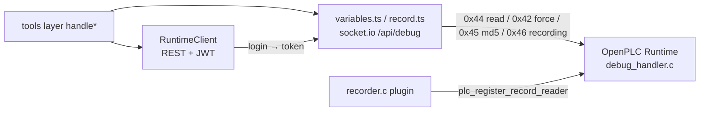

# Runtime Client and Debug Protocol

Everything sema-plc-tools does to observe or intervene in the OpenPLC Runtime goes through two channels: **REST** (management plane: login, start/stop, upload, compilation status) and the **WebSocket debug channel** (data plane: variable reads, force, recording). This page uses `src/client/runtime.ts`, `src/client/variables.ts`, `src/client/record.ts`, and `runtime/plugins/recorder/` as the source of truth and lays out the protocol details of both channels. For upper-layer tool semantics see [Observation and Verification Tool Semantics](en/wiki/tools/observation); for the runtime container environment see [OpenPLC Runtime Environment](en/wiki/tools/runtime).



## REST Client (client/runtime.ts)

`RuntimeClient` is the sole REST wrapper — 144 lines, with its responsibility deliberately narrowed to "authentication plus six endpoints".

### Authentication and JWT

- **Self-signed certificate**: the runtime's HTTPS uses a self-signed certificate; the constructor builds the axios instance with `new https.Agent({ rejectUnauthorized: false })` (`runtime.ts:22`), disabling certificate validation globally — a deliberate trade-off for a local container, not an oversight.
- **Idempotent user creation on first login**: `getToken()` first does `POST /api/create-user` (admin role, with the double safety net of `validateStatus: () => true` + `.catch(() => {})` to swallow "already exists" errors), then `POST /api/login` to obtain `access_token`. The token is cached in an instance field and reused by subsequent requests.
- **One automatic refresh-and-retry on 401**: a response interceptor catches 401, calls `invalidateToken()`, logs in again, and replays the original request with a `_retry` flag (`runtime.ts:27-41`), so a token expiring during a long session does not break the tool chain.
- `getAuthToken()` exposes the JWT to the WebSocket side — **the WS debug channel reuses the same token for its `auth: { token }` handshake**.

### Endpoint Overview

| Method | Endpoint | Notes |
|---|---|---|
| `getStatus()` | `GET /api/status` | Normalizes `STATUS:RUNNING` → `RUNNING` (both return shapes have been observed) |
| `startPlc()` / `stopPlc()` | `GET /api/start-plc` / `stop-plc` | Start/stop the PLC |
| `uploadZip()` | `POST /api/upload-file` | Multipart upload of the matiec build zip; failure details live in the `UploadFileFail` field |
| `pollCompilationStatus()` | `GET /api/compilation-status` | Polls the in-container GCC compilation, default 2s interval and 55s timeout; log lines containing `error` but not `[INFO]` are filtered into `gccErrors` |
| `getRuntimeLogs()` | `GET /api/runtime-logs` | Raw runtime logs |

## WebSocket Debug Protocol (client/variables.ts)

### Connection Setup

All debug operations go over a socket.io connection to `${baseUrl}/api/debug`, with `transports: ['polling']` (long polling rather than native WS, for compatibility with self-signed-certificate environments) and `auth: { token }` carrying the JWT. Each operation uses **one short-lived socket**: connect → send one `debug_command` (hex string) → receive one `debug_response` → disconnect. Sending is double-insured: the `connected` event sends immediately, the `connect` event sends after a 100ms delay, and a `commandSent` flag prevents duplicates (`variables.ts:174-183`).

Scenarios that need multiple commands with preserved ordering (condition-triggered force, recording pagination) use a **single persistent socket + single in-flight command** pattern instead: at most one `debug_command` is in flight at any moment, and the `pending` callback guarantees the next `debug_response` belongs to it (the runtime replies in order).

### The Variable Table: Origin and Caching

The debug protocol addresses variables by **index**; it knows no names. The name→index mapping (variableMap) is produced at compile time and cached in the state file:

1. matiec compilation produces `VARIABLES.csv`; `normalizeCsv()` in `compile.ts` parses it: FB instance rows are skipped and the remainder renumbered from 0 (strictly matching the indices of the `debug_vars[]` array generated by debug.c);
2. names have the `CONFIG0.RES0.INST0.` prefix stripped, the remaining segments joined with `.`, and are **lowercased** — a program-level variable becomes `hb_out`, while FB outputs keep their instance prefix as `timer1.q` / `rtrig.q` (so the `.Q` of multiple TONs cannot collide with each other); this is **instance.port addressing**;
3. the result is written to `lastCompile.variableMap` in `state.json` (`src/state.ts` writes atomically: write a temp file then `renameSync`, so a concurrent reader can never see a half-written JSON and misreport it as "No variable map found").

All tools resolve variable names **case-insensitively** (comparison via `name.toLowerCase()`): matiec folds names to lowercase, while agents/scenes use the ST source casing (`sensor_color_A` → runtime `sensor_color_a`). IEC 61131-3 identifiers are case-insensitive by definition, so this is correct semantics rather than a workaround (comment at `forceVariables.ts:71-74`). On resolution failure, `buildNameSuggestions()` (`readVariables.ts:32`) produces `nameSuggestions` — "exact lowercase match first, otherwise nearest by edit distance".

### 0x44 DEBUG_GET_LIST: Batch Read

Command `[0x44, count u16 BE, idx u16 BE × n]`; the response header is 10 bytes:

```
byte[0]   = 0x44 command echo
byte[1]   = 0x7E success marker
byte[2-3] = lastVarIdx (u16 BE)
byte[4-7] = tick__ (u32 BE, +1 per scan cycle)
byte[8-9] = responseSize (u16 BE)
byte[10+] = raw bytes of each variable in order (little-endian)
```

Each variable's byte width is determined by its IEC type (`varSize()`: BOOL/SINT=1, INT/WORD=2, DINT/REAL=4, LREAL/LINT=8, the TIME family=8 as the `IEC_TIMESPEC{tv_sec,tv_nsec}` struct, decoded to milliseconds). `decodeValue()` is the **single decoding source of truth** — 0x44 live reads and 0x46 recording frames share this one function; 64-bit integers are returned as strings (BigInt-safe).

`parseDebugTick()` extracts `tick__`: it orders samples by real scan progress (independent of the wall clock) and is the common foundation for trace ordering, pulseScans verification, and the gap evidence of when-triggered forces.

### 0x42 DEBUG_SET: The force Mechanism

Command `[0x42, varidx u16 BE, flag u8 (1=force/0=release), len u16 BE, value bytes LE]`; a successful response is `42 7E`, and any other second byte is an error code (e.g. `0x80` for out of bounds). On release the protocol still requires the byte count and payload, so all-zero bytes of the corresponding width are sent.

Two key constraints (`variables.ts:217-232`):

- **Only located variables can be forced**: `isForceable()` requires `location` to start with `%I` or `%Q` and the type to be a serializable basic numeric/bit type. The runtime's `force_var()` **silently no-ops** on unsupported combinations (returns success but never latches the value), so the tool layer rejects up front instead of pretending success. This determination was corrected by per-type testing against a real runtime on 2026-06-05 (the earlier inference of "only BOOL + INT_O" was wrong).
- A force is a **persistent latch** (FORCE_FLAG): once applied it takes effect every scan until explicitly released — which is the entire reason the cleanup ledger (active-forces.json) exists.

`serializeValue()` performs type coercion: BOOL is mapped explicitly (the string `'false'` must become FALSE — naive truthiness would write it backwards), numeric strings auto-convert, values are range-checked by signedness, and REAL/LREAL go through `writeFloatLE/writeDoubleLE`.

### Condition-Triggered force (forceWhenViaSocket)

The naive two-step `waitFor → forceVariables` loses 3-5 scans (two connection handshakes ≈ 46ms polling + 30ms connection setup). `forceWhenViaSocket()` polls the condition variable on **the same already-connected socket** (0x44 single-variable read) and emits the force command the instant the condition holds; the force lands within about 1 scan of observing the condition. It returns `tickAtMet` / `tickAtForced`, from which the upper layer computes `gapScans` as objective evidence of trigger latency.

## The recorder Plugin and 0x46 Per-Scan Recording

0x44 polling has a physical floor of roughly 50ms per read, while the scan cycle is typically 20ms — polling inevitably misses transients. The recorder plugin (`runtime/plugins/recorder/recorder.c`) moves sampling into the runtime process, achieving **one frame per scan with zero misses**:

- **Write side**: the plugin registers a `cycle_end` hook; at the end of every scan it writes the raw bytes of all recordable variables plus a 64-bit `tick__` into a ring buffer (default 4000 frames, 16MB cap; if frames are too wide, the frame count is first halved down to a 64-frame floor, and if still over, decimation thins the data — store 1 frame every N ticks, extending time coverage rather than saving memory; a single frame >256KB refuses to arm outright).
- **Addresses re-resolved every cycle**: a located variable's address flips between `->value` / `->fvalue` with FORCE_FLAG, so `get_var_list` must be called every scan and must not be cached across cycles — otherwise you record the stale pre-force address.
- **Lock-free concurrency**: the scan thread is the sole writer, using a seqlock (write: seq++ odd → write frame → seq++ even; read: even seq → copy → re-read and accept only if consistent) instead of a mutex, so the scan thread never blocks; `stop_loop` unregisters the callback first, then spins until `g_readers` reaches zero before freeing (after a 2s timeout it would rather leak the ring than UAF).
- **STRING is unrecordable**: the generated `get_var_size()` returns 0 for STRING; such variables are skipped and counted in `skipped`, which the INFO header reports honestly (this is where the tool layer's `skippedUnrecordable` comes from).
- **Program md5**: the INFO header carries `ext_plc_program_md5` (a pointer exported via plc_main's `-rdynamic`); when unavailable, 32 bytes of `'?'` are filled in, and the tool layer treats all-`'?'` as "unverifiable" rather than a version conflict.

### The 0x46 Wire Protocol (Frozen Contract)

The runtime's `debug_handler.c` carries a patch (`runtime-0x46.md`): it adds sub-function code `0x46 MB_FC_DEBUG_FETCH_RECORD` and exports `plc_register_record_reader()`; the plugin registers its read callback during `start_loop`. If no callback is registered, or the payload is under 11 bytes, it returns `MB_DEBUG_ERROR_OUT_OF_BOUNDS` (the client reports "recorder not armed").

The command is a fixed 11 bytes: `u8 0x46 | u64 from_tick BE | u16 max_slots BE`; `max_slots=0` means an INFO query. **Multi-byte fields on this channel are always big-endian**, while the variable payload bytes inside a frame remain little-endian (handed to `decodeValue` for decoding) — `client/record.ts:1-17` marks this mixed endianness as a FROZEN CONTRACT.

| Response kind | Layout |
|---|---|
| `0x01` INFO | `kind, magic 0x52454331 "REC1", ver, var_count, skipped, decimation, slot_size, frames, count, md5[32], var_count × {idx u16, off u32, size u16}` |
| `0x02` FRAMES | `kind, n u16, next_from u64 (0 = no more), n × {tick u64, slot raw bytes}` |

### Client-Side Reading (client/record.ts)

`fetchRecording()` completes over one persistent socket: first an INFO query for the header (a magic/version mismatch throws immediately — the peer is simply not speaking the recorder contract), then paged FETCHes following `next_from` until it reaches 0 or `maxFrames` is satisfied. `next_from` is **the tick of the first frame that did not fit**; the next round resumes from it inclusively (the server retains `t ≥ from_tick`).

The polling transport has one pitfall confirmed against a real runtime: it can **redeliver stale responses**, mismatching the pending callback. `request()` shape-checks every response (INFO must have kind=0x01; FETCH must have kind=0x02 and a first-frame tick ≥ the requested fromTick — anything lower can only be an old page); anything failing the check is discarded as a stale duplicate and the callback is re-armed to wait for the real response (retried once only).

How recording data is gated and decoded into agent-consumable series is covered in the plc_record section of [Observation and Verification Tool Semantics](en/wiki/tools/observation).
