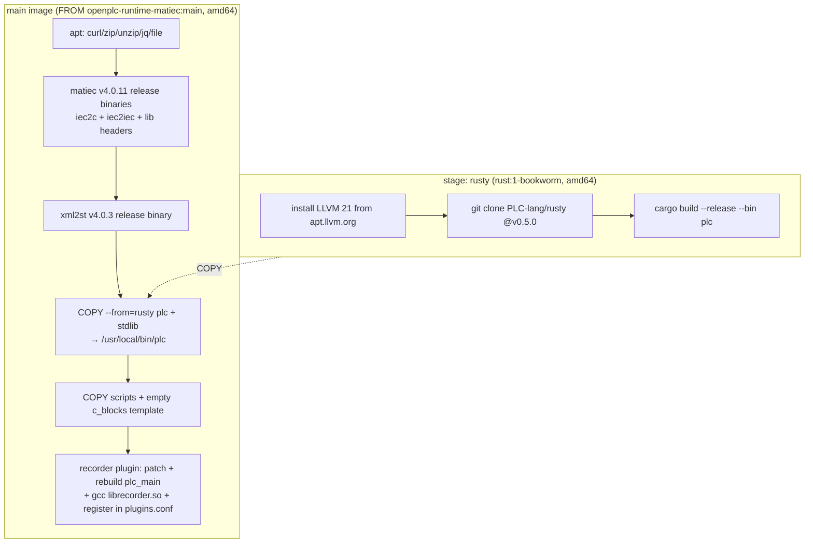

# The OpenPLC Runtime Environment

`sema-plc-tools/runtime/` provides a real IEC 61131-3 execution environment: OpenPLC Runtime v4 + the matiec compiler + xml2st, packaged as one self-contained Docker image. The entire [Compile and Deploy Pipeline](en/wiki/tools/compile-pipeline) and the [Declarative Verify Runner](en/wiki/tools/verify-runner) run on this container.

## Why We Build Our Own MatIEC Base Image

Upstream `autonomy-logic/openplc-runtime` went through a compiler switch (full story in the header comment of `runtime/scripts/build-matiec-base.sh` and lines 43–53 of `Dockerfile.plc-dev`):

- The upstream published image `ghcr.io/autonomy-logic/openplc-runtime:latest` (**and every SHA tag**) has switched to the **STruC++** branch (v4.1.0-rc3), whose `compile.sh` **explicitly rejects MatIEC artifacts** (`Config0.c` / `glueVars.c`) — this project's matiec compile chain would fail wholesale at the GCC stage.
- The upstream **main-branch source is still MatIEC to this day** (`compile.sh` runs `gcc Config0.c → new_libplc.so`), but no image was ever published from it.
- Therefore `scripts/build-matiec-base.sh` builds the base image from upstream source, **pinned (commit) to the last MatIEC-era commit before the STruC++ switch**, `f1a70e9`, making the build reproducible and independent of any later drift on upstream main:

```bash
cd sema-plc-tools/runtime
./scripts/build-matiec-base.sh   # → openplc-runtime-matiec:main (first time only; needs Docker + network)
docker compose up -d --build     # layer matiec / xml2st / rusty / recorder on top
```

The script has a built-in drift sentinel: after cloning, if it finds the phrase `no longer supports MatIEC` in `compile.sh` (meaning upstream has switched main too and the pin is dead), it errors out immediately and tells you to move `PIN_COMMIT` to an earlier commit. `PIN_COMMIT` / `IMAGE` / `BUILD_DIR` can all be overridden via environment variables. If you need to roll back to the STruC++ runtime, the previous image is kept as `openplc-plc-dev:strucpp-4.1.0-rc3` (see `runtime/README.md`).

## Dockerfile.plc-dev Build Stages

Source: `runtime/Dockerfile.plc-dev`. Two stages:



- **Architecture policy: force `--platform=linux/amd64`, not TARGETARCH dynamic dispatch.** The reason is written in the file header: matiec upstream v4.0.11's linux-arm64 release actually packages x86_64 binaries (an upstream release accident), producing a rosetta error outright in an arm64 container. With everything unified on amd64: Apple Silicon goes through Docker Desktop's Rosetta 2, Linux ARM relies on binfmt + qemu, and x86 runs natively. TARGETARCH dynamic selection will be restored once upstream fixes the arm64 release (the TARGETARCH comment at the top of `docker-compose.yml` is a leftover of that expectation).
- **rusty stage**: builds the `plc` checker from the public `PLC-lang/rusty` source at tag v0.5.0 (for `plc_check` self-checking, see [Syntax Check and IO Detection](en/wiki/tools/check-and-io)). rusty v0.5.0 depends on LLVM 21, which bookworm's default sources lack; it is installed from the official apt.llvm.org with `LLVM_SYS_211_PREFIX` set. This binary used to be COPY-ed from a private benchmark image (unobtainable externally); building it ourselves makes the image self-contained and reproducible.
- **Tool versions managed uniformly by ARG**: `MATIEC_VERSION=v4.0.11`, `XML2ST_VERSION=v4.0.3`, both installed from GitHub release linux-x64 tarballs.
- **Deliberate trade-offs** (stated explicitly in the header comment; do not "fix them literally"): apt packages are unpinned, and the base image uses a local tag (not a public registry, so no dependency-confusion surface); the container runs as root (OpenPLC needs root plus SYS_NICE/SYS_RESOURCE to set real-time scheduling priority). The image is for local localhost development only and must not be deployed to the public internet.

## docker-compose Configuration Highlights

Source: `runtime/docker-compose.yml`.

| Item | Value |
|---|---|
| compose project | `sema-plc-runtime` (pinned, so a directory rename does not orphan containers) |
| Service / container name | `openplc-runtime` / `openplc-plc-dev` (fixed; plc-tools finds the container by name) |
| Image | `openplc-plc-dev:latest` (built from `Dockerfile.plc-dev`) |
| Ports | `8443:8443` (REST API, HTTPS with a self-signed certificate) |
| Credentials | `admin` / `admin123` (Runtime built-in defaults, publicly known; not a compose setting) |
| capabilities | `SYS_NICE`, `SYS_RESOURCE` (real-time scheduling) |
| Volumes | `openplc-runtime-data:/var/run/runtime`; `samples/` and `scripts/` mounted read-only into `/workspace/` |
| healthcheck | `/api/status` returning **200 or 401** counts as healthy — the endpoint requires JWT, the health check has no token, so 401 is expected; an earlier `curl -f` treated 401 as a hard failure, permanently marking the container unhealthy and masking real faults |

## In-Container Directories and Key Scripts

```
Inside the container:
/workdir/                 # OpenPLC Runtime source + build (WORKDIR)
├── librecorder.so        # recorder plugin (compiled at build time)
├── plugins.conf          # plugin registry (includes the recorder line)
/workspace/
├── samples/  scripts/    # host read-only mounts
├── templates/c_blocks_code_empty.cpp   # empty template the Runtime build requires to exist
/usr/local/bin/           # iec2c  iec2iec  xml2st  plc (rusty)
/usr/local/share/matiec/lib   # matiec standard library headers
```

The scripts under `scripts/`:

| Script | Purpose |
|---|---|
| `build-matiec-base.sh` | Run on the host: builds the pinned-commit MatIEC base image (see above) |
| `plc_build.sh` | Run inside the container: the full 8-step ST-to-deployment pipeline (see below) |
| `verify_environment.sh` | In-container component self-check (7 items: iec2c liveness via a real compile, xml2st, matiec library headers, debug.c/glueVars.c generation, Runtime API, etc.) |
| `test_api.sh` | REST API endpoint tests |
| `quick_verify.sh` | One-shot end-to-end verification on the host (start → auth → self-check → compile) |

**What `plc_build.sh` does**: it is the shell-flavored reference implementation of the [Compile and Deploy Pipeline](en/wiki/tools/compile-pipeline); `plc_build.sh <st_file> [runtime_url] [auth_token]` executes 8 steps in order —

1. `iec2c -f -p -i -l program.st` compiles ST to C (validating outputs such as `Config0.c/Res0.c/POUS.c/LOCATED_VARIABLES.h/VARIABLES.csv`);
2. `xml2st --generate-debug` generates `debug.c` (variable debug indices);
3. `xml2st --generate-gluevars` generates `glueVars.c` (glue between located variables and the IO buffers);
4. supply empty `c_blocks_code.cpp` / `c_blocks.h` (a hard requirement of the Runtime build);
5. copy the matiec `lib/` headers;
6. package everything into `program.zip`;
7. `POST /api/upload-file` to upload;
8. poll `/api/compilation-status` until SUCCESS/FAILED (60s timeout).

`plc_compile` in plc-tools and the verify runner run the TypeScript implementation of this exact same chain.

## How the recorder Plugin Gets into the Image

`plugins/recorder/` is a per-scan "flight recorder" plugin, underpinning the verify runner's record case (per-scan waveform recording). At image build time (the tail of the Dockerfile), four steps:

1. **Apply the runtime patch**: `apply-0x46-patch.sh` uses anchor-based editing to inject the debug sub-function code `0x46 MB_FC_DEBUG_FETCH_RECORD` into `/workdir/core/src/plc_app/debug_handler.c` — adding a `plc_register_record_reader()` registration interface plus one `case MB_FC_DEBUG_FETCH_RECORD` branch (reading recorded frames back over the debug channel by `from_tick + max_slots`). The script is **idempotent** (if `MB_FC_DEBUG_FETCH_RECORD` is already present it exits successfully at once, preventing redefinition/duplicate case from Docker layer re-runs) and carries a **drift sentinel** (if either of the two grep anchors is missing, the build fails explicitly). The injected content is verbatim-identical to the version hand-patched and verified inside a container; details in `plugins/recorder/runtime-0x46.md`.
2. **Rebuild `plc_main`** so the patch takes effect (`cmake --build /workdir/build --target plc_main`; `-rdynamic` exports the new symbols so the plugin can resolve them at dlopen, same mechanism as `tick__`).
3. **Build the plugin**: `gcc -fPIC -shared` produces `/workdir/librecorder.so`. The header comment of `recorder.c` records several empirically measured constraints: located variable addresses flip between `value/fvalue` with FORCE_FLAG, so **addresses must be re-looked-up every cycle and never cached**; the scan thread and the debug thread use a seqlock rather than a mutex, guaranteeing the scan thread never blocks; the wire format (the two frame kinds INFO/FRAMES) is a frozen contract with the plc-tools parser.
4. **Register**: append `recorder,./librecorder.so,1,1,./recorder.json` to `/workdir/plugins.conf` (with a grep duplicate check).

`plc_record` and the record case read the data from the plc-tools side via 0x46; see [Observation and Verification Tool Semantics](en/wiki/tools/observation). `integration-test.sh` is the plugin's in-container integration test.

## The Three samples

| File | What it demonstrates |
|---|---|
| `simple_counter.st` | **The deliberately broken version**: located variables with initializers, mixed into the same VAR section as internal variables, and a missing semicolon after `END_IF` — exactly the high-frequency pitfalls listed in AGENTS.md, used to demonstrate compile-error reporting |
| `simple_counter_fixed.st` | The corrected version of the same program: located variables in their own section without initializers, internal variables in `VAR_TEMP` and explicitly initialized at the top of the program body, block terminators with semicolons — diffing the two gives a "wrong example → correct style" comparison |
| `traffic_light.st` | Traffic-light state machine: a CASE state machine plus TIME accumulation, emergency-stop/night-mode inputs, and a complete `CONFIGURATION` (INTERVAL 100ms), serving as a runnable comprehensive example |

The in-container path is `/workspace/samples/` (read-only mount); you can verify the whole chain directly with `docker compose exec openplc-runtime /workspace/scripts/plc_build.sh /workspace/samples/simple_counter_fixed.st`.

## troubleshooting Directory Guide

`runtime/troubleshooting/` records the pitfalls hit while setting up the environment (the README has a status table of the issues):

| Document | One-liner |
|---|---|
| `01-architecture-issues.md` | Docker architecture compatibility: the matiec arm64 release ships x86_64 binaries, ultimately solved by forcing amd64 |
| `02-matiec-compilation-errors.md` | matiec (iec2c) compiler-related issues |
| `03-library-path-issues.md` | matiec lib header path issues (the origin of the `lib` symlink in `plc_build.sh`) |
| `04-st-syntax-compatibility.md` | ST syntax compatibility: VAR declaration format and other matiec pickiness |
| `05-runtime-compilation-failures.md` | OpenPLC Runtime-side compile failures (missing dependency files such as c_blocks) |
| `06-verification-script-timeouts.md` | Verification script timeouts (non-blocking; the environment itself is usable) |
| `quick-reference.md` | Quick troubleshooting command reference |

## Exposing Modbus Externally (Optional)

Setting `PLC_MODBUS_PORT=502` makes plc-tools bake the `modbus_slave` plugin configuration into every program ZIP, letting OpenPLC expose located IO externally; access from outside the container additionally requires opening the corresponding port in `docker-compose.yml`. The configuration can also be generated manually via the CLI: `node dist/cli.js genModbusConfig program.st` (see [Standalone CLI](en/wiki/tools/cli)). This switch is seeded into the MCP env by the web side; see [Workspace and Skills](en/wiki/web/workspace).
