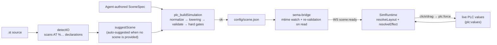

# Process Simulation and the Scene Spec

Process simulation is the pathway from ST program to interactive animation: the agent (or the auto-suggester) produces a **Scene Spec** (JSON), `plc_buildSimulation` validates it and writes it to `$workspace/config/scene.json`, and the frontend `SimRuntime` loads it and drives the SVG animation with live PLC variable values. The Scene Spec types and validation logic are concentrated in `sema-plc-tools/src/tools/sceneSpec.ts` (pure functions, no fs / DOM), which is the single contract between the agent (producer) and the frontend (consumer).

## End-to-End Flow



## Scene Spec Structure (sceneSpec.ts)

```ts
export interface SceneSpec {
  version: '1' | '2'
  canvas: { width: number; height: number; background?: string }
  parts: PartInstance[]
}
export interface Binding {
  variable: string            // ST symbol name; must match a detectIO name
  target?: string             // element id (#id) or data-anchor name; omit = part primary anchor
  effect: Effect
}
```

`PartInstance` fields: `id` (unique within the scene), `kind` (a library part name or `"custom"`), `x/y` (must be numbers), optional `w/h/rotation/label/params`, `svg` (`custom` only, inline SVG with id-bearing elements), `snap` (v2, positioning relative to a host), and `bindings`.

**Effect union type** (`EFFECT_TYPES`, 11 in total):

| type | Key fields | Semantics |
|---|---|---|
| `fill` | `map:[{when,color}]` | Switch fill color on value match |
| `class` | `map:[{when,className}]` | Attach a CSS class on value match (e.g. the `sim-run` animation) |
| `visible` | `when` | Conditional show/hide (missing `when` is a hard error) |
| `text` | `format?/decimals?/suffix?` | Numeric text display, `{v}` placeholder |
| `translateX/Y` | `valueFrom,valueTo,from,to` (or absolute `xFrom/xTo`, `yFrom/yTo`) | Linearly maps a value range to a relative translation |
| `width/height/opacity` | `valueFrom,valueTo,from,to` | Linearly maps a value range to the attribute |
| `rotate` | `degPerUnit?` | value × factor = rotation angle |
| `translateAlong` | `host,axis?,variable,valueFrom,valueTo` (v2) | Workpiece travels along the host part's motion axis |

`ValueMatch` has three forms: `{eq: number|boolean}`, a `{gte, lt?}` range, and `{truthy: true}`; `matchValue` normalizes booleans to 0/1 and then compares numerically.

**v2-only fields**: `snap: {to, dx, dy}` attaches a part to a host (`child.abs = host.abs + R(host.rotation)·(dx,dy)`); `translateAlong` positions a workpiece along the host's (typically a conveyor's) motion axis at `t = clamp((v-valueFrom)/(valueTo-valueFrom), 0, 1)`. A v1 scene carrying v2 fields is only a warning (the fields are ignored); v2 structural errors (snap missing `to`, self-referencing, or cyclic; a nonexistent translateAlong host; `valueFrom >= valueTo`) are hard errors; a `custom` host is a warning (no motion axis, so translateAlong silently does nothing).

## Validation Rules (validateSceneSpec)

The detectIO roster of the running program serves as `knownVariables` (compared **case-insensitively** — matiec lowercases located variable names, while the scene is written in the ST source's casing). Rule highlights:

- Hard errors (errors, block the write): version not 1/2; canvas missing numeric width/height; parts not an array; a part missing id/kind/numeric x/y; duplicate id; `kind` not in the library roster and not `custom`; a binding variable that is not a located IO (except translateAlong variables, downgraded to a warning); unknown effect type; `translateX/Y/width/height/opacity` missing numeric `valueFrom/valueTo/from/to`; `visible` missing `when`; empty `fill/class` map; `custom` missing a non-empty `svg`; a binding `target` whose id cannot be found in the custom svg; a custom svg with zero bindings while the program has bindable IO (a static dead image); a part field name that looks like a misspelling of `bindings` with no valid bindings present.
- Warnings: parts fully overlapping / overflowing the canvas (minor); a `fill` map with no off state (sticky fill: `resolveEffect` returns `color:null` on no match, `applyPatch` does not reset, so the element stays colored); a custom svg without a viewBox; multiple custom parts sharing the same element id; `label` on a `custom` part not being rendered; a `stack-light` with fewer than 3 bindings.
- **Geometry gate** (translateX/Y + custom + target): `svgTargetGeometry` statically derives the target bbox (only rect/circle/ellipse/line are recognized; it explicitly bails on path/text/transform/nested motion bindings and other cases that cannot be statically derived). The `from` end pushing the target entirely out of the viewBox = hard error (typical cause: writing an absolute coordinate where a relative offset was meant); the `to` end going out of bounds / more than half out = warning.

**Absolute-coordinate lowering** (`lowerAbsoluteTranslate`, called by buildSimulation before validate): the agent may write `xFrom/xTo` (translateX) or `yFrom/yTo` (translateY) in the absolute "where should the element move to" mindset; the tool converts them in place, using the target's static bbox left/top edge, into the relative `from/to` the renderer needs, keeping the original absolute fields as metadata. Wrong axis, mixing with `from/to`, non-custom / missing target, and an underivable bbox are all hard errors.

## Parts Catalog (partsCatalog)

The frontend `sema-plc-web/src/components/sim/partsCatalog.ts` is the **visual source of truth**; `sema-plc-tools/src/tools/partsCatalog.ts` is a lightweight copy (`PART_KINDS`/`PART_BOXES` for validation, `PARTS_CATALOG_MD` injected into the tool description). The two are locked in sync by the snapshot test `catalogSync.test.ts`.

| kind | Description | Primary anchor | Value type | Effects | box |
|---|---|---|---|---|---|
| `lamp` | Indicator lamp, changes color with the value | Lamp body circle | BOOL | fill/visible | 44×44 |
| `sensor-button` | Sensor/button state indicator | State circle | BOOL | fill | 48×38 |
| `valve` | Valve, changes color when open/closed | Valve body square | BOOL | fill/class | 48×48 |
| `cylinder` | Pneumatic cylinder piston, extend/retract | Piston rod | BOOL | fill/translateX/visible | 52×48 |
| `motor` | Motor, spins while running | Rotor group (`sim-run` class) | BOOL | class/rotate/fill | 44×44 |
| `conveyor` | Conveyor, belt rolls while running | Belt tick-mark group | BOOL | class | 120×54 |
| `tank` | Tank/level, liquid surface rises and falls | Liquid-level rect (height-driven) | INT/REAL | height/fill | 52×64 |
| `numeric-display` | Digital readout | Text | INT/REAL | text | 92×34 |
| `gauge` | Needle gauge | needle (rotates around the center) | INT/REAL | rotate | 64×64 |
| `pump` | Pump, impeller spins | Impeller group | BOOL | class/fill | 52×52 |
| `hopper` | Hopper, material level rises and falls | Material-level rect | INT/REAL | height/fill | 60×54 |
| `stack-light` | Three-segment alarm light tower | red segment (plus amber/green anchors) | BOOL | fill | 32×80 (manual layout) |
| `slider` | Analog input slider, draggable to write a value | thumb (plus a val anchor) | INT/REAL | translateX/text | 150×44 |

`stack-light` is on the `REQUIRES_MANUAL_LAYOUT` list; suggestScene never auto-lays it out.

## suggestScene: Auto-Suggesting a Scene from IO

`sema-plc-tools/src/tools/suggestScene.ts` is the deterministic fallback: the agent can use its output as-is or refine on top of it.

1. **Filter**: keep IO with a Modbus mapping plus `%M` memory BOOLs (internal sensors/flags also get parts).
2. **Part selection** (`chooseKind`): the `component` hint from io_map.yaml takes priority (e.g. `conveyor→conveyor`, `counter→numeric-display`); otherwise a name/type heuristic — BOOL input → `sensor-button`; a numeric input whose name contains sp/setpoint/ref/cmd etc. → `slider`, containing level/tank → `tank`, otherwise `gauge`; BOOL outputs go by shape words first (cyl/push → cylinder, valve, pump, conv/belt → conveyor, motor/spin → motor), with color words falling back to `lamp`; a numeric output containing level/temp/press etc. → `tank`, otherwise `numeric-display`.
3. **Default bindings** (`defaultBindingEffect`): conveyor/motor/pump → `class` attaching `sim-run`; tank/hopper → `height 0..100 → 0..56`; gauge → `rotate degPerUnit:1.8`; slider → thumb `translateX 0..100 → 0..126` plus text on the `val` anchor; remaining BOOL parts → gray/green `fill`.
4. **Layout**: inputs in one column (col 0), outputs in another (col 1), `COL=170, PAD=24, ROW=max(96, maxBoxH+8)`, canvas sized from the row/column counts.
5. **v2 enhancement**: when a conveyor exists, `snap` the sensor-button above the belt surface (`dx:30, dy:-28`), and look for the first non-input INT variable as the material position quantity, generating a custom workpiece placed at (0,0) (a small `#wp` square) bound with `translateAlong`; if any v2 feature is used, `version:'2'`.

## plc_buildSimulation: Generate / Validate / Write to Disk

`handleBuildSimulation` in `sema-plc-tools/src/tools/buildSimulation.ts` executes in order:

1. **Verification gate**: when a workspace is configured, compare the `stHash` in `$workspace/.plc-act/latest.json` against the current ST hash with `ok:true` — if the program has never passed verify (or was changed without a re-run), refuse to produce a scene unless `allowUnverified:true` is passed explicitly (see [Declarative Verify Runner](en/wiki/tools/verify-runner)).
2. **detectIO**: no located IO with a Modbus mapping at all → fail immediately.
3. **io_map hint layer**: when `PLC_IO_MAP_FILE` exists, fill each IO's `component`; this only biases suggestScene part selection.
4. **Tolerant normalization** (`normalizeScene`): parse the scene if it is a JSON string (some models serialize nested objects into strings); unwrap `{item:[...]}` wrappers; convert numeric strings to numbers; rename binding variable-key aliases (`var/name/signal/…`) back to `variable` in place; wrap bare effect strings into `{type}`; default missing top-level x/y to (0,0); add `width/height` to custom svg (`sizeCustomSvg`, preventing a nested svg from filling the canvas). All corrections are reported back as warnings.
5. **Absolute-coordinate lowering** → **validateSceneSpec** (with `PART_KINDS`/`PART_BOXES`).
6. **Semantic hard gates** (any error means `ok:false`, no write): a conveyor drawn with no translateX/translateAlong workpiece motion binding; a motion effect bound to a positioning input `%I…` that the program cannot write and that has no slider/sensor-button driver (a dead image stuck at its initial value in live simulation); a part bounding box exceeding the canvas by >15% (render clipping); a BOOL `%I` input with no clickable binding in the scene (mirroring the frontend click-mount rules, including case checks on custom targets).
7. **Semantic warnings**: a conveyor output with no INT position quantity; a numeric quantity bound to fill/class/visible of a BOOL-style part; a translate position quantity whose ST assignments are all constant literals (discrete jumps in the animation); a custom binding omitting target (whole-image clicks colliding).
8. **Write**: when `ok` and `PLC_SCENE_FILE` is configured, write `scene.json` (pretty JSON).

The MCP layer (`sema-plc-tools/src/server.ts`) additionally accepts `stPath/stPaths/projectDir` (multi-file merge) and `scenePath` (read the scene from a file, taking priority over inline); see [MCP Tool Reference](en/wiki/tools/mcp-tools).

## Frontend Consumption: scene.json → Animation

**Loading**: `emitSceneIfPresent` in `sema-plc-web/server/sema-bridge.ts` watches the mtime of `$workspace/config/scene.json` — covering both sources, the tool path and the agent writing the file directly. On every change it re-reads the file and runs `validateSceneSpec` again **at read time** (variable names taken from state.json's variableMap), pushing the result along with `sceneErrors/sceneWarnings` to the frontend via the WS event `scene:ready` (`src/store/sim.ts` stores it); errors are shown as a banner above the simulation view rather than a white screen.

**Rendering** (`sema-plc-web/src/components/sim/SimRuntime.tsx`):

- The whole scene is one SVG with `viewBox = canvas` and `preserveAspectRatio="xMidYMid meet"` filling the stage proportionally; each part renders as `<g data-part-id transform="translate(x,y) rotate(r)">`. Library parts come from `PART_REGISTRY[kind]` (pure SVG fragments in `parts.tsx`, anchors marked with `data-anchor`); `custom` is injected via innerHTML after `sanitizeSvg` (strips scripts/event attributes/external hrefs) plus `sizeCustomSvg`.
- **Value-driven loop**: whenever `values` or `scene` changes, iterate all bindings — target element resolution order is `target` via `[id="…"]` → `[data-anchor="…"]`, and with no target, `[data-anchor="primary"]`; `translateAlong` computes absolute coordinates via `alongPosition` and calls setAttribute directly; other effects go through `resolveEffect` to an `EffectPatch` (seven kinds: fill/visible/text/transform/attr/opacity/class), which `applyPatch` lands on the DOM. All lookups against variableMap and values are case-insensitive.
- **Interaction**: binding targets of BOOL `%I` inputs are clickable; a click is a **toggle** (persistent force true / release back to 0, not a pulse) sent via WS `plc:force`; a custom image mounts click per target element (multiple inputs never mis-trigger each other). While dragging the slider, the thumb optimistically follows the pointer and **a single force is committed only on release** (mirroring the change semantics of a native `<input type=range>`). Interpolatable custom binding targets are tagged `data-sim-tween`, using a CSS transition to tween the steps caused by 500ms polling.

**resolveEffect.ts** is the pure function at the animation core: `lerp` clamps the value over `valueFrom..valueTo` to `[0,1]` and maps it to `from..to`; `fill/class` take the first matching map entry; the semantics are exactly identical to `matchValue` in `sceneSpec.ts` (one copy on each side, the contract locked by tests).

## Layout Strategy (layout.ts)

`resolveLayout(scene)` resolves every part to an absolute `Pose {x,y,rotation}`:

- Parts without `snap` use their own coordinates as-is; parts with `snap` are resolved transitively via `child = parent.abs + R(parent.rotation)·(dx,dy)` (chains supported).
- Parts whose snap graph is cyclic, whose host is missing, or that reference themselves **fall back to their own original coordinates** — a white/gray/black tri-color DFS (`findCycleMembers`) marks the nodes on the cycle, guaranteeing it never throws and never loops forever (this function runs inside a `useMemo` in the render phase; a throw means a white screen).
- `alongPosition(host, kind, axis, t)`: the workpiece's absolute position along the host's motion axis. The axis comes from `PART_GEOM[kind].axis` (currently only conveyor defines an explicit axis: the belt centerline from local `(0,27)→(120,27)`); other parts degrade to the bounding-box centerline; the local point is rotated by the host's rotation and offset by the host's coordinates.

Related pages: [MCP Tool Reference](en/wiki/tools/mcp-tools) · [Frontend Overview](en/wiki/web/frontend) · [Workspace and Skills](en/wiki/web/workspace) · [State, Configuration, and Security Boundaries](en/wiki/tools/state-config)
