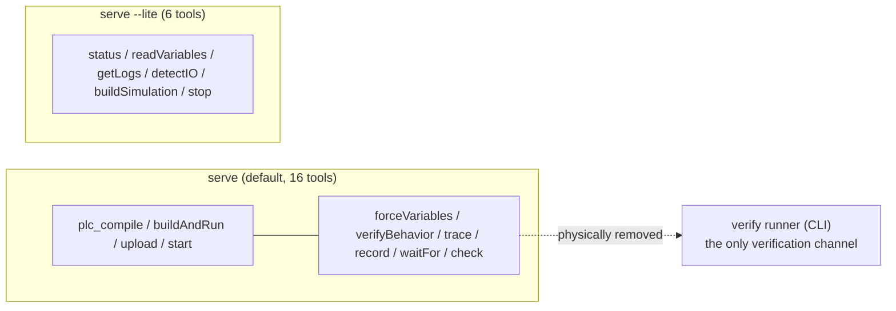

# State, Configuration, and Security Boundaries

This page covers the four pieces of cross-cutting infrastructure in `sema-plc-tools`: the cross-tool compile-state cache (`state.ts`), environment-variable configuration (`config.ts`), the MCP time budget (`mcpBudget.ts`), path/command-injection defenses (`pathSafety.ts` and the container-name validation in `config.ts`), plus the tool registration structure and `--lite` narrowed-surface logic in `server.ts`.

## The State File: state.json (state.ts)

`sema-plc-tools/src/state.ts` has only two functions: `readState` / `writeState`, operating on one JSON state file (default `~/.plc-tools/state.json`, redirectable via `PLC_STATE_FILE`; the Web IDE's bridge points it at `$workspace/.plc-vis/state.json`, see `plcStateFileForWorkspace` in `sema-plc-web/server/state-reader.ts`).

State structure (`PlcState` in `src/types.ts`):

```ts
export interface PlcState {
  // After plc.compile success this is non-null; readVariables uses variableMap to resolve indices.
  lastCompile: {
    timestamp: string
    stCode: string
    zipPath: string
    variableMap: VariableEntry[]
  } | null
}
```

**Single writer**: `handleCompile` writes it after a successful compile (`src/tools/compile.ts`) — the variableMap comes from `VARIABLES.csv` inside the container, with missing locations backfilled from the `AT %…` declarations in the ST source. **Every successful compile overwrites `lastCompile` wholesale**, which is its invalidation semantics: recompile a different program and the old variableMap/zipPath is replaced; a failed compile writes nothing, keeping the last successful version.

**Readers**: `plc_upload` uses `zipPath` to locate the ZIP to upload; `plc_readVariables` / `plc_trace` / `plc_waitFor` / `plc_forceVariables` / `plc_record` use `variableMap` to resolve variable names into the debug protocol's index/type; the verify runner (`src/verify/cliEntry.ts`) reads `variableMap` and `stCode`. When the state is empty these tools error out directly, telling you to run `plc_compile` first — the "compile before observe" ordering constraint is threaded through this file.

Two defenses (`state.ts`): on read, a missing file or corrupted JSON always returns the empty state `{ lastCompile: null }` without throwing; writes go through **tmp + rename atomic replacement** — concurrent readers (MCP server / plc-monitor / verify runner) can never see half-written JSON. Previously a torn read would be misreported as "No variable map found. Run plc.compile first." (semantics locked by `tests/state.test.ts`). The Web bridge side additionally watches the file's mtime, so after the verify runner writes it directly via the CLI, the frontend Vars panel refreshes too (`sema-plc-web/server/sema-bridge.ts`).

## Configuration: Full Environment-Variable Table (config.ts)

`loadConfig()` (`sema-plc-tools/src/config.ts`) reads environment variables at process entry (once at MCP server startup, once per CLI command); there is no config file:

| Environment variable | Default | Purpose |
|---|---|---|
| `PLC_URL` | `https://localhost:8443` | OpenPLC Runtime address |
| `PLC_CONTAINER` | `openplc-plc-dev` | Docker container name (see injection defense below) |
| `PLC_CHECK_STDLIB_DIR` | `/opt/iec61131-stdlib` | In-container directory of rusty StandardFunctions `.st` files (used by `plc_check`) |
| `PLC_USER` | `admin` | Runtime login user |
| `PLC_PASSWORD` | `admin123` | Runtime login password |
| `PLC_STATE_FILE` | `~/.plc-tools/state.json` | State file path |
| `PLC_SCENE_FILE` | None (no write) | Absolute path where `plc_buildSimulation` writes scene.json |
| `PLC_IO_MAP_FILE` | None | Optional io_map.yaml (the component hint layer) |
| `PLC_WORKSPACE` | None | Workspace root for resolving relative `stPath`; also determines where the verify gate's `.plc-act/latest.json` lives |
| `PLC_MODBUS_PORT` | None (`null` = off) | When set, `plc_compile` injects `modbus_slave.json` into the ZIP and OpenPLC opens a Modbus TCP slave on this port (for FUXA integration) |
| `PLC_POOL_SIZE` | `1` (serial) | Verify scenario parallel pool size, clamped to `[1, 16]`; >1 fans scenarios out to multiple instances |

**Container-name injection defense**: `PLC_CONTAINER` is validated right at the configuration entry point against Docker's own legal character set `^[a-zA-Z0-9][a-zA-Z0-9_.-]*$`, throwing immediately if illegal — the value flows downstream as a `docker exec` argument, so a single-point sanitization frees every `execFile/spawn` from command injection.

## MCP Time Budget (mcpBudget.ts)

The MCP client (sema-core, via `@modelcontextprotocol/sdk`) has a default timeout of about 60s per tool request; on timeout the client throws `-32001` while the tool is actually still running — the result is both lost and wasted. `sema-plc-tools/src/mcpBudget.ts` solves this with one constant (50s = the 60s client timeout minus a 10s transport/wrap-up margin):

```ts
export const MCP_SAFE_MAX_MS = 50_000

export function clampToMcpBudget(ms: number | undefined, fallback: number): number {
  return Math.min(ms ?? fallback, MCP_SAFE_MAX_MS)
}
```

Every tool whose duration is caller-controlled or runtime-determined applies it: `plc_waitFor` clamps `timeoutMs` to 50s; `plc_trace` uses 50s as a wall-clock cap, truncating samples if the cap is hit mid-sampling and saying so in the result's `note` (truncated advisory); `plc_verifyBehavior` caps the budget of the entire force→wait→release sequence. Semantics are locked by `tests/mcpBudget.test.ts` (including a "must stay below 55s for margin" assertion).

The companion mechanisms that keep tool **output** from flooding the LLM context live in the individual tools: `plc_trace` clamps sample counts to `[1, 200]`; `plc_record` mandates `varNames` (the types.ts comment calls it a context-explosion gate, banning full-table dumps), and when transitions exceed the cap it truncates and writes the full decoded window to `fullDumpFile` for on-demand inspection. See [Observation and Verification Tool Semantics](en/wiki/tools/observation).

## Path Safety (pathSafety.ts)

`safePath(p, base?)` is the single audit point before every `fs.*` touchpoint (`sema-plc-tools/src/pathSafety.ts`):

- Rejects non-string paths and paths containing NUL bytes (poison-null-byte attack);
- Returns the canonical absolute path from `path.resolve` (behavior-preserving: `fs` resolves relative paths against the same cwd anyway);
- When `base` is passed, asserts the resolved result lies inside that directory (prefix comparison with `path.sep`), blocking `../` escapes.

Reads and writes in `state.ts` go through it; when the Web bridge reads `config/scene.json`, its namesake copy (`sema-plc-web/server/pathSafety.ts`) performs the same `safePath(…, workspace)` check; the resolution of workspace-relative `stPath/scenePath` in `resolveProject/resolveScene` is likewise bounded by the workspace.

## Tool Registration and the --lite Narrowed Surface (server.ts)

`sema-plc-tools/src/server.ts` starts a stdio MCP server with `@modelcontextprotocol/sdk` (CLI entry `plc-tools serve [--lite]`, see [Standalone CLI](en/wiki/tools/cli)):

- **Registration structure**: `TOOLS` is a static array of 16 tools, each with name/description/inputSchema (JSON Schema); `ListTools` returns it directly, and `CallTool` dispatches through a single `switch(name)` to the handlers in `src/tools/*.ts`, with results uniformly `JSON.stringify`-ed into one text content item. The tool descriptions themselves are the usage manual fed to the model — the description of `plc_buildSimulation` embeds the entire `PARTS_CATALOG_MD` parts roster and an effect-field quick reference. Individual tool semantics are in the [MCP Tool Reference](en/wiki/tools/mcp-tools).
- **Input resolution**: tools accepting source code uniformly go through `resolveProject` (supporting the four inputs `stCode` / `stPath` / `stPaths` / `projectDir`, merging multiple files in order into a single compilation unit), and compile-error line numbers are written back to the original file plus local line numbers via `applyErrorTraceback`. `plc_buildSimulation` also assembles the verify gate here (`$workspace/.plc-act/latest.json` plus the current ST hash).

**--lite narrowed surface**:

```ts
export const LITE_TOOLS = new Set(['plc_status', 'plc_readVariables', 'plc_getLogs', 'plc_detectIO', 'plc_buildSimulation', 'plc_stop'])
```

Lite mode does **physical removal**, not prompt-level discouragement: `filterToolsForLite` makes `ListTools` return only the 6 tools on the list, and `isToolAllowed` intercepts again in `CallTool` (even a model calling from memory receives a structured refusal, redirecting to the verify runner). Design intent (source comments cite spec §4 / review P0-1): with verification-class tools like `plc_forceVariables` / `plc_verifyBehavior` / `plc_trace` removed from the MCP surface, **verification can only go through the declarative verify runner** — structurally sealing the channel by which a weak model, after an assertion failure, slides back into the unreliable old "force inputs → read outputs" habit. The 6 tools that remain are all read-side/low-risk or unavoidable: state and variable snapshots, logs, IO detection, simulation-scene generation, and stop. Compiling and running in a lite environment likewise go through the runner (the CodeAct path); see [Declarative Verify Runner](en/wiki/tools/verify-runner).



Related pages: [MCP Tool Reference](en/wiki/tools/mcp-tools) · [Standalone CLI](en/wiki/tools/cli) · [Observation and Verification Tool Semantics](en/wiki/tools/observation) · [Process Simulation and the Scene Spec](en/wiki/tools/simulation)
