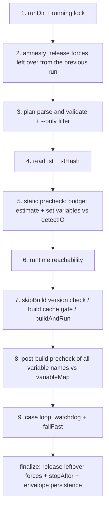

# Declarative Verify Runner

`node <cli> verify plan.json` consolidates "compile → drive cases → assert → clean up" into one self-time-limited, self-cleaning command that emits a structured envelope. The implementation lives in `src/verify/`; the authoritative plan contract is `sema-plc-web/templates/.sema/skills/plc-build-and-verify/plan-schema.md`. For the execution primitives it orchestrates see [Observation and Verification Tool Semantics](en/wiki/tools/observation); for CLI registration see [Standalone CLI](en/wiki/tools/cli).

## The plan's JSON Structure (planTypes.ts / planParse.ts)

Top level `{program, options?, cases}`: `program` is a workspace-relative `.st` path (must end in `.st`); `cases` is a non-empty array with four types (`planTypes.ts` is explicit: pulse/when are modifier fields of steady, not standalone types):

| type | Drive | Assertion | Typical scenario |
|---|---|---|---|
| `steady` | `set` (required) + optional `settleMs`/`pulseScans`/`when` | `expect: [{var, op, value}]` end-state assertions | motor latches after start is pressed |
| `trace` | optional `set` (held for the duration, released at the end) | `expectShape` temporal shape | three lights rotating in order |
| `record` | none (after-the-fact forensics) | `expectShape` over the per-scan recording | a self-driven position value is moving |
| `sequence` | `steps[]`, each step with `set`/`pulseScans`/`settleMs`/`waitFor`/`expect` | per-step expect | start → confirm running → e-stop → confirm stopped |

`options` has five fields: `perCaseBudgetMs` (default 30s), `stopAfter` (default true — stop the PLC when done), `failFast`, `skipBuild` (reuse the running program, after verifying it matches), and `serial` (force serial execution even when the pool is available). The common field `resetBefore` restarts the PLC before a state-dependent case starts.

### Parsing: Lenient with LLM Output, Strict on Semantics

`parsePlanText` first runs `stripJsonNoise` (a character-level scan that strips `//` and `/* */` comments and trailing commas outside strings — the most common LLM JSON slips), then `JSON.parse`. `normalizeAndValidate` then performs:

- **field whitelisting**, with "did you mean X?" suggestions for unknown fields by edit distance (errors carry a JSONPath-style `path`);
- **type coercion**: `"true"`→true, `"99"`→99;
- **legacy-shape compatibility**: an `expectations: {"x_min": 5}` map is auto-converted to an `expect` array (`_min`→`>=`, `_max`→`<=`, everything else→`==`);
- **semantic interception**: elements of `cycle.sequence` must be mutually distinct (with duplicates, the shape judgment's findIndex would always hit the first occurrence — a silent misjudgment, intercepted at the parser layer); `expect.timeoutMs` must be passed through (dropping it would make slow-changing conditions time out falsely; the comment at `planParse.ts:127-129` records this contract breach); `pulseScans` is limited to 1..50; `set` must not be an empty object.

All errors are aggregated into `PlanError[]`; nothing runs.

## Execution Model (runner.ts + caseExec.ts)

The serial path `runVerify()` is pure orchestration: all side effects go through the injected `RunnerDeps` (production wiring in `cliEntry.ts`); the runner itself only touches fs directly (lock/runDir/latest persistence). Steps:



Key points:

- **amnesty** (step 2): reads the `.plc-act/active-forces.json` ledger and releases the forces left over from the previous run (which may have been SIGKILLed). The ledger is written by caseExec via `registerForces` — **registered before forcing** (SIGKILL-safe: `cliEntry.ts:60-62`); the file is cleared only after release succeeds;
- **double precheck**: before the build, only the `set` variables to be forced are checked against the located declarations in the `.st` (force only works on located variables; `when.var` is an observed quantity, may be an internal variable, and is not checked); after the build, **all** case variables are checked against the real variableMap — unknown names fail directly with `nameSuggestions`, and not a single case runs;
- **build cache gate** (step 7): if the stCode in state matches this run's and the runtime is RUNNING → skip recompilation (`cached: true`), covering the most common waste of "only assertions changed, ST unchanged, yet everything is rebuilt"; same code but already STOPPED still gets a real build;
- **watchdog**: each iteration of the case loop checks `deadline = t0 + TOTAL_BUDGET_MS - CLEANUP_RESERVE_MS`; past the line, the remaining cases are recorded as skipped and the failure classified as `timeout`; 2 consecutive connection-class `caseSetup` failures auto-escalate to failFast (the environment is down — stop burning budget).

### caseExec: Driving and Triage

`runCase()` dispatches by type; its core output is the two-way `stage` triage — **`caseSetup` (the precondition case never stood up: force failed / when timed out / pulse not verified / variable name unresolved — do not touch the program) ≠ `assert` (the drive held but the assertion failed — only then is the program's correctness in question)**. This is the most important dividing line in the envelope semantics.

- steady without modifiers → lands directly on `verifyBehavior` (atomic force→wait→release); with `when`/`pulseScans` → the `forceVariables` modifier path plus per-condition `waitFor`;
- before running, a **contamination precheck**: if all assertions already hold before driving → a hint that the case may be contaminated by a predecessor or that the assertions lack discriminating power, suggesting `resetBefore`;
- an assert failure triggers the **diagnostic trio** (`assertDiag`): one extra full-variable sample (an OpenPLC debug read returns all variables in one shot, so full costs the same as a few columns), producing the narrow-column `lastFrames` (projecting only the asserted variables, exempt from the envelope's array cap), `stateTrace` (a compressed change-trajectory string over all variables, e.g. `state: 0→1→2 | [断言失败] pusher: F(全程未变)`), and accurate hints: outputs constant but internals responsive → "the input was consumed, check the downstream logic"; no variable changed at all → "the input was likely not consumed, or the variable name is wrong". `assertDiag` is only invoked on steady/sequence assert failures; trace/record assert failures only add the full `stateTrace` (trace additionally uses the last 8 sampled frames as `lastFrames`);
- held forces in a sequence accumulate across steps, "held upon attempt" (registered into held before the force call), so any failing return path can clean up in finally;
- each case's finally unconditionally releases that case's own set and deregisters it from the ledger.

## shapes.ts: Temporal Shape Assertions

The `expectShape` of trace/record cases is judged by `judgeShape()`, with four kinds:

| kind | Parameters | Semantics |
|---|---|---|
| `changed` | none | at least 2 distinct values — dead-value protection for continuous quantities (never moving = no self-driving / input not consumed) |
| `range` | `min`+`max` | every sample within the interval throughout; **no valid numeric samples counts as failure** — no vacuous passes allowed |
| `settle` | `min`+`max`+`tailRatio` (default 0.25) | the tail samples are all within the interval — for PID-convergence style checks |
| `cycle` | `sequence` (≥2, mutually distinct) | after collapsing consecutive repeats, every adjacent transition must be the cyclic "next" of sequence, with entry allowed at any point of the ring; fewer than 3 states after collapsing counts as rotation not observed |

The record path's series is `[first, ...transition values]` — here `settle` takes its tail over the **sequence of changes** rather than a time window, so use it with care on signals that converge after high-frequency oscillation (warned in both the planTypes.ts:33 comment and the plan-schema).

## budget.ts: The Budget Mechanism

Three constants: `TOTAL_BUDGET_MS = 100_000` (must be strictly below run_shell's default 120s — on overrun the process gets SIGTERMed and the envelope is swallowed), `CLEANUP_RESERVE_MS = 15_000` (watchdog trigger point = total minus reserve), and `BUILD_BUDGET_MS = 45_000`.

`precheckBudget()` performs a static estimate before running: trace at `durationMs`+1s overhead, record at 3s+1s overhead, steady/sequence waitFor/expect at the **real-world median return time of 2s** rather than the 5s timeout ceiling (a sequence waitFor with an explicit `timeoutMs` is estimated at that value) (the old conservative estimate misjudged normal plans as over-budget, accounting for 60% of plan failures; the worst case is backstopped by the watchdog). An over-budget plan does not run — it reports `stage=plan` with splitting guidance: the first half of the plan with `stopAfter: false`, the second half with `skipBuild: true` reusing the running program. With poolSize>1, wall-clock is estimated as `max(longest, ceil(sum/pool))`.

## envelope: The Structured Envelope

The result is a single JSON (`Envelope` in `planTypes.ts`): `ok / summary / stHash / steps[]{name,ok,ms,skipped?,cached?} / failure{stage, detail, hints, lastFrames, stateTrace} / cleanup{released, releaseFailed, stopOk, rollbackFailed?} / artifacts.runDir`. `failure.stage` has 10 possible values (plan/compile/gcc/start/runtime/caseSetup/assert/version-conflict/timeout/exception).

`renderEnvelope()` in `envelope.ts` does context-explosion protection: a 900-character cap on strings, a 5-entry cap on arrays (with `${key}TotalCount` attached), a 100-entry cap on steps, and an 880-line cap overall — when a limit is exceeded, detail degrades wholesale to "see artifacts.runDir/envelope.json". **The full envelope + a copy of the plan + a program snapshot are always persisted under `.plc-act/runs/<timestamp>/`**; stdout gets only the digest version. `stHash` (`hash.ts`, sha256 of the ST source) pins the conclusion to a specific program version; after a full run (not an `--only` subset) finishes, `.plc-act/latest.json` is written (recording `{stHash, ok, ts}`) — it is the credential for `plc_buildSimulation`'s "verify before rendering" version gate, which requires `ok: true` in it.

## --only Filtering

`verify plan.json --only <caseName>` (case-insensitive, trimmed) runs only the named case, for iterative debugging. A subset run's summary carries a `[subset: xxx]` prefix and **does not write latest.json** — subset results cannot masquerade as a full sign-off; the rendering gate still requires one full run with `ok: true`.

## pool / hash: The Parallel Path

With `cfg.poolSize > 1` and the plan not declaring `serial: true`, execution goes through `runVerifyParallel`: `compileOnce` (one matiec compile, docker cp the zip out as a Buffer) → parallel deployment to the pool instances (`pool.ts`: instances #1..#N, port basePort+id, container `openplc-plc-dev-${id}`; #0 is reserved for interactive use) → `runWithPool` fans the cases out to instances with a worker pool (shared cursor, claimed atomically in Node's single-threaded synchronous sections; failFast stops claiming new work but **lets in-flight cases finish naturally**, leaking no forces).

Deployment carries an **md5 hard gate**: the 0x45 live md5 must equal `md5(ST source bytes)` for the swap to count as truly successful (suppressing the swap race: start may bring up the old program); on mismatch, stop→start and retry once, and if still mismatched report `version-conflict`. Cases that failed because an instance died (connection errors) get **one round of redispatch** on healthy instances (only death-caused failures — genuine assertion failures are untouched). Each instance keeps its own force ledger `active-forces.<id>.json`.

## Interplay with --lite MCP Mode

`plc-tools serve --lite` (`src/server.ts:280-284`) narrows the MCP surface to six read-only/low-risk tools:

```ts
export const LITE_TOOLS = new Set(['plc_status', 'plc_readVariables', 'plc_getLogs', 'plc_detectIO', 'plc_buildSimulation', 'plc_stop'])
```

force / verifyBehavior / waitFor / trace / record / compile and the other verification and write-side tools are **physically removed from MCP** (absent from list, calls rejected); verification can only go through the single CLI channel of the verify runner. The design intent is written in the source comments: after an assert failure, weaker models slide back to the old force→read path to "manually double-check" — a path that readily produces fake verification with no cleanup, no version binding, and no structured evidence. lite mode **structurally seals off** that channel (review P0-1): either you get an envelope carrying stHash, cleanup records, and stage triage, or there is no verification. The runner's own amnesty/finally-release/stopAfter guarantee that even an interrupted run leaves no force residue — precisely the engineering precondition that makes "verification only through the runner" tenable. For the workspace-side counterparts (skills and the `.plc-act` conventions) see [Workspace and Skills](en/wiki/web/workspace).
