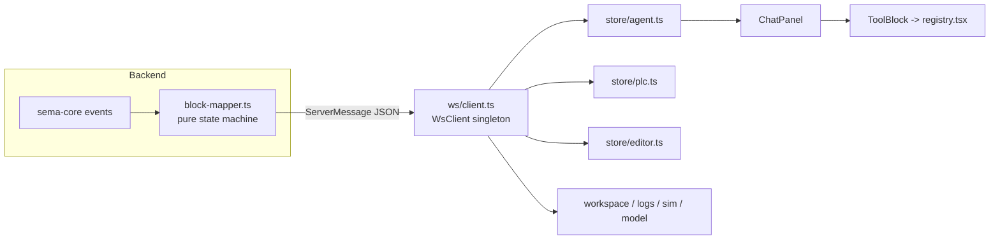

# Chat Panel and Tool Cards

The left chat panel is the Agent's visual terminal: user input goes over WS to the sema-core Agent embedded in the backend (see [SemaBridge: Embedded Agent Integration](en/wiki/web/sema-bridge)); the backend's `server/block-mapper.ts` normalizes the Agent event stream into a "block protocol" (`agent:turn-start / block-start / block-delta / block-end / turn-end`), and the frontend renders each block type as thinking blocks, Markdown text, and the various tool cards.

## Data Flow and Store Responsibilities



`WsClient` in `ws/client.ts` is a minimal singleton: JSON encode/decode, status callbacks, exponential-backoff reconnect (starting at 1s, doubling, capped at 10s), understanding no message semantics whatsoever. **Message dispatch does not live in the client** -- `wireStoresToWs()` in `store/index.ts` (called once when the App.tsx module loads) registers each store's `subscribeXxxToWs` as a listener, and each store claims its messages with its own `switch (m.type)`. React components get `status` and `send` through `ws/useWsConnection.tsx` (lazily initialized with the current state, so late-mounting components do not get stuck in connecting).

| store | Claimed messages | Responsibility |
|---|---|---|
| `store/agent.ts` | `agent:*`, `error`, `workspace:ready/switching` | Chat message stream (turn/block state machine), agent busy/idle, todos; persisted to localStorage |
| `store/plc.ts` | `plc:state/variables/values/runtime-error/force-result` | PLC run state, variable table, 500ms value snapshots, force set |
| `store/editor.ts` | `editor:files/open/saved` | File tree and editor content sync (details in [ST Language Support (Editor)](en/wiki/web/st-language)) |
| `store/workspace.ts` | `workspace:ready/switching` | Workspace path and sessionId |
| `store/logs.ts` | Compile/runtime/tool log messages | Bottom log panel, 500-entry ring buffer, tool start/complete merged into one entry |
| `store/sim.ts` | `scene:ready` | Process simulation Scene Spec (see [Process Simulation and Scene Spec](en/wiki/tools/simulation)) |
| `store/model.ts` | `model:config` | Model selection and thinking toggle state |

Nearly all stores respond to `workspace:switching` by clearing themselves -- a workspace switch is a global reset.

### The agent Store: Block State Machine and Persistence

`handleAgentWsMessage()` in `store/agent.ts` (exported separately, so tests can drive it directly without a WsClient) maintains `ChatMessage[]`: `user` / `agent` (with `blocks: AgentBlock[]` and `streaming/done/error/interrupted` status) / `manual-tool` (standalone cards triggered by the top-bar Run/Stop/Force buttons, belonging to no turn) / `error`. Key points:

- All updates go through immutable helpers (`upsertTurn/updateTurn/updateBlock`), replacing only the changed block objects, so together with `React.memo`, sealed blocks do not re-render with every token;
- **Lazy-create fallbacks**: a delta with an unknown `blockId` received after a mid-stream reconnect -> a text block is created first; a `block-end` whose kind mismatches an existing block -> the block is rebuilt from the end payload, never silently dropping the result;
- `agent:turn-snapshot` (the backend replaying an in-progress turn on reconnect) wholesale-replaces that turn's blocks;
- **Persistence**: persist stores only `messages + sessionId`, filtering out messages still streaming, capped at 60 entries; writes are throttled at 300ms and flushed synchronously on `pagehide`. A `sessionId` carried by `workspace:ready` that matches the local one is treated as a same-session reconnect (no clearing); a mismatch is treated as a new session after a reset (cleared).

## ChatPanel's Message Stream

`components/left/ChatPanel.tsx` subscribes to `messages / state / todos` from the agent store, structured top to bottom:

- **Header**: Agent badge + status badge (`processing` -> Processing; otherwise Ready/Connecting/Offline based on WS status) + `PlanIndicator` + collapse button (the panel is hosted by App.tsx's `react-resizable-panels` and can be folded as a whole);
- **Empty state**: 3 example scenario chips randomly drawn from `i18n/scenarios` (crypto RNG shuffle; if "shuffle" draws exactly the same set as the current one, it redraws once); clicking one sends the preset prompt;
- **Message stream**: one `Bubble` per `ChatMessage`. Blocks in an agent turn are rendered in order, first folded by `groupBlocks()` (see below); `status === 'error'` shows a retry button (resending the last user input), `interrupted` shows an interruption notice; auto-scroll only sticks to the bottom when the user is within 40px of it (`pinnedRef`), and the collapsed state skips scrollHeight reads to avoid reflowing hidden elements;
- **Input area**: thinking toggle (sends `model:set-thinking`), textarea (Enter to send, Shift+Enter for a newline, IME composition guarded by `shouldSubmitOnEnter` against accidental sends), the send button turns into a stop button while `processing` (sending `agent:interrupt`), and a context-usage ring (usageRing, rendered from `agent:usage`); when no model or no container engine is available, a persistent StatusBar above the input area shows the degradation notice, and separately `inputDisabled` blocks invalid input when the WS is down or no model is active (no-engine does not block — you can still write code).

The render components for the three block kinds (`components/left/blocks/`):

| Block kind | Component | Behavior |
|---|---|---|
| `thinking` | `ThinkingBlock` | Expanded while streaming, with a pulsing dot; auto-collapses on completion, title shows "Thought for N seconds" (durationMs) |
| `text` | `MarkdownText` | react-markdown + GFM; code blocks get a copy button and ST/JSON/YAML line highlighting (`lib/codeHighlight`); folded beyond 40 lines |
| `tool` | `ToolBlock` | Dispatched via the registry to a dedicated card or the generic `ToolCallCard` |

**Noise folding**: `tools/groupBlocks.ts` folds runs of >= 2 consecutive "exploratory" tool blocks (`view_file`, `search_files`, `search_content`, plus `run_shell` containing only `ls/pwd/find` without `-exec/-delete`) into a single expandable `GroupCard`; runs containing a running block are not folded.

**PlanCard/todos**: the backend pushes the Agent's real todo list via `agent:todos`, and `PlanIndicator` in `PlanCard.tsx` is pinned to the panel's top right -- while processing it shows a gear + `done/total` progress, and clicking it opens a popover with step details (sorted by numeric id, with `progressText` as the subtitle); it auto-expands on the processing start edge and auto-collapses on the end edge; when everything is done it collapses into a green check. Todo-type tool calls (`create_todo/update_todo/list_todos`) are therefore hidden from the message stream (the registry's `HIDDEN` set).

## The Dispatch Mechanism of registry.tsx

`blocks/tools/registry.tsx` is a "toolName suffix -> renderer" registry:

```tsx
const RENDERERS: Record<string, ToolRenderer> = {}

export function registerRenderer(suffix: string, r: ToolRenderer) { RENDERERS[suffix] = r }

export function pickRenderer(toolName: string): ToolRenderer | null {
  const sn = shortName(toolName)
  return RENDERERS[sn] ?? null
}
```

`shortName()` (`ToolCallCard.tsx`) strips the MCP prefix `mcp__<server>__`, so registry keys are bare tool names. All `registerRenderer` calls are centralized in `registry.tsx` (each card is imported and registered in place), and `ToolBlock` does only three things: hide todo tools -> use the dedicated card if `pickRenderer` hits -> otherwise fall back to the generic `ToolCallCard` (three expandable JSON sections for params/streamed output/result, truncated at 30 lines).

The backend's `block-mapper.ts` applies three truncations on the display path (result/stream 16KB, input 8KB; display-only, never affecting the real results the Agent receives); on the frontend, `parseResult()` in `tools/parse.ts` handles them uniformly: check the `truncated` flag first, then attempt JSON.parse, falling back to the raw text on failure. Every card degrades gracefully on this basis -- when parsing fails, it still shows the `ToolShell` wrapper plus the raw text.

## Tool Card Overview (blocks/tools/)

All dedicated cards share `ToolShell` (status icon ✓/✗/spinner + label + collapsible wrapper):

| Card | Tool (registered suffix) | Displayed content |
|---|---|---|
| `VarsBlock` | `plc_readVariables` | Variable table (name/value/type/address), BOOL values rendered as on/off pills, tick number, hint for unresolved variable names |
| `ForceBlock` | `plc_forceVariables` | Three groups of variable rows: forced / released / failed (name+value+type) |
| `CompileBlock` | `plc_buildAndRun`, `plc_compile` | Success: ✓ + variable mapping table; failure: failing stage + iec2c error list (line:column, source line, 💡 suggestion) + warning summary |
| `VerifyBlock` | `plc_verifyBehavior`, `plc_waitFor` | Passed/timeout/unmet badges, verdict text, final value/elapsed time/poll count |
| `TraceBlock` | `plc_trace` | Sampled timing table (elapsedMs x variable columns), BOOL columns colored by value, horizontal scrolling |
| `ShellBlock` | `run_shell` | `$ command` + terminal output (emulating `\r` carriage-return overwrite behavior), keeping only the last 12 lines with a note on how many were omitted |
| `EditBlock` | `write_file`, `patch_file` | File name, first-line diff summary of search->replacement (when input is not truncated), result snippet with line numbers |
| `ReadBlock` | `view_file` | File name + content, collapsed by default |
| `SkillBlock` | `skill` | Skill name + arguments, collapsed by default |
| `ToolCallCard` (fallback) | All remaining tools | Generic three-section params/output stream/result |

Tool card semantics correspond one-to-one with the backend MCP tools; for the behavior of the tools themselves, see [MCP Tool Reference](en/wiki/tools/mcp-tools) and [Observation and Verification Tool Semantics](en/wiki/tools/observation).

## Layout Position

`App.tsx` uses `react-resizable-panels` to split the UI into left (ChatPanel, draggable between 20%-50%, collapsible to 0) and right (`ArtifactCanvas`). `ArtifactCanvas.tsx` supports two layout modes (`localStorage: semaplc:layout`): `split` with top/bottom panes and `columns` with three side-by-side columns, containing the code/logic main tabs and the process/vars/logs secondary tabs; switching layouts force-remounts the PanelGroup with `key={layout}`, and each mode uses its own `autoSaveId` (`artifact-split` / `artifact-cols`) to remember its split ratios independently. For the overall architecture, see [Architecture Design](en/wiki/overview/architecture).

Related tests: `tests/store-agent.test.ts` and `tests/frontend/store-agent.test.ts` (block state machine), `tests/block-mapper.test.ts` (backend block protocol), `tests/block-*.test.tsx` (each card type), `tests/group-blocks.test.ts` (folding rules), `tests/frontend/chat-panel-scenarios.test.ts` (empty-state scenario chips).
