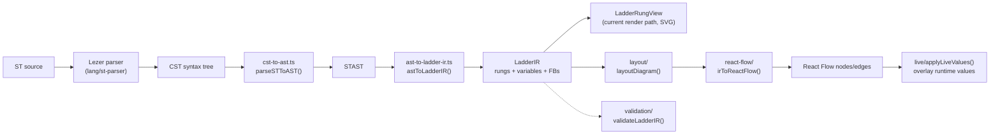

# ST -> Ladder Diagram Transformer

The frontend converts Structured Text source into a ladder diagram in real time, entirely in the browser. The whole pipeline is pure functions with no backend involvement -- it can be rerun on every editor content change. The code lives in `sema-plc-web/src/transformer/`, with `st-to-ladder.ts` as the entry point.

## Pipeline Overview



The main entry `transformSTToLadder()` (`src/transformer/st-to-ladder.ts`) chains five steps: parse -> AST -> IR -> layout -> React Flow. There is also a lightweight entry `transformSTToLadderIR()` that stops at the IR -- this is the path the current UI actually uses: `components/center/LadderCanvas.tsx` calls it to get a `LadderIR` and hands it to `LadderRungView`, which draws "rung cards" directly as SVG. layout/ and react-flow/ are the fully preserved graph rendering path; they are no longer mounted in the UI, but are continuously verified end to end via `transformSTToLadder()` by the integration test (`tests/frontend/ladder-live-integration.test.ts`). The React Flow node components under `src/ladder-nodes/` (ContactNode, CoilNode, TimerNode, CounterNode, ComparatorNode, PowerRailNode) are likewise preserved and currently have no code references.

## Step 1: ST -> AST (`transformer/ast/`)

Parsing reuses the editor's Lezer grammar (see [ST Language Support (Editor)](en/wiki/web/st-language)). `parseSTToAST()` in `cst-to-ast.ts` walks the Lezer CST with a cursor and produces a typed `STAST` (`st-ast-types.ts`):

- `programs`: `PROGRAM` / `FUNCTION` / `FUNCTION_BLOCK` declarations, with `varBlocks` and `statements`
- `topLevelStatements` / `topLevelVarBlocks`: bare statements and variable blocks outside any program block
- `typeDefinitions`: STRUCT / ENUM inside `TYPE...END_TYPE`
- `errors`: `⚠` error nodes in the CST, with source positions

Expressions are recursively reconstructed following the grammar's precedence levels (Or -> And -> Xor -> Compare -> Add -> Mul -> Unary -> Power -> Primary) into left-associative `STBinaryExpr` chains; `NOT` is kept as an `STUnaryExpr` as required by De Morgan handling. Every node carries `loc: { start, end }` for error reporting.

Whenever `ast.errors` is non-empty, `transformSTToLadder()` returns `success: false` immediately with the errors converted to line numbers, and never enters the later stages.

## Step 2: AST -> LadderIR (`transformer/ladder-ir/`)

This is the core of the conversion. Each rung of the `LadderIR` consists of an "input network + output":

```ts
// ladder-ir-types.ts
export interface LadderRungIR {
  id: string;
  index: number;
  comment?: string;
  /** Reference to the source ST statement for roundtrip */
  sourceStatement: STStatement;
  /** The input logic (contacts, comparators) */
  inputNetwork: ContactNetwork;
  /** The output (coil, timer, counter) */
  output: RungOutput;
}
```

`ContactNetwork` is a recursive structure: `series` (series, AND), `parallel` (parallel, OR), `contact` (NO/NC contact), `comparator` (comparator block), `true` (always conducting).

### Mapping Rules (Supported ST Patterns -> Ladder Elements)

| ST pattern | Ladder element | Implementation (ast-to-ladder-ir.ts) |
|---|---|---|
| `Out := expr;` | One rung: expr as input network, `Out` as a standard coil | `assignmentToRung` |
| Boolean variable `A` (incl. dotted paths like `Timer.Q`) | NO contact `[ ]` | `variableToContact` |
| `NOT A` | NC contact `[/]` (a single contact is flipped directly) | `unaryExprToNetwork` + `negateNetwork` |
| `A AND B` | Series (horizontally adjacent) | `flattenSeries` |
| `A OR B` | Parallel (vertical branches) | `flattenParallel` |
| `A XOR B` | Expanded to `(A AND NOT B) OR (NOT A AND B)` | `binaryExprToNetwork` |
| `x = / <> / < / > / <= / >= y` | Comparator block (EQ/NE/LT/GT/LE/GE) | comparison branch of `binaryExprToNetwork` |
| Arithmetic expression in boolean context | Comparator block `expr NE 0` | default branch of `binaryExprToNetwork` |
| `T1(IN := A, PT := T#5s);` (`T1 : TON/TOF/TP`) | Timer block, with the `IN` expression as the input network | `functionBlockCallToRung` |
| `C1(CU := A, PV := 10);` (`C1 : CTU/CTD/CTUD`) | Counter block, with `CU` (`CD` for CTD) as the input network | `functionBlockCallToRung` |
| `IF cond THEN statements END_IF` | The cond network is placed in series into the input of every rung in the THEN branch | `ifStatementToRungs` |
| `ELSIF cond2` | cond2 is used directly as the condition (**simplification: the negation of preceding conditions is not stacked on**) | same as above |
| `ELSE` | The IF condition negated via De Morgan is used as the condition | `negateNetwork` |
| `CASE X OF 0: ... 1..5: ...` | Each label -> an `X EQ n` comparator block; ranges -> `GE AND LE` in series; multiple labels in parallel | `caseStatementToRungs` |
| Consecutive assignments under the same condition | Merged into one rung with multiple parallel coils (`multi` output) | `mergeSharedOutputs` |

Variable collection happens in a first pass: declarations in `VAR` blocks whose type is `TON/TOF/TP/CTU/CTD/CTUD` go into `ir.functionBlocks`, everything else into `ir.variables` (with scope).

### Constructs That Cannot Be Mapped

`FOR` / `WHILE` / `REPEAT` / `RETURN` / `EXIT` cannot be expressed as a ladder diagram; `statementToRungs` returns an empty array for them (silently skipping). When `transformSTToLadder` is called with `warnOnUnsupported: true`, loop statements produce warnings with line numbers (`collectUnsupportedWarnings`). The `ELSE` branch of `CASE` is a known simplification: instead of constructing an "all labels negated" condition, the statements' rungs are emitted as-is.

### Negation: De Morgan's Laws

`negateNetwork()` is the foundation of NOT / ELSE handling: a single contact flips NO <-> NC; `NOT(A AND B)` -> `(NOT A) OR (NOT B)`; `NOT(A OR B)` -> `(NOT A) AND (NOT B)`; comparator blocks flip their operator (EQ <-> NE, GT <-> LE, GE <-> LT).

### Shared-Condition Merging

`mergeSharedOutputs()` folds adjacent coil rungs whose input networks are structurally equal (`networkEq`, comparing only logical shape, not `sourceExpr`) into a single multi-output rung -- `IF Start THEN Motor := TRUE; Lamp := TRUE; END_IF` is drawn as one rung with two parallel coils, matching real PLC editors. Only coils participate in merging; timers/counters each keep their own `inputNetwork` and are never merged. After merging, rungs are renumbered to keep `index` contiguous.

## The Role of validation/

`validateLadderIR()` in `validation/validation.ts` is an IR validator independent of the transform pipeline (it is not called inside `transformSTToLadder`), checking five classes of issues:

| Category | Level | Description |
|---|---|---|
| `orphaned_output` | error | An output has no input condition at all (input network is `true` or empty) |
| `undeclared_variable` | error | An undeclared variable is used (FB outputs `T1.Q/ET/CV/QU/QD` count as declared) |
| `always_true` | warning | A rung has no conditional logic; the output is always energized |
| `always_false` | warning | NO and NC contacts of the same variable in series (contradictory logic, simplified topology analysis) |
| `unused_variable` | warning | Declared but never used |

## Step 3: The layout/ Algorithm

`layoutDiagram()` in `layout/diagram-layout.ts` stacks the rungs vertically (`RUNG_VERTICAL_GAP = 40`) and hands each rung to `layoutRung()` in `rung-layout.ts`:

- Fixed size constants: contact/coil 80x60, timer 120x100, counter 120x120, comparator block 100x60, power rail width 30, horizontal gap 30, vertical gap 20
- Rung structure: left power rail -> input network -> output element -> right power rail, laid out left to right
- **Series**: elements are arranged along the X axis; the previous element's `lastNodeIds` are pairwise connected to the next element's `firstNodeIds`
- **Parallel**: branches are arranged along the Y axis; each branch's first/last node ids all feed into this level's `firstNodeIds`/`lastNodeIds`, and the parent level does the wiring (i.e. parallel branches merge at both left and right ends)
- A `true` network generates a 30-wide empty-variable "wire" placeholder node, so React Flow always has a connectable node
- Power rail heights are backfilled after layout with the rung's actual total height

All connection handles are uniformly `power-out` -> `power-in`, indicating the direction of power flow.

## Step 4: react-flow/ Generates Nodes and Edges

`react-flow/ir-to-react-flow.ts` is a thin format-conversion layer: `LayoutNode` -> `{ id, type, position, data }`, where `type` is taken directly from the element type (`contact` / `coil` / `timer` / `counter` / `comparator` / `powerRail`), matching the custom node components registered in `src/ladder-nodes/`; `data` keeps business fields such as `variable` / `contactType` / `presetTime` plus `rungIndex` (used by `buildDiagram` to group by rung). Every edge carries an initial `data: { powerFlow: false }`.

## live/: Live Values -> Coloring

`applyLiveValues(nodes, values)` in `live/apply-live-values.ts` overlays a runtime variable snapshot (the WS `plc:values` message, see [Realtime Channel and WS Protocol](en/wiki/web/realtime)) onto the static nodes, producing a new array with `data.live: { active, value }`. It is a pure synchronous function, designed to be rerun on every 500ms value tick:

- Name matching is **case-insensitive**: `timer.Q` in the IR matches the lowercase runtime key `timer.q`
- Contacts: `active = truthiness of the variable`, negated for NC contacts; coils: `active = truthiness of the variable`
- Timers: read `instanceName.q` (active) and `.et` (display value); counters: read `.q`/`.qu` and `.cv`
- Comparator blocks: the left operand takes its live value, the right operand is first parsed as a numeric/TRUE/FALSE literal, otherwise looked up in the value table, and the comparison is executed locally in the frontend
- Nodes not found in the value table have their `live` residue cleared -- colors naturally disappear after the PLC stops

The currently mounted `LadderRungView` (`components/center/LadderRungView.tsx`) embeds the same decision logic (`makeLookup` / `contactPasses` / `networkConducts`): a series network conducts only if all elements pass, a parallel network conducts if any branch does, and conducting paths and energized elements are rendered green when `status === 'RUNNING'`. `tests/frontend/apply-live-values.test.ts` and `ladder-live-integration.test.ts` verify with real transformer output that node naming aligns with runtime keys.

## Where It Is Used

- `LadderCanvas.tsx`: the editor's "logic" tab; inside a `useMemo` it calls `transformSTToLadderIR` on the current `stCode`. Before rendering, `stripConfigurationBlock()` strips the trailing `CONFIGURATION...END_CONFIGURATION` block required by OpenPLC (the transformer only understands pure `PROGRAM`; the compile path still sees the full source, see [Compile and Deploy Pipeline](en/wiki/tools/compile-pipeline))
- Switching to the logic tab on a non-`.st` file shows a hint instead of a parse error

For the overall page layout, see [Frontend UI Overview](en/wiki/web/frontend).
