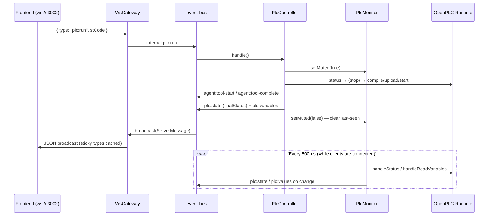

# Realtime Channel: Monitoring, Event Bus and WS Protocol

The backend's realtime pipeline consists of four modules: `event-bus.ts` (in-process bus), `plc-monitor.ts` (runtime polling), `plc-controller.ts` (manual Run/Stop/Force), and `ws-gateway.ts` (WebSocket gateway). Protocol types are centrally defined in `shared/protocol.ts`, imported by both frontend and backend.

## event-bus: In-Process Decoupling

`event-bus.ts` is a 50-line singleton `TypedBus` (internally just an `EventEmitter` with a single `'msg'` event and `setMaxListeners(50)`). All modules use `bus.emit(msg)` / `bus.on(handler)`; `on` returns an unsubscribe function. Two kinds of messages travel on the bus:

- **`ServerMessage`** (defined in protocol.ts) -- subscribed by ws-gateway and broadcast to all clients
- **`InternalMessage`** (`internal:` prefix) -- in-process commands, which the gateway does **not** send out

Full table of internal commands (`event-bus.ts:12`):

| Internal message | Sender | Consumer | Description |
|---|---|---|---|
| `internal:user-input` | ws-gateway | SemaBridge | Forwards user input to the Agent |
| `internal:agent-interrupt` | ws-gateway | SemaBridge | Interrupts the current turn |
| `internal:plc-run` / `plc-stop` / `plc-fetch-logs` / `plc-force` | ws-gateway | PlcController | Manual PLC operations |
| `internal:workspace-switch` / `session-reset` | ws-gateway | SemaBridge | Session/workspace lifecycle |
| `internal:editor-save` / `editor-open` | ws-gateway | SemaBridge | Editor file read/write |
| `internal:model-switch` / `custom-add` / `custom-delete` / `set-key` / `set-thinking` | ws-gateway | SemaBridge | Model system, see [Model System](en/wiki/web/model-system) |
| `internal:client-connected` | ws-gateway | SemaBridge | Triggers `agent:turn-snapshot` replay |

## plc-monitor: 500ms Polling + Diff + Start/Stop by Client Count

`PlcMonitor` directly imports `handleStatus` / `handleReadVariables` from `sema-plc-tools/dist` (no child process spawn), running a `tick()` every `intervalMs` (default 500ms):

1. `handleStatus` reads runtime status; `plc:state` is emitted **only if different from last time**; if unreachable, this tick returns immediately
2. Values are not read unless the status is `RUNNING`; likewise not read when `state.json` has no variableMap
3. `handleReadVariables` reads all variables; `hasChanged()` compares values key by key, and **`plc:values` is emitted only on change** -- zero traffic on the bus and WS when idle

**Start/stop by client count**: ws-gateway's connect/disconnect callbacks call `clientConnected()` / `clientDisconnected()`; polling starts when the active count goes 0->1 and stops at 1->0 -- when no page is open, the runtime is left completely undisturbed.

**setMuted muting**: while muted, both `plc:state` and `plc:values` are suppressed. On unmute, `lastStatus` / `lastValues` are cleared, guaranteeing the next tick **necessarily re-emits the current true values** (even if identical to before muting).

## plc-controller: Manual Operations and Muting

`PlcController` handles operations triggered by UI buttons (Agent-driven tool calls do not come through here; they go via MCP -> [SemaBridge](en/wiki/web/sema-bridge)'s block protocol). It reuses **the same** plc-tools implementation as the Agent: directly imports buildAndRun / compile / upload / start / stop / status / getLogs / forceVariables and `RuntimeClient` from `dist/tools/`; all handlers are injectable for testing (`tests/server/plc-controller.test.ts`).

**Run (`internal:plc-run`) flow**:

1. Create `toolId = user-<ts>` and emit `agent:tool-start` (the frontend renders manual operations as tool cards too)
2. `monitor.setMuted(true)` -- during the transition, the UI does not flash intermediate states such as INIT / ERROR / transient RUNNING
3. If currently RUNNING, **stop first, then compile** -- avoids the OpenPLC upload->start swap race (start occasionally brings up the old program); probe/stop failures do not block
4. `handleBuildAndRun({ stCode }, { compile, upload, start })` composes the three stages
5. On success: emit `plc:state` (finalStatus) + re-read `state.json` and emit `plc:variables` (aligned with the bridge's Agent path); on failure: `emitBuildFailureDetail()` sends the **full diagnostics** of each stage (matiec/gcc/start) line by line to the bottom log (iec2c errors carry line/column numbers, capped at 20 entries), instead of just a single "✗ compile"
6. `setMuted(false)` in `finally`

**Force (`internal:plc-force`)**: variable forcing for simulation interaction. The entry has a guard -- rejected when `.plc-act/running.lock` exists and its mtime is < 150s old (the verify runner is running, preventing user clicks and the runner's workload from overwriting each other; stale locks do not block). After execution (success or not), `setMuted(false)` clears last-seen, prompting the monitor to immediately re-emit values on the next tick.

**Stop** follows the same pattern (tool card + muting); **fetchLogs** emits neither a tool card nor mutes; logs are sent line by line as `log` (source=`runtime`), and runtime errors parsed out by `getLogs` (watchdog / scan_overrun / segfault...) are sent in structured form as `plc:runtime-error`.

## ws-gateway: JSON-over-WS and Sticky Replay

`WsGateway` starts a `WebSocketServer` on `127.0.0.1:3002` (default); messages are protocol types serialized as JSON text. Two directions:

- **Downstream**: subscribes to the bus, filters out `internal:*`, and broadcasts `ServerMessage` to all OPEN clients
- **Upstream**: parses `ClientMessage` and translates each type into an `internal:*` command back onto the bus (parse failures get an `error` reply). `plc:read` / `permission:response` are P2 placeholders, currently ignored

**STICKY_TYPES cached replay**: state-class messages are cached one-per-type (the last one); when a new client connects, they are replayed one by one first, so a late-joining tab gets the full current state without waiting for the next event:

| Sticky type | State carried |
|---|---|
| `workspace:ready` | Workspace path + sessionId |
| `plc:state` | PLC runtime status |
| `plc:variables` | Variable table (compile artifact) |
| `plc:values` | Most recent variable values |
| `editor:files` | Project file list |
| `editor:open` | Currently open file and its content |
| `agent:state` | idle / processing |
| `agent:todos` | Current turn's plan |
| `agent:usage` | Context usage (useTokens/maxTokens) |
| `scene:ready` | Process simulation scene |
| `model:config` | Model configuration state |

When `workspace:switching` arrives, **the entire sticky cache is cleared** (repopulated by the hydration messages after the switch completes). Chat blocks never enter sticky -- after replay the gateway emits `internal:client-connected`, and the bridge broadcasts `agent:turn-snapshot` to fill in the in-progress turn (see [SemaBridge](en/wiki/web/sema-bridge)).

## shared/protocol.ts: Message Type Reference

### Client → Server

| Message | Payload highlights |
|---|---|
| `user:input` | `text` -- chat input |
| `agent:interrupt` | Interrupts the current turn |
| `plc:run` | `stCode` -- manually run the editor content |
| `plc:stop` | -- |
| `plc:force` | `set?: Record<name, value>`, `release?: string[]` |
| `plc:fetch-logs` | `lines?` |
| `plc:read` | P2 placeholder |
| `editor:open` | `path` -- switch the open file |
| `editor:save` | `path?`, `stCode` |
| `workspace:switch` | `path` |
| `session:reset` | -- |
| `model:switch` | `key` (registry key or `custom:*`) |
| `model:custom-add` | `baseURL`, `apiKey`, `modelName`, `adapt` |
| `model:custom-delete` | `id` |
| `model:set-key` | `key`, `apiKey`, `force?` (skip the probe) |
| `model:set-thinking` | `enabled` -- lossless runtime switch |
| `permission:response` | P2 placeholder |

### Server → Client

| Message | Payload highlights | Sticky |
|---|---|---|
| `workspace:ready` / `workspace:switching` / `workspace:error` | Path + sessionId / -- / message | ready is |
| `editor:files` / `editor:open` / `editor:saved` | File list (path+mtime) / path+content / save confirmation | First two are |
| `agent:user-input-received` | Echoes user input | No |
| `agent:state` | `idle` / `processing` | Yes |
| `agent:turn-start` / `block-start` / `block-delta` / `block-end` / `turn-end` | Block protocol: turnId, blockId, kind (thinking/text/tool), delta, result | No |
| `agent:turn-snapshot` | `SerializedTurn \| null` -- replayed on connect | No |
| `agent:tool-start` / `agent:tool-complete` | For manual Run/Stop/Force **only**; Agent tools use the block protocol | No |
| `agent:todos` | `TodoItem[]` (current turn, watermark-filtered) | Yes |
| `agent:usage` | `useTokens` / `maxTokens` -- context usage | Yes |
| `plc:state` | `EMPTY \| INIT \| RUNNING \| STOPPED \| ERROR` | Yes |
| `plc:variables` | `VariableEntry[]` (index/name/type/location) | Yes |
| `plc:values` | `Record<name, VariableValue>` | Yes |
| `plc:runtime-error` | Structured runtime error (type/message/advice) | No |
| `plc:force-result` | forced / released / failed / error | No |
| `scene:ready` | `SceneSpec` + validation errors/warnings | Yes |
| `model:config` | `ModelConfigState` (selected/active/options/thinking) | Yes |
| `model:key-result` | Key-entry probe result; failures carry message + curl | No |
| `log` | source (iec2c/gcc/runtime/tool/agent/system) + level + ts | No |
| `error` | message | No |
| `permission:request` | P2 placeholder | No |
