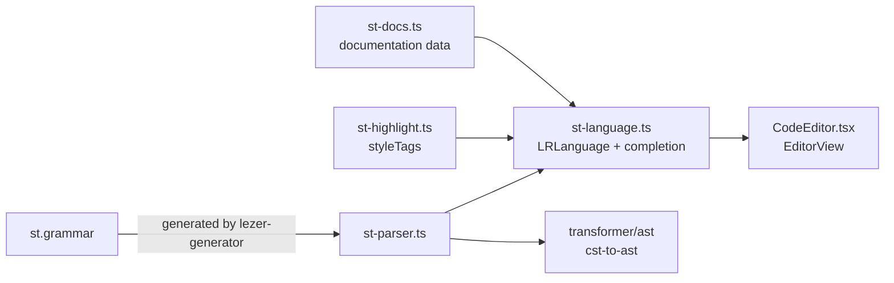
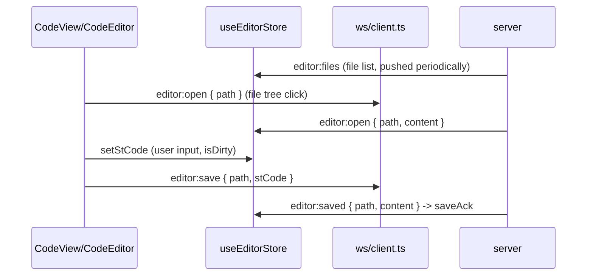

# ST Language Support (Editor)

The frontend uses CodeMirror 6 plus a home-grown Lezer grammar to provide a full editing experience for IEC 61131-3 Structured Text: syntax highlighting, indentation, folding, auto-completion, and inline documentation. All the code lives in `sema-plc-web/src/lang/`, and the same parser is shared by the editor and the [ST -> Ladder Diagram Transformer](en/wiki/web/ladder-transformer) -- what the highlighter sees is exactly what the transformer parses.



## Lezer Grammar: The Subset Covered by st.grammar

`src/lang/st.grammar` is a hand-written Lezer grammar (its file header describes itself as "Simplified grammar to avoid token conflicts"); `st-parser.ts` is the output of `lezer-generator` (do not edit by hand). Coverage:

| Category | Covered content |
|---|---|
| Top-level declarations | `PROGRAM` / `FUNCTION` (with return type) / `FUNCTION_BLOCK` / `TYPE...END_TYPE` (STRUCT, ENUM); bare statements and bare `VAR` blocks are also allowed |
| Variable blocks | `VAR / VAR_INPUT / VAR_OUTPUT / VAR_IN_OUT / VAR_TEMP / VAR_GLOBAL / VAR_EXTERNAL`, qualifiers `CONSTANT / RETAIN`, `AT %IX0.0` direct addresses, initial values, multiple variables per line |
| Types | `BOOL INT SINT DINT LINT UINT USINT UDINT ULINT REAL LREAL TIME DATE TIME_OF_DAY DATE_AND_TIME STRING BYTE WORD DWORD LWORD`, FB types `TON TOF TP CTU CTD CTUD`, custom identifier types, `ARRAY[a..b, c..d] OF T` multi-dimensional arrays |
| Statements | Assignment `:=`, `IF/ELSIF/ELSE`, `CASE` (single-value and `a..b` range labels), `FOR..TO..BY..DO`, `WHILE`, `REPEAT..UNTIL`, FB calls `T1(IN := x, PT := y)`, `RETURN / EXIT / CONTINUE` |
| Expressions | Precedence chain `OR -> AND -> XOR -> comparison -> add/sub -> mul/div MOD -> unary NOT/- -> ** -> primary`; dotted paths `Timer.Q`, array subscripts `arr[i, j]`, function calls, parentheses |
| Literals | Decimal/fractional, `16#FF`, `2#1010_0101`, `TRUE/FALSE`, single- and double-quoted strings, `T#5s`, `D#2024-01-15`, `TOD#14:30:00`, `DT#...`, qualified enum values `TrafficLight#Yellow` |
| Comments | `// line comments` and `(* block comments *)` |

Key implementation details: keywords are specialized from identifiers via `kw<term> { @specialize<Identifier, term> }` (ST keywords do not conflict with identifiers); token precedence is declared explicitly (time/date literals > hex/binary > booleans > direct addresses > numbers > identifiers) to prevent `T#5s` or `16#FF` from being split apart. The grammar does **not** include the `CONFIGURATION` block -- which is why the ladder diagram path strips it before parsing (`stripConfigurationBlock` in `lang/st-source.ts`, called by `LadderCanvas`).

## CodeMirror Integration: st-language.ts + st-highlight.ts

`st-language.ts` attaches three groups of metadata to the generated parser via `parser.configure({ props })` and wraps it as an `LRLanguage`:

- **Highlighting** (`st-highlight.ts`): `styleTags` maps CST nodes to standard `@lezer/highlight` tags -- control-flow keywords -> `controlKeyword`, declaration keywords -> `definitionKeyword`, types and FB types -> `typeName`, `AND/OR/XOR/NOT/MOD` -> `logicOperator`, and `DirectAddress` (`%IX0.0`) gets `attributeName` on its own so IO points can be marked in red. The actual colors in `stHighlightStyle` in `components/center/cmSetup.ts` all reference CSS variables (`--tk-*`), so switching themes does not require rebuilding the EditorView
- **Indentation**: `indentNodeProp` adds one level of indentation for block nodes such as `ProgramDecl / VarBlock / IfStatement / CaseStatement / For / While / Repeat`
- **Folding**: `foldNodeProp.add({ ... foldInside })` makes ProgramDecl / FunctionBlockDecl / VarBlock / If / Case / For / While / Repeat blocks foldable (not including the extra ELSIF / ELSE / CaseClause clauses covered by the indentation rules)
- **languageData**: comment tokens (`//` and `(* *)`) and auto-closing brackets

Auto-completion uses `completeFromList`, with a static list in two categories:

1. **Keywords/types/constants** (about 50 entries): `createCompletion()` looks up `st-docs.ts`; on a hit it attaches an `info` callback that renders a detailed documentation panel;
2. **Code snippets**: `IF-THEN-END_IF`, `CASE-OF-END_CASE`, `FOR-DO-END_FOR`, `VAR-END_VAR`, `TON-timer` (`${TimerName}(IN := ${condition}, PT := T#${5}s);`), `CTU-counter`, etc., with placeholders inside `apply`.

Only one factory is exported:

```ts
export function structuredText(): LanguageSupport {
  return new LanguageSupport(stLanguage, [stCompletions]);
}
```

When `components/center/CodeEditor.tsx` mounts the EditorView, it assembles the language extension through a `Compartment`: YAML/JSON/TOML files do not enable `structuredText()` (they are plain text in the editor; code-block highlighting in the chat stream is handled by the lightweight line highlighter in `lib/codeHighlight`), while all other extensions (including `.st`, as well as unknown extensions that `CodeView.langOf` falls back to classifying) are treated as ST.

## Inline Documentation: st-docs.ts

`st-docs.ts` is a pure data module with three tables:

| Table | Content | Example entries |
|---|---|---|
| `FUNCTION_BLOCK_DOCS` | Timers TON/TOF/TP, counters CTU/CTD/CTUD, edge detectors R_TRIG/F_TRIG, bistables SR/RS | Signature, parameter table (IN/PT...), output table (Q/ET...), runnable example, seeAlso |
| `DATA_TYPE_DOCS` | BOOL/INT/DINT/UINT/REAL/TIME/STRING | Description + value range + declaration example |
| `KEYWORD_DOCS` | Control-flow keywords such as IF/CASE/FOR | Signature + example |

`getSTDocumentation(symbol)` looks up the three tables in order after `toUpperCase()`; `formatDocumentationText()` produces plain text for the completion info panel, and `formatDocumentationHTML()` produces an HTML version (all content passes through `escapeHTML`; it currently has no consumer inside the editor).

The trigger dictionary is static: it only covers built-in FBs, types, and keywords, with no semantic lookup of user variables. Earlier versions shipped a hover tooltip (`hoverTooltip`) provided by `st-hover.ts`; that file was removed in the language-service refactor, so the documentation data is currently surfaced only through the completion info panel.

## Editor and File Tree / Backend File Sync

Editor state is held by `store/editor.ts` (zustand), and file content is synchronized with the backend over WS (protocol in [Realtime Channel and WS Protocol](en/wiki/web/realtime)):



Key design points (each documented with comments in `store/editor.ts`):

- **Display decoupled from run**: `currentPath/stCode` is "the file currently displayed", while `stProgram/stProgramPath` is "the .st program to run". Opening a non-ST file such as `plan.json` or `scene.json` changes only the former; the Run button always points to the most recent real `.st` program.
- **Three-way branching for `editor:open`** (the backend re-pushes the current file every second): path changed -> switch wholesale; same path but a local draft exists (`isDirty`) -> only record `onDiskUpdate`, do not overwrite user input; not dirty and content unchanged -> no-op, avoiding resetting the editor cursor every second.
- **`diskChanged` is a sticky flag**: it means "the disk has changed relative to the last known disk content" (usually the Agent modified the file), and stays set until the user clicks Refresh (`refresh`, discarding the draft in favor of the disk version) or a save succeeds. `CodeView` combines `isDirty`/`diskChanged` into the revision status cell on the tab (draft / disk changed / conflict).
- **Late save acknowledgements**: `saveAck` verifies `path === currentPath`; acknowledgements for a file the user has already navigated away from are simply dropped.
- **External changes do not feed back**: `CodeEditor.tsx` uses a CodeMirror `Annotation` (`EXTERNAL`) to mark programmatic setValue, and `updateListener` calls `onChange` only for user transactions, preventing disk applies/file switches from triggering a spurious `isDirty`.
- **Workspace switching**: on `workspace:switching` the store performs a wholesale `clear()`.

The file tree (`buildTree` in `CodeView.tsx`) is built from the flat path list in `editor:files`, with directories first, sorted by name; heuristic regexes tag generated files (`globals/`, `gvl_`, `glue`, `.merged.` -> ⚙) and single-source-of-truth files (`io_map` -> ★). When the Agent opens a file, its ancestor directories are automatically expanded. The Check button goes over HTTP `POST /api/check` for a rusty syntax check (the same backend capability as [Syntax Check and IO Detection](en/wiki/tools/check-and-io)), with results written into `store/logs`.

Related pages: [Frontend UI Overview](en/wiki/web/frontend) · [ST -> Ladder Diagram Transformer](en/wiki/web/ladder-transformer)
