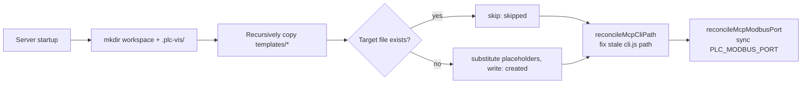

# Workspace and Skills

The Agent does not work inside the repository, but in a separate **workspace directory** (default `~/plc-workspace`, or `/tmp/plc-ver-ws` under `dev.sh`; set with `--workspace` or `$WORKSPACE`). At startup the backend seeds `sema-plc-web/templates/` into the workspace — AGENTS.md, the MCP configuration, and 4 skills together form the Agent's "factory knowledge". This page covers the seeding mechanism and what each part of that knowledge contains.

## Seeding Logic (workspace-setup.ts)

Source: `sema-plc-web/server/workspace-setup.ts`.



Key points:

- **Idempotent + never overwrite**: `setupWorkspaceIfNeeded()` copies file by file and always skips files that already exist (the return value distinguishes `created` / `skipped`). As a consequence, **an old workspace never picks up new files after a template update** — for acceptance or re-testing, use a fresh `WORKSPACE`, or call `cleanWorkspace()` to wipe and re-seed.
- **Placeholder substitution** (`substituteTokens()`): on write, `__WORKSPACE__` is replaced with the workspace's absolute path and `__PLC_TOOLS_CLI__` with the absolute path of `sema-plc-tools/dist/cli.js` (resolved per the sibling-directory repo layout, overridable with the `PLC_TOOLS_DIST` environment variable). On resolution failure, the placeholder is **kept** and an error is logged, rather than injecting an empty string and producing broken commands like `node  verify`.
- **Two self-healing hooks** (run on every startup, targeting `.sema/.mcp.json` only):
  - `reconcileMcpCliPath()` — in an old workspace, `args[0]` may point to a cli.js that has since moved (MCP spawn fails with MODULE_NOT_FOUND); at startup it is corrected to the current template's real path; an unresolved/nonexistent path is never used to overwrite.
  - `reconcileMcpModbusPort()` — syncs the server process's `PLC_MODBUS_PORT` environment variable into the MCP env block (when sema-core launches plc-tools it passes **only** this env, without inheriting the parent process environment); if unset, the key is removed.

Workspace structure after seeding (the convention is documented in `templates/AGENTS.md` under the workspace directory structure section):

```
<workspace>/
├── AGENTS.md               # Agent project manual (in context every turn)
├── plan.json               # verify cases (written by the Agent at runtime)
├── src/programs/*.st       # ST program sources (written by the Agent at runtime)
├── config/
│   ├── io_map.yaml         # pin-semantics hint layer (seed)
│   └── scene.json          # process-simulation Scene (written by plc_buildSimulation, do not edit by hand)
├── .plc-vis/               # plc-tools state cache (state.json)
├── .plc-act/               # verify runner artifacts (runs/force ledger)
└── .sema/
    ├── .mcp.json           # MCP configuration (seed, with placeholder substitution)
    └── skills/             # 4 PLC skills (seed)
```

Dot directories such as `.sema` and `.plc-vis` are excluded from the frontend file tree (skipped by `walk()` in `workspace-setup.ts`); the file tree only shows `.st/.yaml/.yml/.json/.toml` project files.

## AGENTS.md: Key Conventions for the Agent

`templates/AGENTS.md` is the "project manual" the Agent has in context every turn. Its core conventions, distilled:

| Convention | Content |
|---|---|
| Two-channel workflow | **Channel A (default)**: for any write/modify/verify, always "write ST + write plan.json + run `node <cli> verify plan.json`", reading conclusions only from the JSON envelope on stdout; **Channel B**: only 6 observational MCP tools may be called directly (`plc_status` / `plc_readVariables` / `plc_getLogs` / `plc_detectIO` / `plc_stop` / `plc_buildSimulation`); the other compile/run/force tools are removed |
| Load skills up front | For verification tasks, first `skill plc-build-and-verify`; for complex requirements (many mutual exclusions / long state machines), first `skill plc-spec-review`; on `stage=compile`, first `skill plc-fix-compile-error`; before writing a scene, first `skill plc-build-simulation` |
| Logic self-check gate | Before the first verify, walk through the four questions — coverage / boundaries / mutual-exclusion priority / timing; a verify takes about 20s, so catching one logic error in the pre-check saves a whole iteration round |
| Failure-branch table | Route handling by the envelope's `failure.stage`: `compile` → fix the ST (≤3 rounds), `caseSetup` → check the plan drivers, **do not change the program**, `assert` → first look at `stateTrace` to triage "program bug vs case bug", `plan` with the same error twice unresolved → stop and report |
| Version binding | After the ST is changed, all earlier envelopes are void (the `stHash` changed); the deliverable must cite the `stHash + summary` of the last `ok:true` envelope |
| ST syntax constraints | Must have `PROGRAM + CONFIGURATION`; block terminators such as `END_IF` **must carry a semicolon**; `AT` located variables get **their own exclusive VAR section** (mixing with FB instances/plain variables raises `invalid located variable declaration`); BOOL bit addresses must include the dot (`%IX0.0`); strict type matching requires explicit conversion |
| Scan-cycle model | A TON's Q stays TRUE (it is not a single-cycle pulse); edge-triggered actions must pair with `R_TRIG`; `timer(IN := NOT timer.Q)` is a correct self-oscillator, not a bug |
| Simulated inputs | In the simulation environment `%IX`/`%IW` are always 0; a program that depends on inputs **must drive them in the plan**; only located elementary variables can be forced — FB-internal variables cannot go into `set` but can be asserted |
| Timing-verification discipline | For cyclic logic, check the "shape" (cycle/changed/range/settle) instead of guessing exact ticks with sleep + single reads; `--only` re-runs only failed cases to speed up, then run the full suite once before delivery to seal it |
| Task pacing | Start working on a task directly without stopping to ask (take reasonable defaults for missing parameters and note them); use `create_todo` to build a stage-level plan that drives the frontend plan card |

## The 4 Skills

Skills are structured workflows loaded on demand (`skill <name>` pulls in the body; deep-dive materials come along via the base path). AGENTS.md is the always-resident skeleton cheat sheet; skills are the full recipes.

### plc-build-and-verify (the core main flow)

Path: `templates/.sema/skills/plc-build-and-verify/SKILL.md`. Trigger: load at the start of any task that writes/modifies/verifies a PLC program. The flow it teaches:

1. **Check the pattern library first**: for complex topologies, first `view_file` the matching `./st-patterns/*.st` skeleton and adapt it — do not hand-write from scratch (see table below).
2. **Two data files + one command**: write the ST to `src/programs/<name>.st`, write `plan.json` to the workspace root, and `run_shell` `node <cli> verify plan.json` — the three calls have no dependencies, send them in one round; the runner self-limits to 100s, do not pass a timeout.
3. **5-line self-check before writing the plan**: extract the contract → coverage (every `%Q` output has a driving source, catching "dead outputs") → boundaries (`<` vs `<=`, CASE with ELSE) → mutual exclusion / priority → cycle semantics.
4. **Case design discipline**: design only 1-3 representative cases based on the requirement prose; inputs must be driven in `set`; for shift registers verify "persistent consequences" instead of chasing pulses through; check timing by shape, not exact counts; always add a `changed` case for continuous quantities to guard against dead values; add `resetBefore` for state-dependent cases.
5. **Budget and stop-loss**: total budget 100s, about 3 verify re-run rounds max; milestone priority is "compiles → renders (`plc_buildSimulation`) → only then exhaustive behavior verification", to avoid grinding on verification and failing to deliver the simulation.

Two deep-dive materials come with it:

- **`plan-schema.md`** — the single authoritative contract for plan.json: top-level `program`/`options` (perCaseBudgetMs/stopAfter/failFast/skipBuild)/`cases`; four case types (`steady` force + assert final state, `trace` sample over time and assert shape, `record` per-scan waveform capture, `sequence` multi-step timing); four `expectShape` kinds (`cycle`/`range`/`settle`/`changed`); how to read the envelope (`ok`/`summary`/`stHash`/the 10 values of `failure.stage`/`stateTrace`); plus a table of frequent mistakes (❌→✅). It is one end of the same contract as the [Declarative Verify Runner](en/wiki/tools/verify-runner).
- **`st-patterns/`** — 6 verified-to-compile skeletons ready for adaptation:

| Pattern file | Control problem it solves |
|---|---|
| `latch_priority.st` | Input-driven latch + priority override (motor/valve start-stop): a one-line RS latch `motor := (start OR motor) AND NOT stop AND NOT estop`; the e-stop at the end of the AND chain is naturally highest priority |
| `edge_counter.st` | R_TRIG edge counting + lower-bound clamp + threshold-compare output (parking lot / production-line counting / batches) |
| `bangbang_plant.st` | Two-position (bang-bang) hysteresis control + self-driven plant (tank level / temperature control): open below LOW, close above HIGH, hold in between |
| `state_machine_timed.st` | N-state machine + TON timers (traffic light / sequential actions): 1Hz self-oscillating beat + a derived countdown quantity; cycles automatically once deployed |
| `pid_level_with_plant.st` | Continuous-quantity closed loop + **internal self-driven plant** (level/temperature PID): the feedback quantity must be a program-driven output, not a `%IW` input, or the simulation renders a dead picture |
| `conveyor_shift_register.st` | Conveyor workpiece tracking + shift-register sorting (the hardest): self-driven workpiece-position quantity + the "verify persistent consequences" verification discipline |

### plc-fix-compile-error (compile-error repair)

Trigger: the verify envelope reports `failure.stage = compile / gcc / start`. The flow it teaches is a decision tree:

- **compile**: first check for a "dead output" (error at `line:0` with `advice` = a `%Q` was declared but never assigned); otherwise take `failure.detail.errors[]` sorted by line ascending and **fix only the first one** (the rest are usually cascading errors), using the envelope's own `sourceLine` against a message → fix table (missing semicolon / AT section mixing / type conversion / `ELSE IF` → `ELSIF` / FB outputs use `=>`, etc.); `patch_file` a single spot and re-run immediately.
- **gcc**: fix at the source first (infer the ST fix from the C error); if that fails, simplify in order (drop custom FBs → drop bit operations → drop ARRAY/STRUCT → keep only basic structure).
- **start**: call `plc_getLogs`, read `runtimeErrors[].advice`, and fix the logic.
- **Hard cap of 3 rounds** (round count = number of envelopes in the conversation, not by feel); over the limit, report stuck and request human intervention; `caseSetup`/`assert` are not compile errors and do not belong to this skill.

### plc-spec-review (requirement spec review)

Trigger: after implementing/modifying complex logic and **before** writing out the final ST (routine tasks use the 5-line self-check inlined in plc-build-and-verify; only complex requirements — many mutually exclusive conditions / long state machines / multiple priority preemptions — go through the full pass). The core is an 8-part self-check list, answering "pass / revised" item by item:

1. Extract the contract (all inputs/outputs/branches/thresholds); 2. Coverage (every input is used, every `%Q` output has a driving source — catching "dead outputs"); 3. Boundary discipline (`<` vs `≤`, which side equality belongs to, "otherwise" covers all remaining ranges, CASE always has ELSE); 4. Global invariants (mutual exclusion / one-hot, e-stop is checked first and overrides everything after); 5. Behavior-model fidelity (no unrequested latches/state machines, outputs really assigned to `%Q` located variables); 6. Cycle/timing semantics (cross-cycle memory has reset conditions, per-cycle recomputed values are explicitly initialized at the top of the body — the highest-frequency defect zone); 7. Engineering conventions (non-blocking suggestions); 8. Only write out the final file after everything passes.

Explicitly forbidden: guessing hidden test assertions to pass the checklist (treated as cheating in benchmark scenarios), or using the self-check as a pretext for out-of-scope enhancements.

### plc-build-simulation (process-simulation building)

Trigger: producing a visualization after the program passes verify (`plc_buildSimulation` has a **version gate**: unverified, or ST changed without re-verification, is rejected; `allowUnverified:true` only when the user explicitly asks). The flow it teaches:

1. `plc_detectIO` to sync the variable fingerprint → 2. **Physical-topology judgment** (what is the main axis, which station each attachment anchors to; anything with spatial relations always gets a `custom` full drawing — scattering library parts is the exception that needs justification) → 3. Safety-signal coverage check (estop/alarm must not be "invisible" in the picture) → 4. Assemble the Scene Spec from the 13 library components (lamp/tank/conveyor/slider/stack-light...) + the effect system (fill/text/translateX/rotate/class...) → 5. `plc_buildSimulation` validates and generates; on `ok:false`, fix per `errors[]` until `ok:true` (on repeated failure, degrade per the escape clause to a library-component dashboard; **writing `config/scene.json` directly to bypass validation is strictly forbidden**) → 6. Wrap up with concrete instructions: "click/drag what = see what".

Two key design disciplines: **continuous process quantities (level / workpiece position) must be built as self-driven quantities in the ST** (`%QW` self-increment/saturation), and the simulation binds to the self-driven quantity, not an undriven `%IX` input; **auto-cycling demos must derive internal in-position booleans from the self-driven quantities** to gate the sequential logic, or the sequence stays stuck on step one forever. See [Process Simulation and Scene Spec](en/wiki/tools/simulation) for details.

## config/io_map.yaml: Pin-Semantics Hint Layer

The seed file itself is a commented empty template (`templates/config/io_map.yaml`): key = the symbol name declared with `AT %...` in the ST, value = `{ component, label? }`, where component is one of `lamp / sensor-button / valve / cylinder / motor / conveyor / tank / numeric-display`. Its purpose is to **bias** component selection before simulation parts are chosen — the `plc_buildSimulation` server merges it as a fallback, and the final binding is still governed by the Scene Spec. Optional and hand-writable; `plc_detectIO` does not read it (its result carries no `component`).

## .sema/.mcp.json: MCP Wiring

`templates/.sema/.mcp.json` defines the single MCP server `plc-tools`: stdio transport, command `node __PLC_TOOLS_CLI__ serve --lite`. `--lite` exposes only Channel B's 6 observational tools — compile/run/force are all folded into the verify runner as the single entry point (design rationale in the [MCP Tool Reference](en/wiki/tools/mcp-tools)). The env block (the only env sema-core passes when launching plc-tools):

```json
"env": {
  "PLC_URL": "https://localhost:8443",
  "PLC_CONTAINER": "openplc-plc-dev",
  "PLC_USER": "admin",
  "PLC_PASSWORD": "admin123",
  "PLC_STATE_FILE": "__WORKSPACE__/.plc-vis/state.json",
  "PLC_SCENE_FILE": "__WORKSPACE__/config/scene.json",
  "PLC_IO_MAP_FILE": "__WORKSPACE__/config/io_map.yaml",
  "PLC_WORKSPACE": "__WORKSPACE__"
}
```

(`admin/admin123` are the public default credentials of the [OpenPLC Runtime Environment](en/wiki/tools/runtime).) The two placeholders are substituted at seeding time; on every subsequent startup, the two self-healing hooks `reconcileMcpCliPath` / `reconcileMcpModbusPort` maintain this file (see the seeding logic above).

## File Sync

The backend sema-bridge watches the workspace's `.st` files with `fs.watch` (polling fallback) and pushes changes to the frontend editor in real time; ST code the Agent builds inline is also mirrored to `src/programs/_running.st` for UI display. See [SemaBridge: Embedded Agent Integration](en/wiki/web/sema-bridge) for details.
