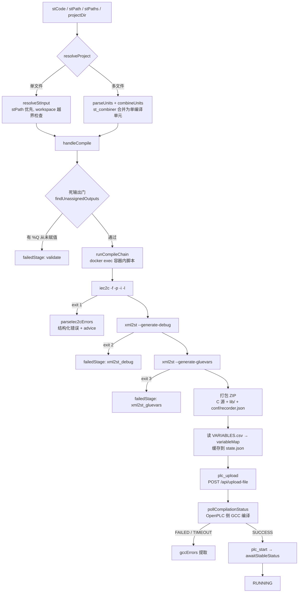

# 编译与部署管线

本页讲 `sema-plc-tools` 从 ST 源码到 OpenPLC 运行程序的完整链路:输入解析(单文件/多文件合并)→ 容器内 matiec 编译 → ZIP 打包 → 上传 GCC 编译 → 启动。工具入口见 [MCP 工具参考](wiki/tools/mcp-tools),运行时环境见 [OpenPLC 运行时环境](wiki/tools/runtime)。



## ST 输入解析:三层职责

| 模块 | 文件 | 职责 |
|---|---|---|
| `resolveStInput` | `src/tools/resolveStInput.ts` | 单文件:从 `stCode`(内联)或 `stPath`(文件)取源码,**stPath 优先**;相对路径以 `PLC_WORKSPACE` 为根,设了 workspace 时解析后的绝对路径必须留在其内(拦截 `../../` 逃逸) |
| `resolveProject` | `src/tools/resolveProject.ts` | 统一入口:`stPaths` 非空或 `projectDir` 非空即走多文件分支,否则退回 `resolveStInput`;`projectDir` 只取单层 `*.st` 按字母序,`stPaths` 按给定顺序;逐文件做 UTF-8 校验(重编码字节数不等即拒绝);所有失败走 `error` 字段,从不 throw |
| `stCombiner` | `src/tools/stCombiner.ts` | 纯函数(无 fs/docker):把多个文件的 POU 单元合并为一个编译单元 |

`plc_compile` / `plc_buildAndRun` / `plc_detectIO` / `plc_buildSimulation` 在 `src/server.ts` 里都经 `resolveProject`;`plc_check` 只走单文件的 `resolveStInput`。

### stCombiner 的合并策略

`parseUnits` 先用 `stripComments` 把注释(`(* *)`、`//`)和字符串字面量**等长置空**(保留字节数与换行),在掩码文本上定位 `TYPE / FUNCTION / FUNCTION_BLOCK / PROGRAM / CONFIGURATION` 的边界——注释里的假关键字不会误触发——再从原文切出 POU 原文。开块关键字找不到匹配的 `END_*` 时 fail-safe:该文件贡献 0 个单元并记录错误,调用方视为"不可合并"。

`combineUnits` 按 `TYPE → FUNCTION → FUNCTION_BLOCK → PROGRAM → CONFIGURATION` 分层拼接(matiec 是多遍编译,顺序不承重,分层只为可读性,源码注释标注 SPIKE-1),并强制**恰好一个 CONFIGURATION、恰好一个 PROGRAM**——多 PROGRAM 会在 `normalizeCsv` 的短名截取中互相碰撞、静默误读(SPIKE-2)。每个单元前插一行 `(* SOURCE: path *)` 锚点,同时记录 `spans`(合并行号 → 源文件 + 本地行号的映射)。

错误回溯:matiec 报的是合并后行号,`server.ts` 的 `applyErrorTraceback` 用 `translateErrorLine(e.line, spans)` 把每条错误**加性地**补上 `sourceFile` / `localLine` 两个字段(见 `src/types.ts` 的 `Iec2cError`),合并行号原样保留。

## compile 完整流程

入口 `handleCompile`(`src/tools/compile.ts`),分四步:

**1. 死输出语义门(先于 matiec)。** `findUnassignedOutputs`(`src/tools/detectIO.ts`)找出声明了 `AT %Q*` 但程序体里找不到任何 `<名> :=` 的输出——matiec 能编译过,但执行器运行时永远停在初值。命中即直接返回 `failedStage: 'validate'`,不进编译器。判定极保守:任意分支里出现一次左值赋值就放行,只标记**零次赋值**,把误报压到接近零。

**2. 容器内编译链。** `runCompileChain`(`src/compiler.ts`)把 ST 源和一段 bash 脚本 `docker cp` 进容器执行(30 s 超时,防容器卡死拖垮整个 buildAndRun)。脚本各阶段与退出码:

| 阶段 | 命令 | 失败退出码 → failedStage | 产物 |
|---|---|---|---|
| matiec | `iec2c -f -p -i -l program.st` | 1 → `iec2c` | `Config0.c/h`、`Res0.c`、`POUS.c/h`、`LOCATED_VARIABLES.h`、`VARIABLES.csv`(缺任一也算失败) |
| 调试桩 | `xml2st --generate-debug program.st VARIABLES.csv` | 2 → `xml2st_debug` | `debug.c`(变量在线读写的调试通道) |
| 胶水层 | `xml2st --generate-gluevars LOCATED_VARIABLES.h` | 3 → `xml2st_gluevars` | `glueVars.c`(定位变量 ↔ Modbus 缓冲区绑定) |
| 打包 | `zip -r` | — | `/tmp/plc_compile_XXXXXX/plc_program_<ts>.zip` |

ZIP 里还塞了两类"非编译产物":占位的 `c_blocks_code.cpp` / `c_blocks.h` 桩,以及 `conf/recorder.json`(内容 `{}`)。后者是关键:OpenPLC 每次上传都跑 `update_plugin_configurations()`,扫描 `conf/*.json` 的文件名 stem 与插件名匹配,**没有对应 json 的插件会被禁用**——不带 `conf/recorder.json` 的 ZIP 会在上传时静默关掉飞行记录仪插件(`plc_record` 依赖它)。stdout 只回显 ZIP 路径;matiec 的 warning 走 stderr,成功时也会被解析进 `iec2c.warnings`。

**3. 变量表归一化。** matiec 的 `VARIABLES.csv` 是分号分隔的层级格式(`index;kind;fullpath;fullpath;type;nativeType;debug_idx;`)。`normalizeCsv` 做三件事:跳过 `FB` 行(程序实例不进 `debug.c` 的 `debug_vars[]` 数组)、**从 0 重排 debug 索引**使其与调试协议对齐、把 `CONFIG0.RES0.INST0.` 前缀之后的段用 `.` 连接并转小写作为短名——程序级变量得到 `hb_out`,FB 输出保留实例前缀得到 `timer1.q`(避免多个 TON 的 `.Q` 互撞)。之后 `buildAtLocationMap` 用正则从 ST 源码回填 CSV 里缺失的 `AT` 地址。

**4. 状态缓存。** 成功后把 `{ timestamp, stCode, zipPath, variableMap }` 写进 `~/.plc-tools/state.json` 的 `lastCompile`——`plc_upload` 和 `plc_readVariables` 都从这里取,所以 upload 不需要任何参数。另:设置 `PLC_MODBUS_PORT` 时,compile 会把 `conf/modbus_slave.json` 追加进 ZIP(见 [语法检查与 IO 检测](wiki/tools/check-and-io) 的 Modbus 一节)。

## iec2c 错误的结构化解析

`parseIec2cErrors`(`src/compiler.ts`)用一条正则同时接受 matiec 的两种诊断格式(`file:行-列..行-列:` 与旧式 `file:行:列-行:列:`):

```ts
const pattern = /^\S+:(\d+)[-:](\d+)(?:\.\.|-)(\d+)[-:](\d+):\s+(error|warning):\s+(.+)$/gm
```

每条错误带上 `line` / `col` / `endLine` / `endCol`(闭区间末端,供诊断波浪线盖住整个 token)/ `severity` / `message`,并从传入的 ST 源码按行号取出 `sourceLine`——agent 修错时不必自己再对行号。随后 `adviceForIec2cError`(`src/tools/iec2cErrorParser.ts`)按模式表匹配 message,命中则附加 `advice`。模式表来自 325 个 benchmark 会话的实证统计,头部两类:

| matiec 报错 | advice 要点 |
|---|---|
| `';' missing at the end of statement` | #1 高频错。matiec 要求块终结符也带分号(`END_IF;`);报错落在终结符**本行**,而 agent 常误改上一行——advice 会检查 `sourceLine` 是否正是裸 `END_IF` 等终结符,给出针对性提示 |
| `invalid variable(s) declaration` 族 | 最不透明的一族:变量名撞 matiec 内部保留标识符,或 AT 定位变量与普通变量混在同一 `VAR` 块;且 matiec 常报在真实病因的**下一行** |
| `bit size ... incompatible with ... location` | 类型宽度与地址类不匹配(BOOL↔%IX/%QX,INT/WORD↔%IW/%QW 等) |
| `type mismatch` 族 | matiec 不做隐式转换,提示补 `INT_TO_REAL()` 等显式转换 |

约 31% 的真实失败(matiec 遇致命语法错直接 `Bailing out`)不产生任何行级诊断,此时 `errors[]` 为空——`runCompileChain` 会把截断的原始 stderr 塞进 `errorSummary`,并对 `Parsing failed|Bailing out` 给出专门排查提示(拼错关键字、缺/多 `END_*`),避免 agent 拿到空错误列表后盲修。

## upload:OpenPLC 侧的 GCC 阶段

`handleUpload`(`src/tools/upload.ts`)无输入参数,读 `state.json` 的 `lastCompile.zipPath`。ZIP 在容器内生成,宿主机上不存在该路径时先 `docker cp` 拷出,再经 `RuntimeClient.uploadZip` POST 到 `/api/upload-file`。

上传成功只是第一步:OpenPLC 收到 ZIP 后要用 GCC 把 C 源编译成运行时程序。`pollCompilationStatus`(`src/client/runtime.ts`)每 2 s 轮询 `/api/compilation-status`,默认 55 s 预算,状态收敛为 `SUCCESS / FAILED / TIMEOUT`;错误提取就是一行过滤——日志行含 `error`(小写化匹配)且不含 `[INFO]` 的进 `gccErrors`:

```ts
gccErrors: (logs as string[]).filter((l: string) =>
  l.toLowerCase().includes('error') && !l.includes('[INFO]'),
)
```

这一步能抓到 matiec 放过而 GCC 拒绝的问题(生成的 C 代码层面)。注意区分:GCC 阶段的错误在 `UploadResult.gccErrors`;程序**运行起来之后**的错误(watchdog、段错误、除零、扫描超限)由 `plc_getLogs` 拉取 `/api/runtime-logs` 后经 `parseRuntimeLogs`(`src/tools/runtimeLogParser.ts`)按模式表识别,每条附 `type + advice`(如 `div_by_zero` → "给除数加 `IF divisor <> 0` 保护")。`getLogs` 还对输出做 8000 字节硬上限截断(从头部丢弃,保最新)——OpenPLC 动辄保留上百 KB 的 WebSocket 连接日志,不截断会一次吃掉小上下文模型的大半窗口。

## buildAndRun:分阶段结果与失败短路

`handleBuildAndRun`(`src/tools/buildAndRun.ts`)是纯编排,三个依赖注入进来(compile / upload / start),严格短路:

| failedStage | 触发条件 | 结果里保留什么 |
|---|---|---|
| `compile` | `compile.success === false`(含死输出门) | `compile`;`upload`/`start` 为 `null` |
| `gcc` | 上传成功但 `gccStatus` 为 `FAILED` 或 `TIMEOUT` | `compile` + `upload`(含 `gccErrors` 前 2 条进 `agentSummary`) |
| `upload` | 上传本身失败(HTTP/文件层) | 同上,detail 取 `uploadError` |
| `start` | PLC 未能稳定进入 RUNNING | 全部三段 + `finalStatus` 取实际状态 |
| `null` | 全部成功 | `finalStatus: 'RUNNING'` |

每个返回都带 `agentSummary` 一句话结论,失败时嵌入第一条可行动错误——弱模型不用翻嵌套结构就能定位。start 阶段本身也不简单:OpenPLC 的 `/api/start-plc` 是异步确认,真正的扫描环切换要 200 ms–1 s,`awaitStableStatus`(`src/tools/start.ts`)要求**连续 2 次**读到目标状态才算稳定,start 最多发送 3 次;连续 32 次读到非规范状态(如 "No response from runtime")判定运行时卡死并快速失败——否则 3×15 s 的重试会把 buildAndRun 拖过 60 s 的 MCP 请求超时。

部署成功后的验证(读变量、驱动输入、断言行为)见 [Verify Runner](wiki/tools/verify-runner) 与 [运行时客户端](wiki/tools/runtime-client)。
