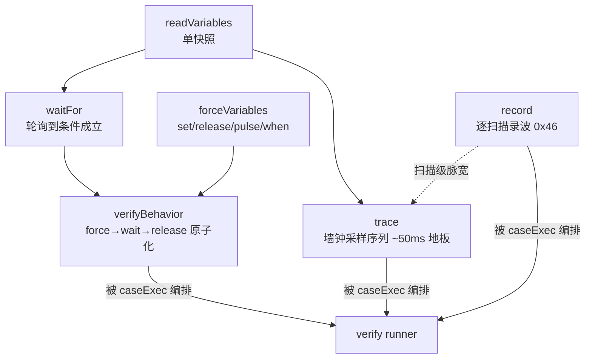

# 观测与验证工具语义

本页逐一讲清六个运行时观测/验证工具的精确语义与设计意图,事实来源为 `src/tools/` 下对应实现与 `tests/tools/` 测试。协议层细节见 [运行时客户端与调试协议](wiki/tools/runtime-client),MCP 注册面见 [MCP 工具参考](wiki/tools/mcp-tools)。

所有工具共享三条前置约定:

1. **变量表来自 state**:`readState(cfg.stateFile).lastCompile.variableMap` 为空即返回 `No variable map found.` 开头的错误(readVariables/forceVariables 提示 `Run plc.compile first.`,trace/waitFor/record 提示 `Run plc.compile or plc.buildAndRun first.`)——观测永远绑定在最近一次编译的名字→索引映射上;
2. **大小写不敏感解析** + 解析失败给 `nameSuggestions`(编辑距离建议);
3. **MCP 预算钳制**(`src/mcpBudget.ts`):MCP 客户端约 60s 超时,任何调用者可控时长的工具都被 `MCP_SAFE_MAX_MS = 50_000` 钳住,留 10s 传输与收尾余量,否则客户端抛 -32001 时工具还在跑。

## plc_readVariables(tools/readVariables.ts)

单次快照:解析 `varNames`(缺省读全表),一条 0x44 读回所有目标变量的当前值 + 运行时 `tick`。语义要点:

- OpenPLC 的 debug 读一次返回请求的全部变量,读 1 个和读 50 个同价;
- 返回 `tick` 让调用方能判断两次快照之间扫描是否推进;
- 它只能回答"现在是多少",**回答不了任何时序问题**——这是后面所有工具存在的理由。

## plc_trace(tools/trace.ts)

按墙钟间隔重复快照,产出列式样本(`columns` + 每样本 `{elapsedMs, tick, values[]}`),用于验证定时器、边沿、状态机轮转、计数器单调性等单快照无法验证的时序行为。上限 200 样本;单次读失败 fail-soft 记 `tick: null` 而不中止整条 trace;全部失败(所有 tick 为 null)才提示 debug socket 未就绪。

### 采样下限:诚实的分辨率申报

一个样本 = 一次完整 debug 往返,物理地板约 50ms。`intervalMs` 请求得再低也达不到,trace 不假装达到了:算出 `actualIntervalMs`(首末样本 elapsed 差 ÷ 间隔数),当请求 <100ms 且实际超请求 1.5 倍时,在 `note` 里明说(`trace.ts:104-110`):

> 寿命短于 ~Nms 的瞬态本 trace 必然漏采——验证边沿/瞬态改用 plc_verifyBehavior(持久下游断言)或 plc_forceVariables 的 pulseScans(tick 验证脉冲)

这是"ws-3 pivot"的产物:与其提高采样率(做不到),不如把瞬态验证改造成对**持久下游效果**的断言。trace 因此定位为"看形状"的工具——verify runner 的 trace case 对样本序列跑 `shapes.ts` 的时序形状断言(cycle/range/settle/changed,见 [声明式验证 Runner](wiki/tools/verify-runner))。

## plc_record(tools/record.ts)

读 recorder 插件的逐扫描环形缓冲(0x46 协议),一次调用抽干整环(最多 4000 帧),窗口在本地按 `fromTick` 或 `lastScans`(默认 250,乘以 decimation 折算 tick 跨度)裁剪。

### record 与 trace 的能力差异

| | trace | record |
|---|---|---|
| 采样者 | 工具进程轮询(墙钟) | runtime 进程内 `cycle_end` 钩子 |
| 分辨率 | ~50ms 地板,漏采瞬态 | **每扫描一帧**,扫描级脉宽可见 |
| 时间轴 | elapsedMs + tick | 纯 tick(逐扫描连续) |
| 观察时机 | 只能录"从现在起" | 事后取证:行为发生完再读历史 |
| 变量集 | 请求的列 | 全部可录变量(STRING 除外),解码时才选列 |

一个 1 扫描宽的脉冲在 trace 里大概率不存在,在 record 里是确定的一帧。

### 三道上下文防爆门 + md5 版本门

`record.ts:1-12` 把设计意图写在文件头:

1. **gate 1**:`varNames` 必填——禁止全量 variableMap dump 进响应;
2. **gate 2**:changes-only 编码(`first` + `transitions: [tick, value][]`),转折点超 50 条即截断至前 50 条并附 `summary{min,max,last,monotonic}`(NaN-aware:连续 NaN 不算变化,聚合前滤掉 NaN);
3. **gate 3**:任何截断发生时,**全量解码窗口落盘** `fullDumpFile`(workspace 下 `record-<from>-<to>.json`),完整证据在磁盘上,永远不进工具响应;
4. **md5 门**:录波头携带产生这些帧的程序 md5,与 0x45 命令读到的 live md5 比对(实测 live md5 == md5(ST 源码字节))。不一致 → **拒绝解码**并报"程序已变更,录波数据属于旧版本"——用新程序的 variableMap 解码旧程序的帧是静默垃圾。头部全 `'?'`(插件拿不到 md5)则降级解码,`programMd5Verified: false` + note,那不是版本冲突。

## plc_waitFor(tools/waitFor.ts)

轮询单变量直到 `actual op expected` 成立或超时。存在意义:替代 agent 手写的对单快照的轮询循环(在 WebSocket 读抖动下很脆)。语义要点:

- `compare()` 的 `==`/`!=` 走 `looseEq`:布尔按 Boolean 归一,数字严格,其余字符串化比较;
- 超时前的最后一轮不再 sleep(`waitFor.ts:100` 预判 `elapsed + intervalMs >= timeoutMs` 即 break),不浪费预算;
- 返回 `finalValue`/`tick`/`polls`/`elapsedMs`——超时不是裸失败,而是带"最后看到什么"的证据;
- `timeoutMs` 被 MCP 预算钳制;verify runner 注入 `budgetOverrideMs` 时以它为准(双向,可放大可收紧)。

## plc_forceVariables(tools/forceVariables.ts)

写侧核心:`set`(force)/`release` 若干定位变量,外加两类修饰。全部名字先本地解析、序列化、`isForceable` 校验,失败先收进 `failed` 再谈网络——不可 force 的变量(内部变量、非基本类型)在发起任何往返前就被拒绝,因为 runtime 对不支持组合会**假装成功**(见 [运行时客户端与调试协议](wiki/tools/runtime-client))。

### pulseMs / pulseScans:被证明过的脉冲

脉冲 = force 后自动 release,制造干净的上升+下降沿(喂 R_TRIG/F_TRIG)。两种:

- **pulseScans(推荐,1..50)**:force 后轮询 tick,直到 `tick - startTick >= N` 才 release——脉冲**被证明**跨过了 ≥N 个扫描边界,程序必然看见它。返回 `pulse: {startTick, releaseTick, scansHeld, verified}`。
- **pulseMs(legacy)**:墙钟 sleep 后 release。盲目的墙钟脉冲可能恰好落在两次扫描之间、跨过 0 个扫描边界而**静默不产生任何边沿**(d9462cc9 事故取证,`forceVariables.ts:202-206` 注释)——现在它也附带 tick 证据,`verified: false` 时 note 明确建议改用 pulseScans。

### when 条件触发

`when: {varName, op, value}` 把 force 变成"等条件成立的瞬间才施加"。走 `forceWhenViaSocket` 单 socket 路径(轮询与 force 同连接,触发延迟约 1 扫描),返回 `when: {met, polls, conditionValue, tickAtMet, tickAtForced, gapScans}`。条件超时未成立 → **不施加任何 force**,整体失败并报最后观测值。典型场景:传送带位置量到达检测位的瞬间按下传感器。

## plc_verifyBehavior(tools/verifyBehavior.ts)

原子的"force 输入 → 等下游条件 →(finally)release"。它是对 force/waitFor 的组合,但组合的**形状**本身就是设计(`verifyBehavior.ts:24-36` 注释):

1 扫描(20ms)量级的边沿/瞬态,分离的 force-then-read(40–300ms 往返)永远抓不到快照;唯一可靠的验证方式是断言其**持久下游效果**(推杆锁存了、计数器加一了)。verifyBehavior 的输入 schema 强制调用方声明这个下游条件——**"抓拍瞬态"这条路在接口上就不存在**。这就是它防验证造假的机制:

- **force 失败即短路**:任何输入不可 force,直接失败返回,不进入等待——不给"等一个永远不会被驱动的下游"浪费超时,也不给"输入根本没施加成功但下游碰巧满足"留假阳性空间;
- **等待带证据**:每个 expect 条件走 waitFor,返回 `matched/finalValue/timedOut/elapsedMs/polls`,verdict 字符串把"force 了什么、条件多少 ms 内成立"钉死;
- **finally 必 release**(默认 `releaseAfter: true`):held `%I` 不污染下一个 case 的验证;
- **预算切分**:settle + 各条件的总时长被 `budgetMs`(默认 MCP 50s)约束,多条件均分。

适用边界也在源码注释里写死:适合 latch/电平保持型下游;单稳态/边沿复位型下游帮不上(与裸瞬态同难);边沿计数型下游一次 held force 只算一个边沿——用 ST 自驱或 plc_trace。

## 组合关系

这些工具是 verify runner 的执行原语:runner 的 steady case 落到 verifyBehavior(或 when/pulse 路径的 forceVariables + waitFor),trace/record case 落到对应工具 + 形状断言。在 `--lite` MCP 模式下,force/verify/waitFor/trace/record 全部从 MCP 面移除,验证只能走 runner——见 [声明式验证 Runner](wiki/tools/verify-runner)。
