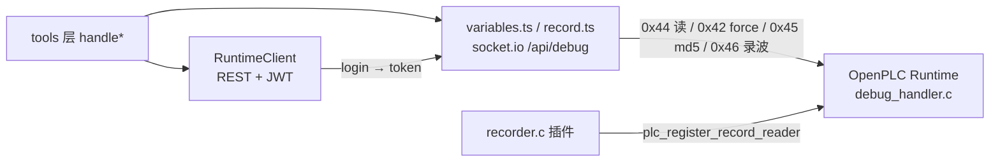

# 运行时客户端与调试协议

sema-plc-tools 对 OpenPLC Runtime 的所有观测/干预都走两条通道:**REST**(管理面:登录、启停、上传、编译状态)与 **WebSocket 调试通道**(数据面:读变量、force、录波)。本页以 `src/client/runtime.ts`、`src/client/variables.ts`、`src/client/record.ts` 与 `runtime/plugins/recorder/` 为事实来源,讲清这两条通道的协议细节。上层工具语义见 [观测与验证工具语义](wiki/tools/observation),运行时容器环境见 [OpenPLC 运行时环境](wiki/tools/runtime)。



## REST 客户端(client/runtime.ts)

`RuntimeClient` 是唯一的 REST 封装,144 行,职责刻意收窄为"认证 + 六个端点"。

### 认证与 JWT

- **自签名证书**:runtime 的 HTTPS 用自签名证书,构造函数里以 `new https.Agent({ rejectUnauthorized: false })` 建 axios 实例(`runtime.ts:22`),全局关闭证书校验——这是对本地容器的刻意取舍,不是疏漏。
- **首次登录幂等建用户**:`getToken()` 先 `POST /api/create-user`(admin 角色,`validateStatus: () => true` + `.catch(() => {})` 双保险吞掉"已存在"错误),再 `POST /api/login` 取 `access_token`。token 缓存在实例字段,后续请求复用。
- **401 自动刷新重试一次**:response 拦截器捕获 401,`invalidateToken()` 后重新登录并带 `_retry` 标记重放原请求(`runtime.ts:27-41`),避免长会话中 token 过期导致工具链断掉。
- `getAuthToken()` 把 JWT 暴露给 WebSocket 侧——**WS 调试通道复用同一个 token 做 `auth: { token }` 握手**。

### 端点一览

| 方法 | 端点 | 说明 |
|---|---|---|
| `getStatus()` | `GET /api/status` | 归一化 `STATUS:RUNNING` → `RUNNING`(两种返回形态都见过) |
| `startPlc()` / `stopPlc()` | `GET /api/start-plc` / `stop-plc` | 启停 PLC |
| `uploadZip()` | `POST /api/upload-file` | multipart 上传 matiec 产物 zip;失败信息在 `UploadFileFail` 字段 |
| `pollCompilationStatus()` | `GET /api/compilation-status` | 轮询容器内 GCC 编译,默认 2s 间隔、55s 超时;把含 `error` 且不含 `[INFO]` 的日志行过滤为 `gccErrors` |
| `getRuntimeLogs()` | `GET /api/runtime-logs` | 原始运行日志 |

## WebSocket 调试协议(client/variables.ts)

### 连接建立

所有调试操作走 socket.io 连接 `${baseUrl}/api/debug`,`transports: ['polling']`(长轮询而非原生 WS,兼容自签名证书环境),`auth: { token }` 带 JWT。每个操作用**一条短命 socket**:连接 → 发一条 `debug_command`(hex 字符串)→ 收一条 `debug_response` → 断开。发送时机做了双保险:`connected` 事件立即发,`connect` 事件延迟 100ms 发,`commandSent` 标志防重(`variables.ts:174-183`)。

需要多条命令保持时序的场景(条件触发 force、录波分页)则用**一条持久 socket + 单飞行命令**模式:同一时刻只有一条 in-flight `debug_command`,`pending` 回调保证下一条 `debug_response` 归属它(runtime 按序应答)。

### 变量表:来源与缓存

调试协议按**索引**寻址,不认名字。名字→索引的映射(variableMap)在编译时产生、缓存在 state 文件里:

1. matiec 编译产出 `VARIABLES.csv`,`compile.ts` 的 `normalizeCsv()` 解析它:跳过 FB 实例行,从 0 重新编号(与 debug.c 生成的 `debug_vars[]` 数组下标严格一致);
2. 名字裁掉 `CONFIG0.RES0.INST0.` 前缀后取剩余段以 `.` 连接并**转小写**——程序级变量得 `hb_out`,FB 输出保留实例前缀得 `timer1.q` / `rtrig.q`(避免多个 TON 的 `.Q` 相互冲突),这就是 **instance.port 寻址**;
3. 结果写入 `state.json` 的 `lastCompile.variableMap`(`src/state.ts` 原子写:先写临时文件再 `renameSync`,防止并发读到半截 JSON 被误报为 "No variable map found")。

所有工具在解析变量名时做**大小写不敏感匹配**(`name.toLowerCase()` 对比):matiec 会把名字折成小写,而 agent/scene 用的是 ST 源码大小写(`sensor_color_A` → 运行时 `sensor_color_a`)。IEC 61131-3 标识符本身大小写不敏感,所以这是正确语义而非 workaround(`forceVariables.ts:71-74` 注释)。解析失败时 `buildNameSuggestions()`(`readVariables.ts:32`)按"小写精确匹配优先、否则编辑距离最近"给出 `nameSuggestions`。

### 0x44 DEBUG_GET_LIST:批量读

命令 `[0x44, count u16 BE, idx u16 BE × n]`;响应头 10 字节:

```
byte[0]   = 0x44 命令回显
byte[1]   = 0x7E 成功标记
byte[2-3] = lastVarIdx (u16 BE)
byte[4-7] = tick__ (u32 BE, 每扫描周期 +1)
byte[8-9] = responseSize (u16 BE)
byte[10+] = 各变量原始字节顺排(小端)
```

变量字节宽度由 IEC 类型决定(`varSize()`:BOOL/SINT=1、INT/WORD=2、DINT/REAL=4、LREAL/LINT=8、TIME 系=8 的 `IEC_TIMESPEC{tv_sec,tv_nsec}` 结构,解码成毫秒)。`decodeValue()` 是**唯一解码事实**——0x44 实时读与 0x46 录波帧共用同一函数,64 位整型返回字符串(BigInt 安全)。

`parseDebugTick()` 提取 `tick__`:它按真实扫描进度排序样本(与墙钟无关),是 trace 排序、pulseScans 验证、when 触发 gap 证据的共同基础。

### 0x42 DEBUG_SET:force 机制

命令 `[0x42, varidx u16 BE, flag u8 (1=force/0=release), len u16 BE, value bytes LE]`;成功响应 `42 7E`,其余第二字节是错误码(如越界 `0x80`)。release 时协议仍要求字节数与负载,故发对应宽度的全零字节。

两个关键约束(`variables.ts:217-232`):

- **只有定位变量可 force**:`isForceable()` 要求 `location` 以 `%I` 或 `%Q` 开头且类型属可序列化的基本数值/位类型。runtime 的 `force_var()` 对不支持的组合**静默 no-op**(返回成功但值未 latch),所以工具层前置拒绝而不是假装成功。此判定经 2026-06-05 真机逐类型实测校正(早期"只有 BOOL + INT_O"的推断是错的)。
- force 是**持久 latch**(FORCE_FLAG):施加后每扫描都生效,直到显式 release——这是所有清理台账(active-forces.json)存在的原因。

`serializeValue()` 做类型收敛:BOOL 显式映射(`'false'` 字符串必须是 FALSE,朴素 truthiness 会写反)、数字字符串自动转数、按符号范围校验、REAL/LREAL 走 `writeFloatLE/writeDoubleLE`。

### 条件触发 force(forceWhenViaSocket)

`waitFor → forceVariables` 的朴素两步会损失 3–5 个扫描(两次连接握手 ≈ 46ms 轮询 + 30ms 建连)。`forceWhenViaSocket()` 在**同一条已连接 socket**上轮询条件变量(0x44 单变量读),条件成立瞬间直接 emit force 命令,force 落在观测到条件后约 1 个扫描内。返回 `tickAtMet` / `tickAtForced`,上层算出 `gapScans` 作为触发延迟的客观证据。

## recorder 插件与 0x46 逐扫描录波

0x44 轮询的物理下限约 50ms/次,而扫描周期通常 20ms——轮询必然漏采瞬态。recorder 插件(`runtime/plugins/recorder/recorder.c`)把采样搬进 runtime 进程内,做到**每扫描一帧、零遗漏**:

- **写入侧**:插件注册 `cycle_end` 钩子,每个扫描结束后把全部可录变量的原始字节 + 64 位 `tick__` 写进环形缓冲(默认 4000 帧、上限 16MB;帧过宽时先折半帧数至 64 帧下限,仍超则按 decimation 抽稀——每 N tick 存 1 帧,拉长时间覆盖而非省内存;单帧 >256KB 直接拒绝武装)。
- **地址每周期重查**:定位变量的地址随 FORCE_FLAG 在 `->value` / `->fvalue` 间切换,`get_var_list` 必须每扫描调用,不能跨周期缓存——否则录到的是 force 前的旧地址。
- **无锁并发**:扫描线程是唯一写者,用 seqlock(写:seq++ 奇 → 写帧 → seq++ 偶;读:偶 seq → 拷贝 → 复读一致才收)替代 mutex,保证扫描线程永不阻塞;`stop_loop` 先注销回调再自旋等 `g_readers` 归零后才 free(超时 2s 宁可泄漏 ring 也不 UAF)。
- **STRING 不可录**:生成的 `get_var_size()` 对 STRING 返回 0,跳过并计入 `skipped`,INFO 头如实上报(工具层的 `skippedUnrecordable` 由此而来)。
- **程序 md5**:INFO 头带 `ext_plc_program_md5`(plc_main `-rdynamic` 导出的指针);拿不到时以 `'?'` 填满 32 字节,工具层把全 `'?'` 视为"不可验证"而非版本冲突。

### 0x46 线协议(冻结契约)

runtime 的 `debug_handler.c` 打了补丁(`runtime-0x46.md`):新增子功能码 `0x46 MB_FC_DEBUG_FETCH_RECORD` 并导出 `plc_register_record_reader()`,插件 `start_loop` 时注册读回调。未注册或负载不足 11 字节时返回 `MB_DEBUG_ERROR_OUT_OF_BOUNDS`(客户端报 "recorder not armed")。

命令固定 11 字节:`u8 0x46 | u64 from_tick BE | u16 max_slots BE`,`max_slots=0` 即 INFO 查询。**此通道多字节字段一律大端**,帧内变量负载字节仍是小端(交给 `decodeValue` 解码)——`client/record.ts:1-17` 把这个混合字节序标为 FROZEN CONTRACT。

| 响应 kind | 布局 |
|---|---|
| `0x01` INFO | `kind, magic 0x52454331 "REC1", ver, var_count, skipped, decimation, slot_size, frames, count, md5[32], var_count × {idx u16, off u32, size u16}` |
| `0x02` FRAMES | `kind, n u16, next_from u64 (0=无更多), n × {tick u64, slot 原始字节}` |

### 客户端读取(client/record.ts)

`fetchRecording()` 用一条持久 socket 完成:先 INFO 拿头(magic/version 不符直接 throw——说明对端根本不是 recorder 契约),再按 `next_from` 分页 FETCH 直到 0 或够 `maxFrames`。`next_from` 是**没装下的第一帧的 tick**,下轮从它含端续取(服务端保留 `t ≥ from_tick`)。

polling 传输有一个真机实测陷阱:可能**重复投递旧响应**,导致 pending 回调错配。`request()` 对每个响应做形状校验(INFO 必须 kind=0x01;FETCH 必须 kind=0x02 且首帧 tick ≥ 请求的 fromTick——低于它只可能是旧页),不合格视为 stale duplicate 丢弃并重挂回调等真响应(只重试一次)。

录波数据如何被门控、解码成 agent 可消费的序列,见 [观测与验证工具语义](wiki/tools/observation) 的 plc_record 一节。
