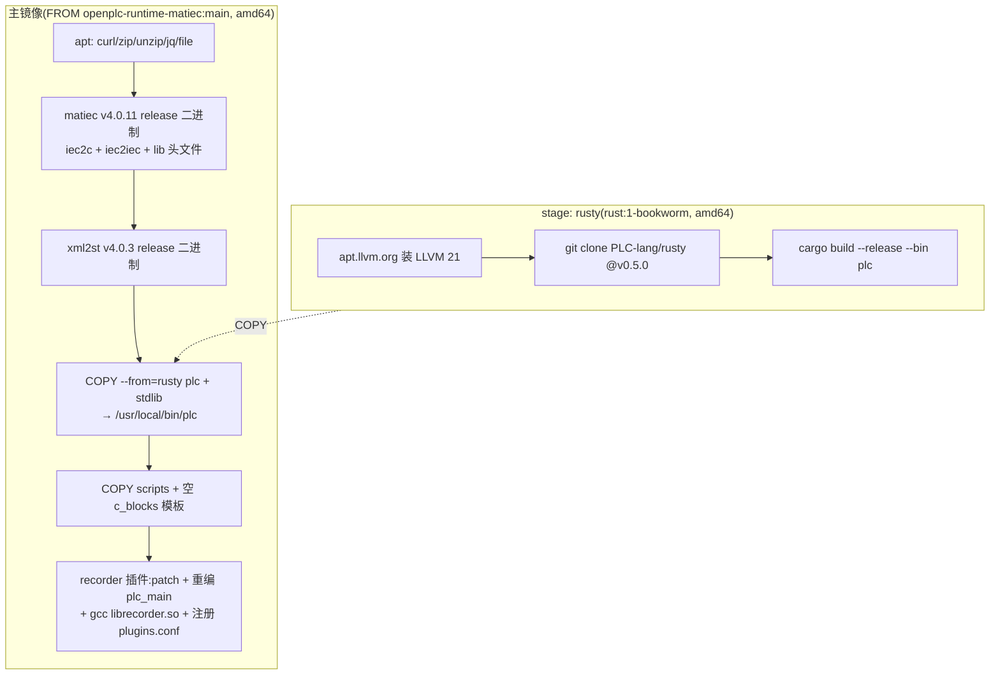

# OpenPLC 运行时环境

`sema-plc-tools/runtime/` 提供真实的 IEC 61131-3 执行环境:OpenPLC Runtime v4 + matiec 编译器 + xml2st,打包为一个自包含 Docker 镜像。整条 [编译与部署管线](wiki/tools/compile-pipeline) 和 [声明式验证 Runner](wiki/tools/verify-runner) 都跑在这个容器上。

## 为什么要自建 MatIEC 基础镜像

上游 `autonomy-logic/openplc-runtime` 发生过一次编译器切换(来龙去脉见 `runtime/scripts/build-matiec-base.sh` 头注释与 `Dockerfile.plc-dev` 第 43–53 行):

- 上游发布的镜像 `ghcr.io/autonomy-logic/openplc-runtime:latest`(**及全部 SHA tag**)已切到 **STruC++** 分支(v4.1.0-rc3),其 `compile.sh` **显式拒收 MatIEC 产物**(`Config0.c` / `glueVars.c`)——本项目的 matiec 编译链路会整体在 GCC 阶段挂掉。
- 上游 **main 分支源码至今仍是 MatIEC**(`compile.sh` 走 `gcc Config0.c → new_libplc.so`),但从未发布过镜像。
- 因此 `scripts/build-matiec-base.sh` 从上游源码自建基础镜像,并**钉死到 STruC++ 切换前最后一个 MatIEC-era 提交** `f1a70e9`,使构建与上游 main 后续漂移无关、可复现:

```bash
cd sema-plc-tools/runtime
./scripts/build-matiec-base.sh   # → openplc-runtime-matiec:main(仅首次,需 Docker + 网络)
docker compose up -d --build     # 在其上叠 matiec / xml2st / rusty / recorder
```

脚本内置一个漂移哨兵:clone 后若发现 `compile.sh` 里出现 `no longer supports MatIEC` 字样(意味着上游把 main 也切了、pin 失效),直接报错退出并提示改 `PIN_COMMIT` 到更早提交。`PIN_COMMIT` / `IMAGE` / `BUILD_DIR` 都可用环境变量覆盖。若需回滚到 STruC++ 运行时,上一版镜像保留为 `openplc-plc-dev:strucpp-4.1.0-rc3`(见 `runtime/README.md`)。

## Dockerfile.plc-dev 构建阶段

源码:`runtime/Dockerfile.plc-dev`。两个 stage:



- **架构策略:强制 `--platform=linux/amd64`,不是 TARGETARCH 动态分派。** 原因写在文件头:matiec 上游 v4.0.11 的 linux-arm64 release 实际打包的是 x86_64 二进制(上游发布事故),arm64 容器里直接报 rosetta error。统一 amd64 后:Apple Silicon 走 Docker Desktop 的 Rosetta 2、Linux ARM 靠 binfmt + qemu、x86 原生。待上游修复 arm64 release 才恢复 TARGETARCH 动态选择(`docker-compose.yml` 头部关于 TARGETARCH 的注释是这一预期的残留)。
- **rusty stage**:从公开源 `PLC-lang/rusty` 按 tag v0.5.0 构建 `plc` 检查器(供 `plc_check` 自检,见 [语法检查与 IO 检测](wiki/tools/check-and-io))。rusty v0.5.0 依赖 LLVM 21,bookworm 默认源没有,经官方 apt.llvm.org 安装并设 `LLVM_SYS_211_PREFIX`。过去这个二进制从私有 benchmark 镜像 COPY(外部拿不到),改为自建后镜像自包含、可复现。
- **工具版本统一由 ARG 管理**:`MATIEC_VERSION=v4.0.11`、`XML2ST_VERSION=v4.0.3`,均从 GitHub release 拉 linux-x64 tar 包安装。
- **有意的取舍**(头注释明示,勿"字面修复"):apt 不钉版本、基础镜像用本地 tag(非公共 registry,无依赖混淆面);容器以 root 运行(OpenPLC 需 root + SYS_NICE/SYS_RESOURCE 设实时调度优先级)。该镜像仅限本地 localhost 开发,不应部署公网。

## docker-compose 配置要点

源码:`runtime/docker-compose.yml`。

| 项 | 值 |
|---|---|
| compose project | `sema-plc-runtime`(钉死,不随目录改名孤立容器) |
| 服务 / 容器名 | `openplc-runtime` / `openplc-plc-dev`(固定,plc-tools 按名找容器) |
| 镜像 | `openplc-plc-dev:latest`(基于 `Dockerfile.plc-dev`) |
| 端口 | `8443:8443`(REST API,HTTPS 自签名证书) |
| 凭据 | `admin` / `admin123`(Runtime 内置默认、公开凭据;非 compose 配置项) |
| capabilities | `SYS_NICE`、`SYS_RESOURCE`(实时调度) |
| 卷 | `openplc-runtime-data:/var/run/runtime`;`samples/`、`scripts/` 只读挂载到 `/workspace/` |
| healthcheck | `/api/status` 返回 **200 或 401** 即健康——接口需 JWT,健康检查没有 token,401 是预期;早期用 `curl -f` 把 401 当硬失败,容器被永久标 unhealthy,反而掩盖真故障 |

## 容器内目录与关键脚本

```
容器内:
/workdir/                 # OpenPLC Runtime 源码 + build(WORKDIR)
├── librecorder.so        # recorder 插件(构建期编译)
├── plugins.conf          # 插件注册表(含 recorder 行)
/workspace/
├── samples/  scripts/    # 宿主只读挂载
├── templates/c_blocks_code_empty.cpp   # Runtime 编译要求存在的空模板
/usr/local/bin/           # iec2c  iec2iec  xml2st  plc(rusty)
/usr/local/share/matiec/lib   # matiec 标准库头文件
```

`scripts/` 下各脚本:

| 脚本 | 作用 |
|---|---|
| `build-matiec-base.sh` | 宿主机跑:自建钉死提交的 MatIEC 基础镜像(见上) |
| `plc_build.sh` | 容器内跑:ST → 部署的完整 8 步管线(见下) |
| `verify_environment.sh` | 容器内组件自检(iec2c 实编译探活、xml2st、matiec 库头文件、debug.c/glueVars.c 生成、Runtime API 等 7 项) |
| `test_api.sh` | REST API 端点测试 |
| `quick_verify.sh` | 宿主机一键端到端验证(启动 → 鉴权 → 自检 → 编译) |

**`plc_build.sh` 做什么**:它是 [编译与部署管线](wiki/tools/compile-pipeline) 的 shell 版参照实现,`plc_build.sh <st_file> [runtime_url] [auth_token]` 依次执行 8 步——

1. `iec2c -f -p -i -l program.st` 把 ST 编成 C(校验产出 `Config0.c/Res0.c/POUS.c/LOCATED_VARIABLES.h/VARIABLES.csv` 等);
2. `xml2st --generate-debug` 生成 `debug.c`(变量调试索引);
3. `xml2st --generate-gluevars` 生成 `glueVars.c`(located 变量 ↔ IO 缓冲区胶水);
4. 补空的 `c_blocks_code.cpp` / `c_blocks.h`(Runtime 编译硬性要求存在);
5. 复制 matiec `lib/` 头文件;
6. 全部打成 `program.zip`;
7. `POST /api/upload-file` 上传;
8. 轮询 `/api/compilation-status` 直到 SUCCESS/FAILED(60s 超时)。

plc-tools 的 `plc_compile` / verify runner 走的就是同一条链路的 TypeScript 实现。

## recorder 插件如何打进镜像

`plugins/recorder/` 是逐扫描"飞行记录仪"插件,支撑 verify runner 的 record case(逐扫描录波)。镜像构建期(Dockerfile 末段)分四步:

1. **打 runtime patch**:`apply-0x46-patch.sh` 用锚点式编辑向 `/workdir/core/src/plc_app/debug_handler.c` 注入 debug 子功能码 `0x46 MB_FC_DEBUG_FETCH_RECORD`——新增 `plc_register_record_reader()` 注册接口 + 一个 `case MB_FC_DEBUG_FETCH_RECORD` 分支(从 debug 通道按 `from_tick + max_slots` 读回录波帧)。脚本**幂等**(已含 `MB_FC_DEBUG_FETCH_RECORD` 即直接成功退出,防 Docker 层重跑造成重定义/duplicate case)且带**漂移哨兵**(两个 grep 锚点找不到就构建期显式失败)。插入内容与容器内手工 patch 并验证通过的版本逐字一致,细节见 `plugins/recorder/runtime-0x46.md`。
2. **重编 `plc_main`** 使 patch 生效(`cmake --build /workdir/build --target plc_main`;`-rdynamic` 导出新符号,插件 dlopen 时可解析,与 `tick__` 同机制)。
3. **编插件**:`gcc -fPIC -shared` 出 `/workdir/librecorder.so`。`recorder.c` 头注释记录了几条实测约束:located 变量地址随 FORCE_FLAG 在 `value/fvalue` 间翻转,**每周期都要重查地址不能缓存**;扫描线程与 debug 线程之间用 seqlock 而非 mutex,保证扫描线程永不阻塞;wire 格式(INFO/FRAMES 两种帧)是与 plc-tools 解析器的冻结契约。
4. **注册**:向 `/workdir/plugins.conf` 追加 `recorder,./librecorder.so,1,1,./recorder.json`(带 grep 判重)。

`plc_record` 与 record case 从 plc-tools 侧经 0x46 读数据,见 [观测与验证工具语义](wiki/tools/observation)。`integration-test.sh` 是插件的容器内集成测试。

## samples 三个示例

| 文件 | 演示什么 |
|---|---|
| `simple_counter.st` | **故意有问题的版本**:located 变量带初始化、与内部变量混在同一 VAR 段、`END_IF` 漏分号——正是 AGENTS.md 里列的高频踩坑点,用来演示编译错误报告 |
| `simple_counter_fixed.st` | 同一程序的修正版:located 变量独立成段且无初始化、内部变量放 `VAR_TEMP` 并在程序体开头显式初始化、块终结符带分号——两者 diff 即"错误示例 → 正确写法"对照 |
| `traffic_light.st` | 交通灯状态机:CASE 状态机 + TIME 累加、急停/夜间模式输入、完整 `CONFIGURATION`(INTERVAL 100ms),作为可运行的综合示例 |

容器内路径 `/workspace/samples/`(只读挂载),可直接 `docker compose exec openplc-runtime /workspace/scripts/plc_build.sh /workspace/samples/simple_counter_fixed.st` 验证全链路。

## troubleshooting 目录导航

`runtime/troubleshooting/` 记录环境搭建期踩过的坑(README 附问题状态总表):

| 文档 | 一句话 |
|---|---|
| `01-architecture-issues.md` | Docker 架构兼容性:matiec arm64 release 装的是 x86_64 二进制,最终强制 amd64 解决 |
| `02-matiec-compilation-errors.md` | matiec(iec2c)编译器相关问题 |
| `03-library-path-issues.md` | matiec lib 头文件路径问题(`plc_build.sh` 里 symlink `lib` 的由来) |
| `04-st-syntax-compatibility.md` | ST 语法兼容性:VAR 声明格式等 matiec 挑剔点 |
| `05-runtime-compilation-failures.md` | OpenPLC Runtime 侧编译失败(缺 c_blocks 等依赖文件) |
| `06-verification-script-timeouts.md` | 验证脚本超时(非阻塞,环境本身可用) |
| `quick-reference.md` | 快速排障命令速查 |

## Modbus 对外暴露(可选)

设置 `PLC_MODBUS_PORT=502` 会让 plc-tools 把 `modbus_slave` 插件配置打进每个程序 ZIP,使 OpenPLC 对外暴露定位 IO;容器外访问还需在 `docker-compose.yml` 里开对应端口。也可用 CLI 手动生成配置:`node dist/cli.js genModbusConfig program.st`(见 [独立 CLI](wiki/tools/cli))。这个开关经 web 端播种进 MCP env,见 [工作区与 Skills](wiki/web/workspace)。
