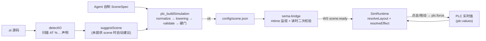

# 过程仿真与 Scene Spec

过程仿真是「ST 程序 → 可交互动画」的通道:Agent(或自动建议器)产出一份 **Scene Spec**(JSON),`plc_buildSimulation` 校验后写入 `$workspace/config/scene.json`,前端 `SimRuntime` 加载它并用 PLC 实时变量值驱动 SVG 动画。Scene Spec 的类型与校验逻辑集中在 `sema-plc-tools/src/tools/sceneSpec.ts`(纯函数,无 fs / DOM),这是 Agent(生产方)与前端(消费方)之间的唯一契约。

## 端到端流程



## Scene Spec 结构(sceneSpec.ts)

```ts
export interface SceneSpec {
  version: '1' | '2'
  canvas: { width: number; height: number; background?: string }
  parts: PartInstance[]
}
export interface Binding {
  variable: string            // ST symbol name; must match a detectIO name
  target?: string             // element id (#id) or data-anchor name; omit = part primary anchor
  effect: Effect
}
```

`PartInstance` 字段:`id`(场景内唯一)、`kind`(库部件名或 `"custom"`)、`x/y`(必须为数字)、可选 `w/h/rotation/label/params`、`svg`(仅 `custom`,内联 SVG,元素带 id)、`snap`(v2,相对宿主定位)、`bindings`。

**Effect 联合类型**(`EFFECT_TYPES` 共 11 种):

| type | 关键字段 | 语义 |
|---|---|---|
| `fill` | `map:[{when,color}]` | 按值匹配换填充色 |
| `class` | `map:[{when,className}]` | 按值挂 CSS 类(如 `sim-run` 动画) |
| `visible` | `when` | 条件显隐(缺 `when` 是硬错) |
| `text` | `format?/decimals?/suffix?` | 数值文本显示,`{v}` 占位 |
| `translateX/Y` | `valueFrom,valueTo,from,to`(或绝对 `xFrom/xTo`、`yFrom/yTo`) | 值区间线性映射为相对平移 |
| `width/height/opacity` | `valueFrom,valueTo,from,to` | 值区间线性映射为属性 |
| `rotate` | `degPerUnit?` | 值 × 系数 = 旋转角 |
| `translateAlong` | `host,axis?,variable,valueFrom,valueTo`(v2) | 工件沿宿主部件运动轴流动 |

`ValueMatch` 三种写法:`{eq: number|boolean}`、`{gte, lt?}` 区间、`{truthy: true}`;`matchValue` 把布尔归一为 0/1 后数值比较。

**v2 专属字段**:`snap: {to, dx, dy}` 把部件挂到宿主上(`child.abs = host.abs + R(host.rotation)·(dx,dy)`);`translateAlong` 让工件沿宿主(典型是 conveyor)的运动轴按 `t = clamp((v-valueFrom)/(valueTo-valueFrom), 0, 1)` 定位。v1 场景带 v2 字段只 warning(被忽略),v2 结构错误(snap 缺 `to`/自指/成环、translateAlong host 不存在、`valueFrom >= valueTo`)是硬错;host 为 `custom` 部件时 warning(无运动轴,translateAlong 静默失效)。

## 校验规则(validateSceneSpec)

以运行程序的 detectIO 名单为 `knownVariables`(**大小写不敏感**比较——matiec 会把 located 变量名转小写,而 scene 按 ST 源码大小写书写),规则要点:

- 硬错(errors,阻止写盘):version 非 1/2;canvas 缺数字宽高;parts 非数组;part 缺 id/kind/数字 x/y;id 重复;`kind` 不在库清单且非 `custom`;binding 变量不是 located IO(translateAlong 变量例外,降为 warning);effect type 未知;`translateX/Y/width/height/opacity` 缺数字 `valueFrom/valueTo/from/to`;`visible` 缺 `when`;`fill/class` map 为空;custom 缺非空 `svg`;binding `target` 在 custom svg 里找不到 id;程序有可绑 IO 时 custom svg 却零绑定(静止死图);part 字段名疑似 `bindings` 拼错且无有效 bindings。
- 警告(warnings):部件完全重叠 / 溢出画布(轻微);`fill` map 无 off 态(sticky fill:`resolveEffect` 不匹配时返回 `color:null`,`applyPatch` 不复位,元素会一直保持着色);custom svg 无 viewBox;多个 custom 部件共享同名元素 id;custom 的 `label` 不渲染;`stack-light` 绑定少于 3 条。
- **几何门**(translateX/Y + custom + target):用 `svgTargetGeometry` 静态推算目标 bbox(只认 rect/circle/ellipse/line;遇 path/text/transform/嵌套运动绑定等不可静态推演的情形显式 bail),`from` 端把目标完全推出 viewBox = 硬错(典型误因:把绝对坐标写成了相对位移),`to` 端出界 / 过半出界 = warning。

**绝对坐标 lowering**(`lowerAbsoluteTranslate`,buildSimulation 在 validate 之前调用):Agent 可按「把元素移到哪」的绝对心智写 `xFrom/xTo`(translateX)或 `yFrom/yTo`(translateY),工具按目标静态 bbox 左/顶边就地换算出渲染器所需的相对 `from/to`,原绝对字段保留为元数据;错轴、与 `from/to` 混写、非 custom/无 target、bbox 不可推算均为硬错。

## 部件库(partsCatalog)

前端 `sema-plc-web/src/components/sim/partsCatalog.ts` 是**视觉事实来源**;`sema-plc-tools/src/tools/partsCatalog.ts` 是轻量副本(校验用 `PART_KINDS`/`PART_BOXES`,注入工具描述用 `PARTS_CATALOG_MD`),两者由快照测试 `catalogSync.test.ts` 锁定同步。

| kind | 说明 | primary 锚点 | 值类型 | 效果 | box |
|---|---|---|---|---|---|
| `lamp` | 指示灯,按值变色 | 灯体圆 | BOOL | fill/visible | 44×44 |
| `sensor-button` | 传感器/按钮状态指示 | 状态圆 | BOOL | fill | 48×38 |
| `valve` | 阀,开/关变色 | 阀体方块 | BOOL | fill/class | 48×48 |
| `cylinder` | 气缸活塞,伸出/缩回 | 活塞杆 | BOOL | fill/translateX/visible | 52×48 |
| `motor` | 马达,运行时旋转 | 转子组(`sim-run` 类) | BOOL | class/rotate/fill | 44×44 |
| `conveyor` | 传送带,运行时皮带滚动 | 皮带刻线组 | BOOL | class | 120×54 |
| `tank` | 罐/液位,液面升降 | 液面矩形(height 驱动) | INT/REAL | height/fill | 52×64 |
| `numeric-display` | 数码显示 | 文本 | INT/REAL | text | 92×34 |
| `gauge` | 指针表 | 指针 needle(绕圆心 rotate) | INT/REAL | rotate | 64×64 |
| `pump` | 泵,叶轮旋转 | 叶轮组 | BOOL | class/fill | 52×52 |
| `hopper` | 料斗,料位升降 | 料位矩形 | INT/REAL | height/fill | 60×54 |
| `stack-light` | 三段报警灯柱 | red 段(另有 amber/green 锚点) | BOOL | fill | 32×80(手工布局) |
| `slider` | 模拟量输入滑块,可拖动写值 | 拇指 thumb(另有 val 锚点) | INT/REAL | translateX/text | 150×44 |

`stack-light` 在 `REQUIRES_MANUAL_LAYOUT` 名单里,suggestScene 永不自动布局它。

## suggestScene:从 IO 自动建议场景

`sema-plc-tools/src/tools/suggestScene.ts` 是确定性兜底:Agent 可以原样使用或在其上精修。

1. **筛选**:保留有 Modbus 映射的 IO + `%M` 内存 BOOL(内部传感器/标志也出部件)。
2. **选件**(`chooseKind`):io_map.yaml 的 `component` 提示优先(如 `conveyor→conveyor`、`counter→numeric-display`);否则按名字/类型启发式——BOOL 输入 → `sensor-button`;数值输入名含 sp/setpoint/ref/cmd 等 → `slider`,含 level/tank → `tank`,否则 `gauge`;BOOL 输出按形状词优先(cyl/push → cylinder,valve、pump、conv/belt → conveyor,motor/spin → motor),颜色词兜底为 `lamp`;数值输出含 level/temp/press 等 → `tank`,否则 `numeric-display`。
3. **默认绑定**(`defaultBindingEffect`):conveyor/motor/pump → `class` 挂 `sim-run`;tank/hopper → `height 0..100 → 0..56`;gauge → `rotate degPerUnit:1.8`;slider → thumb `translateX 0..100 → 0..126` + `val` 锚点 text;其余 BOOL 件 → 灰/绿 `fill`。
4. **布局**:输入一列(col 0)、输出一列(col 1),`COL=170, PAD=24, ROW=max(96, maxBoxH+8)`,画布按行列数推算。
5. **v2 增强**:存在 conveyor 时,把 sensor-button `snap` 到带面上方(`dx:30, dy:-28`),并寻找第一个非输入 INT 变量作为物料位置量,生成一个放在 (0,0) 的 custom 工件(`#wp` 小方块)绑 `translateAlong`;用了 v2 特性则 `version:'2'`。

## plc_buildSimulation:生成 / 校验 / 写盘

`sema-plc-tools/src/tools/buildSimulation.ts` 的 `handleBuildSimulation` 按序执行:

1. **验证门**:配置了 workspace 时,比对 `$workspace/.plc-act/latest.json` 的 `stHash` 与当前 ST 哈希且 `ok:true`——程序没跑过 verify(或改了没重跑)则拒绝出图,除非显式 `allowUnverified:true`(见 [声明式验证 Runner](wiki/tools/verify-runner))。
2. **detectIO**:无任何带 Modbus 映射的 located IO → 直接失败。
3. **io_map 提示层**:`PLC_IO_MAP_FILE` 存在时给 IO 填 `component`,只影响 suggestScene 选件偏好。
4. **容错归一**(`normalizeScene`):scene 是 JSON 字符串则解析(部分模型会把嵌套对象序列化成字符串);`{item:[...]}` 包裹解包;数字字符串转数字;binding 变量键别名(`var/name/signal/…`)就地改回 `variable`;effect 裸字符串包装成 `{type}`;缺顶层 x/y 默认 (0,0);custom svg 补 `width/height`(`sizeCustomSvg`,防嵌套 svg 撑满画布)。所有修正以 warning 形式回报。
5. **绝对坐标 lowering** → **validateSceneSpec**(带 `PART_KINDS`/`PART_BOXES`)。
6. **语义硬门**(错即 `ok:false`、不写盘):画了传送带却无 translateX/translateAlong 工件运动绑定;运动效果绑了程序写不了、又无 slider/sensor-button 驱动的定位输入量 `%I…`(实时仿真恒为初值的死图);部件包围盒超画布 >15%(渲染裁切);BOOL `%I` 输入在场景中没有可点击绑定(镜像前端 click 挂载规则,含 custom target 大小写检查)。
7. **语义警告**:传送带输出但无 INT 位置量;数值量绑到 BOOL 类部件的 fill/class/visible;translate 位置量的全部 ST 赋值均为常量字面量(动画离散跳变);custom 绑定省 target(整图可点互撞)。
8. **写盘**:`ok` 且配置了 `PLC_SCENE_FILE` 时写 `scene.json`(pretty JSON)。

MCP 层(`sema-plc-tools/src/server.ts`)还接受 `stPath/stPaths/projectDir`(多文件合并)与 `scenePath`(从文件读 scene,优先于内联),见 [MCP 工具参考](wiki/tools/mcp-tools)。

## 前端消费:scene.json → 动画

**加载**:`sema-plc-web/server/sema-bridge.ts` 的 `emitSceneIfPresent` 监视 `$workspace/config/scene.json` 的 mtime——覆盖工具路径与 Agent 直写文件两条来源;每次变化重新读取,并在**读时**再跑一遍 `validateSceneSpec`(变量名取自 state.json 的 variableMap),连同 `sceneErrors/sceneWarnings` 经 WS 事件 `scene:ready` 推给前端(`src/store/sim.ts` 存入 store);错误在仿真画面上方以横幅显示而非白屏。

**渲染**(`sema-plc-web/src/components/sim/SimRuntime.tsx`):

- 整个场景是一个 `viewBox = canvas` 的 SVG,`preserveAspectRatio="xMidYMid meet"` 等比铺满舞台;每个 part 渲染为 `<g data-part-id transform="translate(x,y) rotate(r)">`,库部件取 `PART_REGISTRY[kind]`(`parts.tsx` 的纯 SVG 片段,锚点用 `data-anchor` 标注),`custom` 经 `sanitizeSvg`(剥 script/事件属性/外部 href)+ `sizeCustomSvg` 后以 innerHTML 注入。
- **值驱动循环**:`values` 或 `scene` 变化时遍历所有 binding——目标元素解析顺序为 `target` 按 `[id="…"]` → `[data-anchor="…"]`,无 target 取 `[data-anchor="primary"]`;`translateAlong` 由 `alongPosition` 算绝对坐标直接 setAttribute;其余 effect 经 `resolveEffect` 得 `EffectPatch`(fill/visible/text/transform/attr/opacity/class 七种),`applyPatch` 落到 DOM。variableMap 与 values 的查找全部大小写不敏感。
- **交互**:BOOL `%I` 输入的绑定目标可点击,点击为 **toggle**(持久 force true / release 回 0,而非脉冲)经 WS `plc:force` 下发;custom 整图按 target 元素分别挂 click(多输入互不误触)。slider 拖动时 thumb 乐观跟随指针,**松手才提交一次** force(镜像原生 `<input type=range>` 的 change 语义)。可插值的 custom 绑定目标被打上 `data-sim-tween`,用 CSS transition 补间 500ms 轮询造成的阶跃。

**resolveEffect.ts** 是动画核心的纯函数:`lerp` 把值按 `valueFrom..valueTo` 夹逼到 `[0,1]` 再映射到 `from..to`;`fill/class` 按 map 首个命中项取值;与 `sceneSpec.ts` 的 `matchValue` 语义完全一致(两端各留一份,契约靠测试锁定)。

## 布局策略(layout.ts)

`resolveLayout(scene)` 把每个 part 解析为绝对 `Pose {x,y,rotation}`:

- 无 `snap` 的部件原样使用自身坐标;有 `snap` 的按 `child = parent.abs + R(parent.rotation)·(dx,dy)` 传递解析(支持链式)。
- snap 图成环、宿主缺失、自指的部件**回退到自身原始坐标**——白/灰/黑三色 DFS(`findCycleMembers`)标记环上节点,保证永不抛错、永不死循环(此函数在 render 阶段的 `useMemo` 里跑,抛错即白屏)。
- `alongPosition(host, kind, axis, t)`:工件沿宿主运动轴的绝对位置。轴取 `PART_GEOM[kind].axis`(目前只有 conveyor 定义了显式轴:局部 `(0,27)→(120,27)` 的皮带中线),其余部件退化为包围盒中线;局部点经宿主 rotation 旋转后加宿主坐标。

相关页面:[MCP 工具参考](wiki/tools/mcp-tools) · [前端界面总览](wiki/web/frontend) · [工作区与 Skills](wiki/web/workspace) · [状态、配置与安全边界](wiki/tools/state-config)
