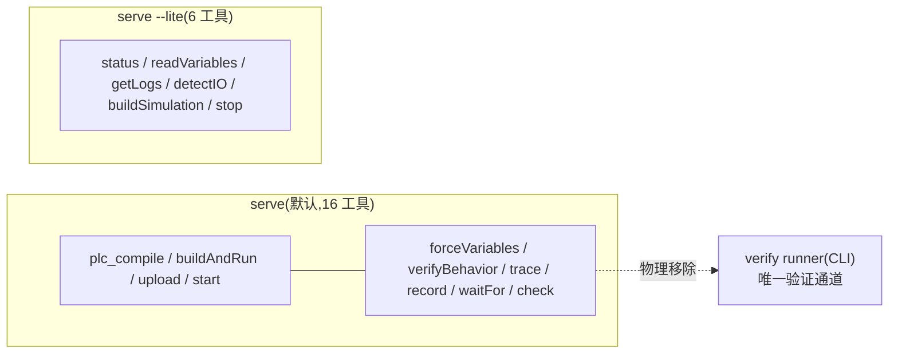

# 状态、配置与安全边界

本页覆盖 `sema-plc-tools` 的四块横切基础设施:跨工具的编译状态缓存(`state.ts`)、环境变量配置(`config.ts`)、MCP 时间预算(`mcpBudget.ts`)、路径/命令注入防御(`pathSafety.ts` 与 `config.ts` 的容器名校验),以及 `server.ts` 的工具注册结构与 `--lite` 收面逻辑。

## 状态文件:state.json(state.ts)

`sema-plc-tools/src/state.ts` 只有两个函数:`readState` / `writeState`,操作一个 JSON 状态文件(默认 `~/.plc-tools/state.json`,可用 `PLC_STATE_FILE` 重定向;Web IDE 的 bridge 把它指到 `$workspace/.plc-vis/state.json`,见 `sema-plc-web/server/state-reader.ts` 的 `plcStateFileForWorkspace`)。

状态结构(`src/types.ts` 的 `PlcState`):

```ts
export interface PlcState {
  // After plc.compile success this is non-null; readVariables uses variableMap to resolve indices.
  lastCompile: {
    timestamp: string
    stCode: string
    zipPath: string
    variableMap: VariableEntry[]
  } | null
}
```

**写入方唯一**:`handleCompile` 在编译成功后写入(`src/tools/compile.ts`)——variableMap 来自容器内 `VARIABLES.csv`,再用 ST 源里的 `AT %…` 声明回填缺失的 location。**每次成功编译整体覆盖** `lastCompile`,这就是它的失效语义:换了程序重新编译,旧的 variableMap/zipPath 即被替换;编译失败则不写,状态保持上一次成功的版本。

**读取方**:`plc_upload` 用 `zipPath` 定位待上传 ZIP;`plc_readVariables` / `plc_trace` / `plc_waitFor` / `plc_forceVariables` / `plc_record` 用 `variableMap` 把变量名解析为调试协议的 index/type;verify runner(`src/verify/cliEntry.ts`)读 `variableMap` 与 `stCode`。状态为空时这些工具直接报错提示先跑 `plc_compile`——即「先编译后观测」的顺序约束是靠这个文件串起来的。

两处防御(`state.ts`):读取时文件缺失或 JSON 损坏一律返回空状态 `{ lastCompile: null }`,不抛错;写入走 **tmp + rename 原子替换**——并发读者(MCP server / plc-monitor / verify runner)绝不会读到半写的 JSON,此前撕裂读会被误报成 "No variable map found. Run plc.compile first."(语义由 `tests/state.test.ts` 锁定)。Web bridge 侧还监视该文件 mtime,verify runner 经 CLI 直写后前端 Vars 面板也能刷新(`sema-plc-web/server/sema-bridge.ts`)。

## 配置:环境变量全表(config.ts)

`loadConfig()`(`sema-plc-tools/src/config.ts`)在进程入口读取环境变量(MCP server 启动时一次、每个 CLI 命令各一次),无配置文件:

| 环境变量 | 默认值 | 作用 |
|---|---|---|
| `PLC_URL` | `https://localhost:8443` | OpenPLC Runtime 地址 |
| `PLC_CONTAINER` | `openplc-plc-dev` | Docker 容器名(见下方注入防御) |
| `PLC_CHECK_STDLIB_DIR` | `/opt/iec61131-stdlib` | 容器内 rusty StandardFunctions `.st` 目录(`plc_check` 用) |
| `PLC_USER` | `admin` | Runtime 登录用户 |
| `PLC_PASSWORD` | `admin123` | Runtime 登录密码 |
| `PLC_STATE_FILE` | `~/.plc-tools/state.json` | 状态文件路径 |
| `PLC_SCENE_FILE` | 无(不写盘) | `plc_buildSimulation` 写 scene.json 的绝对路径 |
| `PLC_IO_MAP_FILE` | 无 | 可选 io_map.yaml(component 提示层) |
| `PLC_WORKSPACE` | 无 | 解析相对 `stPath` 的工作区根;也决定 verify 门的 `.plc-act/latest.json` 位置 |
| `PLC_MODBUS_PORT` | 无(`null` = 关闭) | 设置后 `plc_compile` 向 ZIP 注入 `modbus_slave.json`,OpenPLC 在此端口开 Modbus TCP 从站(对接 FUXA) |
| `PLC_POOL_SIZE` | `1`(串行) | verify 工况并行池大小,钳制到 `[1, 16]`;>1 时工况扇出到多实例 |

**容器名注入防御**:`PLC_CONTAINER` 在配置入口就按 Docker 自身的合法字符集 `^[a-zA-Z0-9][a-zA-Z0-9_.-]*$` 校验,不合法直接抛错——该值下游会作为 `docker exec` 参数,单点清洗使所有 `execFile/spawn` 免受命令注入。

## MCP 时间预算(mcpBudget.ts)

MCP 客户端(sema-core,经 `@modelcontextprotocol/sdk`)对单次工具请求有约 60s 的默认超时;超时后客户端抛 `-32001`,而工具其实还在跑——结果既丢又浪费。`sema-plc-tools/src/mcpBudget.ts` 用一个常量解决(50s = 60s 客户端超时减去 10s 传输/收尾余量):

```ts
export const MCP_SAFE_MAX_MS = 50_000

export function clampToMcpBudget(ms: number | undefined, fallback: number): number {
  return Math.min(ms ?? fallback, MCP_SAFE_MAX_MS)
}
```

凡是时长由调用方控制或运行时决定的工具都套用它:`plc_waitFor` 把 `timeoutMs` 钳到 50s;`plc_trace` 以 50s 为墙钟上限,采样中途触顶就截断样本并在结果 `note` 里说明(truncated advisory);`plc_verifyBehavior` 把整个 force→wait→release 序列的预算封顶。语义由 `tests/mcpBudget.test.ts` 锁定(含「必须低于 55s 留余量」的断言)。

与之配套、防止工具**输出**淹没 LLM 上下文的机制分布在各工具自身:`plc_trace` 的样本数钳制在 `[1, 200]`;`plc_record` 强制要求 `varNames`(types.ts 注释称之为 context-explosion gate,禁止全表转储),transitions 超上限时截断并把完整解码窗口落盘到 `fullDumpFile` 供按需查看。详见 [观测与验证工具语义](wiki/tools/observation)。

## 路径安全(pathSafety.ts)

`safePath(p, base?)` 是所有 `fs.*` 落点前的单一审计点(`sema-plc-tools/src/pathSafety.ts`):

- 拒绝非字符串与含 NUL 字节的路径(poison-null-byte 攻击);
- 返回 `path.resolve` 的规范绝对路径(行为保持:`fs` 本就按同一 cwd 解析相对路径);
- 传入 `base` 时断言解析结果落在该目录内(前缀比较带 `path.sep`),阻断 `../` 越界。

`state.ts` 的读写经它;Web bridge 读 `config/scene.json` 时经其同名副本(`sema-plc-web/server/pathSafety.ts`)做同样的 `safePath(…, workspace)` 校验;工作区相对 `stPath/scenePath` 的解析在 `resolveProject/resolveScene` 中同样以 workspace 为界。

## 工具注册与 --lite 收面(server.ts)

`sema-plc-tools/src/server.ts` 用 `@modelcontextprotocol/sdk` 起一个 stdio MCP server(CLI 入口 `plc-tools serve [--lite]`,见 [独立 CLI](wiki/tools/cli)):

- **注册结构**:`TOOLS` 是一个静态数组,16 个工具各带 name/description/inputSchema(JSON Schema);`ListTools` 直接返回它,`CallTool` 用一个 `switch(name)` 分发到 `src/tools/*.ts` 的 handler,结果统一 `JSON.stringify` 成单条 text content。工具描述本身就是喂给模型的使用手册——`plc_buildSimulation` 的 description 里内嵌了整份 `PARTS_CATALOG_MD` 部件清单与 effect 字段速查。各工具语义见 [MCP 工具参考](wiki/tools/mcp-tools)。
- **输入解析**:接受源码的工具统一经 `resolveProject`(支持 `stCode` / `stPath` / `stPaths` / `projectDir` 四种输入,多文件按序合并成单编译单元),编译报错行号经 `applyErrorTraceback` 回写到原始文件+局部行号。`plc_buildSimulation` 还在此处组装 verify 门(`$workspace/.plc-act/latest.json` + 当前 ST 哈希)。

**--lite 收面**:

```ts
export const LITE_TOOLS = new Set(['plc_status', 'plc_readVariables', 'plc_getLogs', 'plc_detectIO', 'plc_buildSimulation', 'plc_stop'])
```

lite 模式做的是**物理移除**而非提示劝阻:`filterToolsForLite` 让 `ListTools` 只返回名单内 6 个工具,`isToolAllowed` 在 `CallTool` 再拦一道(即使模型凭记忆硬调也会收到结构化拒绝,提示改走 verify runner)。设计意图(源码注释引 spec §4 / 评审 P0-1):把 `plc_forceVariables` / `plc_verifyBehavior` / `plc_trace` 等验证类工具从 MCP 面上拿掉后,**验证只能经声明式 verify runner** 进行——弱模型在断言失败后滑回「force 输入 → read 输出」的不可靠老路的通道被结构性堵死。留下的 6 个都是读侧/低风险或必经工具:状态与变量快照、日志、IO 检测、出仿真图、停机。编译与运行在 lite 环境同样经 runner(CodeAct 路径)完成,见 [声明式验证 Runner](wiki/tools/verify-runner)。



相关页面:[MCP 工具参考](wiki/tools/mcp-tools) · [独立 CLI](wiki/tools/cli) · [观测与验证工具语义](wiki/tools/observation) · [过程仿真与 Scene Spec](wiki/tools/simulation)
