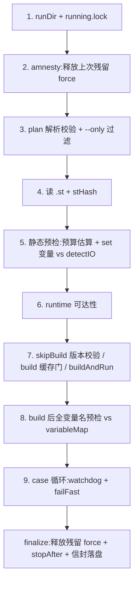

# 声明式验证 Runner

`node <cli> verify plan.json` 把"编译 → 驱动工况 → 断言 → 清理"整合成一条自我限时、自我清理、输出结构化信封的命令。实现在 `src/verify/`,权威 plan 契约在 `sema-plc-web/templates/.sema/skills/plc-build-and-verify/plan-schema.md`。它编排的执行原语见 [观测与验证工具语义](wiki/tools/observation),CLI 注册见 [独立 CLI](wiki/tools/cli)。

## plan 的 JSON 结构(planTypes.ts / planParse.ts)

顶层 `{program, options?, cases}`:`program` 是 workspace 相对的 `.st` 路径(必须以 `.st` 结尾);`cases` 非空数组,四种类型(`planTypes.ts` 明确:pulse/when 是 steady 的修饰字段,不是独立类型):

| type | 驱动 | 断言 | 典型场景 |
|---|---|---|---|
| `steady` | `set`(必填)+ 可选 `settleMs`/`pulseScans`/`when` | `expect: [{var, op, value}]` 末态断言 | 按下启动后电机锁存 |
| `trace` | 可选 `set`(期间持有,结束释放) | `expectShape` 时序形状 | 三灯按序轮转 |
| `record` | 无(事后取证) | `expectShape` 对逐扫描录波 | 自驱位置量在动 |
| `sequence` | `steps[]`,每步 `set`/`pulseScans`/`settleMs`/`waitFor`/`expect` | 步内 expect | 启动→确认运行→急停→确认停 |

`options` 五字段:`perCaseBudgetMs`(默认 30s)、`stopAfter`(默认 true,跑完停 PLC)、`failFast`、`skipBuild`(复用运行中程序,先校验一致)、`serial`(强制串行,即便池可用)。公共字段 `resetBefore` 让状态依赖的 case 开跑前重启 PLC。

### 解析:对 LLM 产出宽容,对语义严格

`parsePlanText` 先过 `stripJsonNoise`(字符级扫描,串外剥 `//`、`/* */` 注释与尾逗号——LLM 最常见的 JSON 笔误)再 `JSON.parse`。`normalizeAndValidate` 随后做:

- **字段白名单** + 未知字段按编辑距离给"是不是想写 X?"建议(错误带 JSONPath 式 `path`);
- **类型收敛**:`"true"`→true、`"99"`→99;
- **兼容旧形**:`expectations: {"x_min": 5}` map 自动转 `expect` 数组(`_min`→`>=`、`_max`→`<=`、其余→`==`);
- **语义拦截**:`cycle.sequence` 元素必须互不重复(重复元素会让形状判定的 findIndex 永远命中首个,静默误判——parser 层拦下);`expect.timeoutMs` 必须透传(丢弃会让慢变条件假超时,`planParse.ts:127-129` 注释记录了这个契约破口);`pulseScans` 限 1..50;`set` 不能是空对象。

任何错误都聚合返回 `PlanError[]`,不跑。

## 执行模型(runner.ts + caseExec.ts)

serial 路径 `runVerify()` 是纯编排:全部副作用经注入的 `RunnerDeps`(生产装配在 `cliEntry.ts`),runner 自身只直接做 fs(lock/runDir/latest 落盘)。步骤:



要点:

- **amnesty**(步 2):读 `.plc-act/active-forces.json` 台账,释放上一次(可能被 SIGKILL 的)运行残留的 force。台账由 caseExec 经 `registerForces` **先登记后 force**(SIGKILL-safe:`cliEntry.ts:60-62`),release 成功才清空文件;
- **双重预检**:build 前只查会被 force 的 `set` 变量是否在 `.st` 定位声明中(force 只能作用于定位变量;`when.var` 是观察量,可为内部变量,不查);build 后用真实 variableMap 查**全部** case 变量,未知名带 `nameSuggestions` 直接 fail,一个 case 都不跑;
- **build 缓存门**(步 7):state 里的 stCode 与本次相同且 runtime 正 RUNNING → 跳过重编(`cached: true`),覆盖"只改断言、ST 没变就全量重跑"这一最常见浪费;同码但已 STOPPED 仍走真 build;
- **watchdog**:case 循环每轮检查 `deadline = t0 + TOTAL_BUDGET_MS - CLEANUP_RESERVE_MS`,超线余下 case 记 skipped、failure 归 `timeout`;连续 2 个连接类 `caseSetup` 失败自动升级 failFast(环境挂了,别继续烧预算)。

### caseExec:驱动与分诊

`runCase()` 按类型分派,核心输出是 `stage` 二分诊断——**`caseSetup`(前置工况没立起来:force 失败/when 超时/pulse 未 verified/变量名未解析,勿改程序)≠ `assert`(驱动成立但断言失败,才谈程序对错)**。这是信封语义里最重要的分界。

- steady 无修饰 → 直接落到 `verifyBehavior`(原子 force→wait→release);带 `when`/`pulseScans` → `forceVariables` 修饰路径 + 逐条 `waitFor`;
- 开跑前做**污染预检**:断言在驱动前已全部成立 → hint 提示可能被前序 case 污染或断言无区分力,建议 `resetBefore`;
- assert 失败触发**诊断三件套**(`assertDiag`):补一次全量变量采样(OpenPLC 一次 debug 读返回所有变量,全量与几列同价),产出窄列 `lastFrames`(只投影被断言量,不被信封数组帽截)、`stateTrace`(全量变量的压缩变化轨迹字符串,如 `state: 0→1→2 | [断言失败] pusher: F(全程未变)`)、以及准确 hints:输出恒定但内部有响应 → "输入已消费,查下游逻辑";全程无任何变量变化 → "疑似未消费输入或变量名错"。`assertDiag` 只在 steady/sequence 的 assert 失败时调用;trace/record 的 assert 失败只补全量 `stateTrace`(trace 另以采样末 8 帧作 `lastFrames`);
- sequence 的 held force 跨步累积,"尝试即持有"(register 在 force 调用前入 held),任何失败 return 路径都能在 finally 清场;
- 每个 case 的 finally 无条件 release 本 case 的 set 并注销台账。

## shapes.ts:时序形状断言

trace/record case 的 `expectShape` 由 `judgeShape()` 判定,四种 kind:

| kind | 参数 | 语义 |
|---|---|---|
| `changed` | 无 | 至少 2 个不同取值——连续量防死值(全程不动 = 无自驱/未消费输入) |
| `range` | `min`+`max` | 全程每样本在区间内;**无有效数值样本判失败**,不许虚假通过 |
| `settle` | `min`+`max`+`tailRatio`(默认 0.25) | 末段样本都在区间——PID 收敛类 |
| `cycle` | `sequence`(≥2,互不重复) | 折叠连续重复后,每个相邻转移必须是 sequence 的循环"下一个",入口可在环中任意点;折叠后 <3 个状态算未观测到轮转 |

record 路径的序列是 `[first, ...transitions 的值]`——`settle` 在这里按**变化次数序列**取末段而非时间窗,高频振荡后收敛的信号慎用(planTypes.ts:33 注释与 plan-schema 均有警示)。

## budget.ts:预算机制

三个常量:`TOTAL_BUDGET_MS = 100_000`(必须严格小于 run_shell 默认 120s——超时会被 SIGTERM 杀掉、信封被吞)、`CLEANUP_RESERVE_MS = 15_000`(watchdog 触发点 = 总额 − 预留)、`BUILD_BUDGET_MS = 45_000`。

`precheckBudget()` 在跑前静态估算:trace 按 `durationMs`+1s 开销、record 按 3s+1s 开销、steady/sequence 的 waitFor/expect 按**现实中位返回时间 2s** 估而非 5s 超时上限(sequence 的 waitFor 显式给了 `timeoutMs` 则按该值估)(旧的保守估把正常 plan 误判超预算,占 plan 失败 60%;worst-case 由 watchdog 兜底)。超预算不跑,报 `stage=plan` 并附拆分指引:前半 plan `stopAfter: false`,后半 `skipBuild: true` 复用运行中程序。poolSize>1 时估墙钟 `max(最长, ceil(和/池))`。

## envelope:结构化信封

结果是单个 JSON(`planTypes.ts` 的 `Envelope`):`ok / summary / stHash / steps[]{name,ok,ms,skipped?,cached?} / failure{stage, detail, hints, lastFrames, stateTrace} / cleanup{released, releaseFailed, stopOk, rollbackFailed?} / artifacts.runDir`。`failure.stage` 共 10 个取值(plan/compile/gcc/start/runtime/caseSetup/assert/version-conflict/timeout/exception)。

`envelope.ts` 的 `renderEnvelope()` 做上下文防爆:字符串 900 字符帽、数组 5 条帽(附 `${key}TotalCount`)、steps 100 条帽、整体 880 行帽——超限时 detail 整体降级为"见 artifacts.runDir/envelope.json"。**全量信封 + plan 副本 + program 快照永远落盘在 `.plc-act/runs/<时间戳>/`**,stdout 只给摘要版。`stHash`(`hash.ts`,sha256 of ST 源码)把结论钉在具体程序版本上;全量运行(非 `--only` 子集)结束后写 `.plc-act/latest.json`(记录 `{stHash, ok, ts}`),它是 `plc_buildSimulation` "先 verify 后出图"版本门的凭证——门要求其中 `ok: true`。

## --only 过滤

`verify plan.json --only <caseName>`(大小写不敏感、trim)只跑指定 case,迭代调试用。子集运行的 summary 加 `[subset: xxx]` 前缀,且**不写 latest.json**——子集结果不能冒充全量签收,出图门仍要求一次全量 `ok: true`。

## pool / hash:并行路径

`cfg.poolSize > 1` 且 plan 未声明 `serial: true` 时走 `runVerifyParallel`:`compileOnce`(matiec 编一次,docker cp 出 zip Buffer)→ 并行部署到池实例(`pool.ts`:实例 #1..#N,端口 basePort+id,容器 `openplc-plc-dev-${id}`;#0 留交互)→ `runWithPool` worker-pool 把 case 扇到实例(共享游标,Node 单线程同步段原子取活;failFast 停取新活但**等飞行中 case 自然完成**,不泄漏 force)。

部署带 **md5 硬门**:0x45 live md5 必须等于 `md5(ST 源码字节)` 才算真换载成功(压换载竞态:start 可能拉起旧程序),不符 stop→start 重试一次,仍不符报 `version-conflict`。因实例死亡(连接错)失败的 case 会在健康实例上**重派一轮**(只重派死亡导致的,不碰真断言失败)。每实例一份 force 台账 `active-forces.<id>.json`。

## 与 --lite MCP 模式的配合

`plc-tools serve --lite`(`src/server.ts:280-284`)把 MCP 面收窄为只读/低危六件:

```ts
export const LITE_TOOLS = new Set(['plc_status', 'plc_readVariables', 'plc_getLogs', 'plc_detectIO', 'plc_buildSimulation', 'plc_stop'])
```

force / verifyBehavior / waitFor / trace / record / compile 等验证与写侧工具**从 MCP 物理移除**(list 不出现,call 被拒),验证只能经 verify runner 这一条 CLI 通道。设计意图写在源码注释里:弱模型在 assert 失败后会滑回 force→read 的老路"手工确认一下"——那条路容易产出未经清理、未经版本绑定、无结构化证据的假验证。lite 模式把这条通道**结构性堵死**(评审 P0-1):要么给出带 stHash、带 cleanup 记录、带 stage 分诊的信封,要么没有验证。runner 自身的 amnesty/finally-release/stopAfter 保证即使被打断也不留 force 残留,这正是"验证只能走 runner"能够成立的工程前提。工作区侧的配套(skills 与 `.plc-act` 约定)见 [工作区与 Skills](wiki/web/workspace)。
