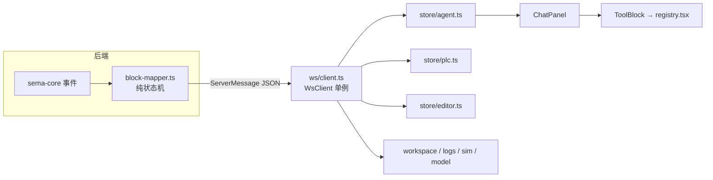

# 聊天面板与工具卡片

左侧聊天面板是 Agent 的可视化终端:用户输入经 WS 送往后端内嵌的 sema-core Agent(见 [SemaBridge:内嵌 Agent 集成](wiki/web/sema-bridge)),后端 `server/block-mapper.ts` 把 Agent 事件流规整为「块协议」(`agent:turn-start / block-start / block-delta / block-end / turn-end`),前端按块类型渲染成思考块、Markdown 文本和各类工具卡片。

## 数据流与 store 分工



`ws/client.ts` 的 `WsClient` 是极简单例:JSON 编解码、状态回调、指数退避重连(1s 起步、2 倍增长、上限 10s),不理解任何消息语义。**消息分发不在 client 里**——`store/index.ts` 的 `wireStoresToWs()`(App.tsx 模块加载时调用一次)把每个 store 的 `subscribeXxxToWs` 注册为监听器,各 store 自己 `switch (m.type)` 认领消息。React 组件通过 `ws/useWsConnection.tsx` 拿 `status` 与 `send`(懒初始化当前状态,避免晚挂载的组件卡在 connecting)。

| store | 认领的消息 | 职责 |
|---|---|---|
| `store/agent.ts` | `agent:*`、`error`、`workspace:ready/switching` | 聊天消息流(turn/块状态机)、agent 忙闲、todos;persist 到 localStorage |
| `store/plc.ts` | `plc:state/variables/values/runtime-error/force-result` | PLC 运行状态、变量表、500ms 值快照、force 集合 |
| `store/editor.ts` | `editor:files/open/saved` | 文件树与编辑器内容同步(详见 [ST 语言支持(编辑器)](wiki/web/st-language)) |
| `store/workspace.ts` | `workspace:ready/switching` | 工作区路径与 sessionId |
| `store/logs.ts` | 编译/运行时/工具日志类消息 | 底部日志面板,500 条环形缓冲,工具 start/complete 合并为单条 |
| `store/sim.ts` | `scene:ready` | 过程仿真 Scene Spec(见 [过程仿真与 Scene Spec](wiki/tools/simulation)) |
| `store/model.ts` | `model:config` | 模型选择与 thinking 开关状态 |

几乎所有 store 都响应 `workspace:switching` 清空自身——工作区切换即全局重置。

### agent store:块状态机与持久化

`store/agent.ts` 的 `handleAgentWsMessage()`(独立导出,测试可不经 WsClient 直接驱动)维护 `ChatMessage[]`:`user` / `agent`(含 `blocks: AgentBlock[]` 与 `streaming/done/error/interrupted` 状态)/ `manual-tool`(顶栏 Run/Stop/Force 按钮触发的独立卡片,不属于任何 turn)/ `error`。要点:

- 更新全部走不可变辅助函数(`upsertTurn/updateTurn/updateBlock`),只替换变化的块对象,配合 `React.memo` 让已封口的块不随 token 重渲染;
- **懒建兜底**:中途重连收到未知 `blockId` 的 delta → 先按 text 块建;`block-end` 与已建块 kind 错配 → 按 end 载荷重建,不静默丢结果;
- `agent:turn-snapshot`(重连时后端重放进行中 turn)整体替换该 turn 的 blocks;
- **持久化**:persist 只存 `messages + sessionId`,过滤掉仍在 streaming 的消息,上限 60 条;写入经 300ms 节流,`pagehide` 时同步 flush。`workspace:ready` 携带的 `sessionId` 与本地一致视为同会话重连(不清空),不一致视为 reset 后的新会话(清空)。

## ChatPanel 的消息流

`components/left/ChatPanel.tsx` 从 agent store 订阅 `messages / state / todos`,结构自上而下:

- **头部**:Agent 徽标 + 状态徽章(`processing` → 处理中;否则按 WS status 显示 就绪/连接中/离线)+ `PlanIndicator` + 收起按钮(面板由 App.tsx 的 `react-resizable-panels` 承载,可整体折叠);
- **空态**:从 `i18n/scenarios` 随机抽 3 个示例场景 chip(crypto RNG 洗牌;「换一批」抽到与当前完全相同的一组时重抽一次),点击即发送预置 prompt;
- **消息流**:每条 `ChatMessage` 一个 `Bubble`。agent turn 内按 blocks 顺序渲染,先经 `groupBlocks()` 折叠(见下);`status === 'error'` 时显示重试按钮(重发最后一条用户输入),`interrupted` 显示中断提示;自动滚动仅在用户位于底部 40px 内时吸底(`pinnedRef`),收起状态跳过 scrollHeight 读取避免隐藏元素 reflow;
- **输入区**:thinking 开关(发 `model:set-thinking`)、textarea(Enter 发送、Shift+Enter 换行、IME 组合输入经 `shouldSubmitOnEnter` 防误发)、发送按钮在 `processing` 时变为停止按钮(发 `agent:interrupt`)、上下文用量环(usageRing,按 `agent:usage` 渲染);无可用模型或无容器引擎时输入区上方显示常驻 StatusBar 降级提示,WS 断连或无模型时另经 `inputDisabled` 挡住无效输入(无引擎不挡——仍可写码)。

三类块的渲染组件(`components/left/blocks/`):

| 块 kind | 组件 | 行为 |
|---|---|---|
| `thinking` | `ThinkingBlock` | 流式时展开、脉冲圆点;结束自动收起,标题显示「思考 N 秒」(durationMs) |
| `text` | `MarkdownText` | react-markdown + GFM;代码块带复制按钮与 ST/JSON/YAML 行高亮(`lib/codeHighlight`);超 40 行折叠 |
| `tool` | `ToolBlock` | 经 registry 分发到专用卡片或通用 `ToolCallCard` |

**噪音折叠**:`tools/groupBlocks.ts` 把连续 ≥2 个「探索型」工具块(`view_file`、`search_files`、`search_content`,以及只含 `ls/pwd/find`(无 `-exec/-delete`)的 `run_shell`)折叠为一个可展开的 `GroupCard`;有 running 块的 run 不折叠。

**PlanCard/todos**:后端 `agent:todos` 推送 Agent 的真实 todo 列表,`PlanCard.tsx` 的 `PlanIndicator` 固定在面板右上——处理中显示齿轮 + `done/total` 进度,点开弹层看步骤明细(按数字 id 排序,`progressText` 作副标题);处理开始沿自动展开、结束沿自动收起;全部完成收成绿勾。todo 类工具调用(`create_todo/update_todo/list_todos`)因此在消息流中隐藏(registry 的 `HIDDEN` 集合)。

## registry.tsx 的分发机制

`blocks/tools/registry.tsx` 是「toolName 后缀 → 渲染器」注册表:

```tsx
const RENDERERS: Record<string, ToolRenderer> = {}

export function registerRenderer(suffix: string, r: ToolRenderer) { RENDERERS[suffix] = r }

export function pickRenderer(toolName: string): ToolRenderer | null {
  const sn = shortName(toolName)
  return RENDERERS[sn] ?? null
}
```

`shortName()`(`ToolCallCard.tsx`)剥掉 MCP 前缀 `mcp__<server>__`,所以注册键就是裸工具名。全部 `registerRenderer` 调用集中在 `registry.tsx` 内(import 各卡片后就地注册),`ToolBlock` 只做三件事:隐藏 todo 工具 → `pickRenderer` 命中则用专用卡片 → 否则回落通用 `ToolCallCard`(参数/流式输出/结果三个可展开 JSON 区块,30 行截断)。

后端 `block-mapper.ts` 对显示链路做三道截断(result/stream 16KB、input 8KB,只影响显示、不影响 Agent 拿到的真实结果);前端 `tools/parse.ts` 的 `parseResult()` 统一处理:先看 `truncated` 标志,再尝试 JSON.parse,失败回落原文。各卡片以此优雅降级——解析失败时仍显示 `ToolShell` 外壳 + 原始文本。

## 工具卡片一览(blocks/tools/)

所有专用卡片共用 `ToolShell`(状态图标 ✓/✗/spinner + 标签 + 折叠外壳):

| 卡片 | 对应工具(注册后缀) | 展示内容 |
|---|---|---|
| `VarsBlock` | `plc_readVariables` | 变量表格(名称/值/类型/地址),BOOL 值渲染为 on/off 胶囊,tick 序号,未解析变量名提示 |
| `ForceBlock` | `plc_forceVariables` | forced / released / failed 三组变量行(名称+值+类型) |
| `CompileBlock` | `plc_buildAndRun`、`plc_compile` | 成功:✓ + 变量映射表;失败:失败阶段 + iec2c 错误列表(行:列、源码行、💡 建议)+ 警告汇总 |
| `VerifyBlock` | `plc_verifyBehavior`、`plc_waitFor` | 通过/超时/未满足徽章、verdict 文本、最终值/耗时/轮询次数 |
| `TraceBlock` | `plc_trace` | 采样时序表(elapsedMs × 变量列),BOOL 列按值着色,横向滚动 |
| `ShellBlock` | `run_shell` | `$ 命令` + 终端输出(模拟 `\r` 回车覆盖行为),只保留最后 12 行并提示省略行数 |
| `EditBlock` | `write_file`、`patch_file` | 文件名、search→replacement 首行 diff 摘要(input 未截断时)、带行号的结果片段 |
| `ReadBlock` | `view_file` | 文件名 + 内容,默认收起 |
| `SkillBlock` | `skill` | skill 名 + 参数,默认收起 |
| `ToolCallCard`(回落) | 其余所有工具 | 通用参数/输出流/结果三段式 |

工具卡片语义与后端 MCP 工具一一对应,工具本身的行为见 [MCP 工具参考](wiki/tools/mcp-tools) 与 [观测与验证工具语义](wiki/tools/observation)。

## 布局位置

`App.tsx` 用 `react-resizable-panels` 把界面分为左(ChatPanel,20%–50% 可拖、可折叠为 0)与右(`ArtifactCanvas`)。`ArtifactCanvas.tsx` 支持两种布局模式(`localStorage: semaplc:layout`):`split` 上下分栏 / `columns` 左右三栏,内含 代码/逻辑 主页签与 过程/变量/日志 副页签;切换布局时以 `key={layout}` 强制重挂 PanelGroup,两种模式各用一个 `autoSaveId`(`artifact-split` / `artifact-cols`)独立记忆分割比例。整体架构见 [架构设计](wiki/overview/architecture)。

相关测试:`tests/store-agent.test.ts` 与 `tests/frontend/store-agent.test.ts`(块状态机)、`tests/block-mapper.test.ts`(后端块协议)、`tests/block-*.test.tsx`(每类卡片)、`tests/group-blocks.test.ts`(折叠规则)、`tests/frontend/chat-panel-scenarios.test.ts`(空态场景 chip)。
