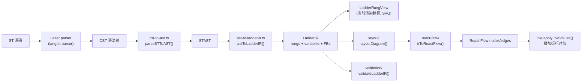

# ST → 梯形图转换器

前端在浏览器内把 Structured Text 源码实时转换成梯形图(Ladder Diagram),整条管线是纯函数、无后端参与——每次编辑器内容变化都可以重跑。代码位于 `sema-plc-web/src/transformer/`,入口是 `st-to-ladder.ts`。

## 管线总览



主入口 `transformSTToLadder()`(`src/transformer/st-to-ladder.ts`)串起 parse → AST → IR → layout → React Flow 五步;另有轻量入口 `transformSTToLadderIR()` 只走到 IR 就停——这是当前 UI 实际使用的路径:`components/center/LadderCanvas.tsx` 用它拿到 `LadderIR`,交给 `LadderRungView` 直接以 SVG 绘制「rung 卡片」。layout/、react-flow/ 是完整保留的图渲染路径,目前不再挂载到界面,但经 `transformSTToLadder()` 全管线被集成测试(`tests/frontend/ladder-live-integration.test.ts`)持续验证;`src/ladder-nodes/` 下的 React Flow 节点组件(ContactNode、CoilNode、TimerNode、CounterNode、ComparatorNode、PowerRailNode)同样保留,当前无代码引用。

## 第一步:ST → AST(`transformer/ast/`)

解析复用编辑器的 Lezer 语法(见 [ST 语言支持(编辑器)](wiki/web/st-language))。`cst-to-ast.ts` 的 `parseSTToAST()` 用游标遍历 Lezer CST,产出类型化的 `STAST`(`st-ast-types.ts`):

- `programs`:`PROGRAM` / `FUNCTION` / `FUNCTION_BLOCK` 声明,含 `varBlocks` 与 `statements`
- `topLevelStatements` / `topLevelVarBlocks`:程序块之外的裸语句与变量块
- `typeDefinitions`:`TYPE...END_TYPE` 中的 STRUCT / ENUM
- `errors`:CST 中的 `⚠` 错误节点,带源码位置

表达式按语法层级(Or → And → Xor → Compare → Add → Mul → Unary → Power → Primary)递归还原为左结合的 `STBinaryExpr` 链;`NOT` 按 De Morgan 需要保留为 `STUnaryExpr`。每个节点都带 `loc: { start, end }`,用于错误定位。

只要 `ast.errors` 非空,`transformSTToLadder()` 直接返回 `success: false` 并把错误换算成行号,不进入后续阶段。

## 第二步:AST → LadderIR(`transformer/ladder-ir/`)

这是转换核心。`LadderIR` 的每条 rung 由「输入网络 + 输出」组成:

```ts
// ladder-ir-types.ts
export interface LadderRungIR {
  id: string;
  index: number;
  comment?: string;
  /** Reference to the source ST statement for roundtrip */
  sourceStatement: STStatement;
  /** The input logic (contacts, comparators) */
  inputNetwork: ContactNetwork;
  /** The output (coil, timer, counter) */
  output: RungOutput;
}
```

`ContactNetwork` 是递归结构:`series`(串联,AND)、`parallel`(并联,OR)、`contact`(NO/NC 触点)、`comparator`(比较块)、`true`(恒通)。

### 映射规则(支持的 ST 模式 → 梯形图元素)

| ST 模式 | 梯形图元素 | 实现位置(ast-to-ladder-ir.ts) |
|---|---|---|
| `Out := expr;` | 一条 rung:expr 为输入网络,`Out` 为标准线圈 | `assignmentToRung` |
| 布尔变量 `A`(含 `Timer.Q` 点路径) | NO 触点 `[ ]` | `variableToContact` |
| `NOT A` | NC 触点 `[/]`(单触点直接翻转) | `unaryExprToNetwork` + `negateNetwork` |
| `A AND B` | 串联(水平相邻) | `flattenSeries` |
| `A OR B` | 并联(垂直分支) | `flattenParallel` |
| `A XOR B` | 展开为 `(A AND NOT B) OR (NOT A AND B)` | `binaryExprToNetwork` |
| `x = / <> / < / > / <= / >= y` | 比较块(EQ/NE/LT/GT/LE/GE) | `binaryExprToNetwork` 比较分支 |
| 算术表达式用于布尔上下文 | 比较块 `expr NE 0` | `binaryExprToNetwork` default 分支 |
| `T1(IN := A, PT := T#5s);`(`T1 : TON/TOF/TP`) | 定时器块,`IN` 表达式为输入网络 | `functionBlockCallToRung` |
| `C1(CU := A, PV := 10);`(`C1 : CTU/CTD/CTUD`) | 计数器块,`CU`(CTD 取 `CD`)为输入网络 | `functionBlockCallToRung` |
| `IF cond THEN 语句 END_IF` | cond 网络串联进 THEN 分支每条 rung 的输入 | `ifStatementToRungs` |
| `ELSIF cond2` | 直接用 cond2 作条件(**简化:未叠加前置条件的否定**) | 同上 |
| `ELSE` | IF 条件经 De Morgan 取反后作条件 | `negateNetwork` |
| `CASE X OF 0: ... 1..5: ...` | 每个标签 → `X EQ n` 比较块;区间 → `GE AND LE` 串联;多标签并联 | `caseStatementToRungs` |
| 同条件的连续赋值 | 合并为一条 rung 多个并联线圈(`multi` 输出) | `mergeSharedOutputs` |

变量收集在第一遍完成:`VAR` 块中类型为 `TON/TOF/TP/CTU/CTD/CTUD` 的声明进 `ir.functionBlocks`,其余进 `ir.variables`(带 scope)。

### 不能映射的结构

`FOR` / `WHILE` / `REPEAT` / `RETURN` / `EXIT` 无法表达为梯形图,`statementToRungs` 对它们返回空数组(静默跳过);`transformSTToLadder` 传入 `warnOnUnsupported: true` 时会对循环语句产生带行号的 warning(`collectUnsupportedWarnings`)。`CASE` 的 `ELSE` 分支是已知简化:不构造「所有标签取反」的条件,直接原样输出语句的 rung。

### 取反:De Morgan 律

`negateNetwork()` 是 NOT / ELSE 处理的基础:单触点翻转 NO↔NC;`NOT(A AND B)` → `(NOT A) OR (NOT B)`;`NOT(A OR B)` → `(NOT A) AND (NOT B)`;比较块翻转操作符(EQ↔NE、GT↔LE、GE↔LT)。

### 共享条件合并

`mergeSharedOutputs()` 把相邻且输入网络结构相等(`networkEq`,只比逻辑形状不比 `sourceExpr`)的 coil rung 折叠成一条 multi 输出 rung——`IF Start THEN Motor := TRUE; Lamp := TRUE; END_IF` 画成一条 rung 两个并联线圈,与真实 PLC 编辑器一致。仅线圈参与合并,定时器/计数器各自持有 `inputNetwork` 不合并。合并后 rung 重新编号保持 `index` 连续。

## validation/ 的角色

`validation/validation.ts` 的 `validateLadderIR()` 是独立于转换管线的 IR 校验器(不在 `transformSTToLadder` 内部调用),检查五类问题:

| 类别 | 级别 | 说明 |
|---|---|---|
| `orphaned_output` | error | 输出没有任何输入条件(输入网络为 `true` 或空) |
| `undeclared_variable` | error | 使用了未声明的变量(FB 输出 `T1.Q/ET/CV/QU/QD` 视为已声明) |
| `always_true` | warning | rung 无条件逻辑,输出恒得电 |
| `always_false` | warning | 同一变量的 NO 与 NC 串联(矛盾逻辑,简化版拓扑分析) |
| `unused_variable` | warning | 已声明未使用 |

## 第三步:layout/ 布局算法

`layout/diagram-layout.ts` 的 `layoutDiagram()` 把各 rung 纵向堆叠(`RUNG_VERTICAL_GAP = 40`),每条 rung 交给 `rung-layout.ts` 的 `layoutRung()`:

- 固定尺寸常量:触点/线圈 80×60,定时器 120×100,计数器 120×120,比较块 100×60,母线宽 30,水平间距 30,垂直间距 20
- rung 结构:左电源母线 → 输入网络 → 输出元件 → 右电源母线,依次向右排
- **串联**:元素沿 X 轴排列,前一元素的 `lastNodeIds` 与后一元素的 `firstNodeIds` 两两连边
- **并联**:分支沿 Y 轴排列,各分支的首/尾节点 id 都汇入本层的 `firstNodeIds`/`lastNodeIds`,由上层负责接线(即并联分支在左右两端合流)
- `true` 网络生成一个宽 30 的空变量「导线」占位节点,保证 React Flow 有可连接的节点
- 母线高度在布局完成后回填为该 rung 的实际总高

所有连线的 handle 统一为 `power-out` → `power-in`,表示电力流方向。

## 第四步:react-flow/ 生成节点与边

`react-flow/ir-to-react-flow.ts` 是薄薄一层格式转换:`LayoutNode` → `{ id, type, position, data }`,`type` 直接取元素类型(`contact` / `coil` / `timer` / `counter` / `comparator` / `powerRail`),对应 `src/ladder-nodes/` 里注册的自定义节点组件;`data` 里保留 `variable` / `contactType` / `presetTime` 等业务字段和 `rungIndex`(供 `buildDiagram` 按 rung 分组)。边统一带 `data: { powerFlow: false }` 初始态。

## live/:实时值 → 着色

`live/apply-live-values.ts` 的 `applyLiveValues(nodes, values)` 把运行时变量快照(WS `plc:values` 消息,见 [实时通道与 WS 协议](wiki/web/realtime))叠加到静态节点上,产出带 `data.live: { active, value }` 的新数组。纯同步函数,设计为每 500ms 值 tick 重跑一次:

- 名称匹配**大小写不敏感**:IR 里的 `timer.Q` 对上运行时小写键 `timer.q`
- 触点:`active = 变量真值`,NC 触点取反;线圈:`active = 变量真值`
- 定时器:读 `实例名.q`(active)与 `.et`(显示值);计数器:读 `.q`/`.qu` 与 `.cv`
- 比较块:左操作数取实时值,右操作数先按数字/TRUE/FALSE 字面量解析、否则查值表,在前端本地执行比较
- 值表中查不到的节点清除 `live` 残留——PLC 停止后颜色自然消失

当前挂载的 `LadderRungView`(`components/center/LadderRungView.tsx`)内嵌了同一套判定逻辑(`makeLookup` / `contactPasses` / `networkConducts`):串联全通才导电、并联任一分支通即导电,导电路径与得电元件在 `status === 'RUNNING'` 时渲染为绿色。`tests/frontend/apply-live-values.test.ts` 与 `ladder-live-integration.test.ts` 用真实转换器输出验证了节点命名与运行时键的对齐。

## 使用位置

- `LadderCanvas.tsx`:编辑器「逻辑」页签,`useMemo` 内对当前 `stCode` 调 `transformSTToLadderIR`;渲染前用 `stripConfigurationBlock()` 剥掉 OpenPLC 要求的 `CONFIGURATION...END_CONFIGURATION` 尾块(转换器只认纯 `PROGRAM`,编译路径仍见完整源码,见 [编译与部署管线](wiki/tools/compile-pipeline))
- 非 `.st` 文件切到逻辑页签时显示提示而不是 parse 错误

页面整体布局见 [前端界面总览](wiki/web/frontend)。
