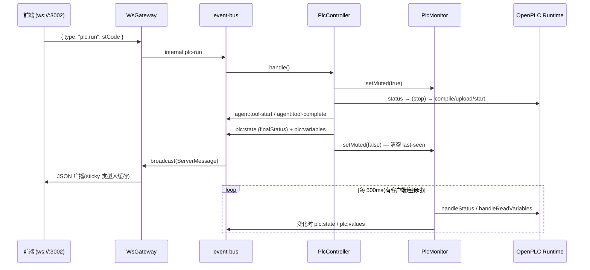

# 实时通道:监控、事件总线与 WS 协议

后端的实时链路由四个模块组成:`event-bus.ts`(进程内总线)、`plc-monitor.ts`(运行时轮询)、`plc-controller.ts`(手动 Run/Stop/Force)、`ws-gateway.ts`(WebSocket 网关)。协议类型统一定义在 `shared/protocol.ts`,前后端共同 import。

## event-bus:进程内解耦

`event-bus.ts` 是一个 50 行的单例 `TypedBus`(内部就是 `EventEmitter`,单一 `'msg'` 事件,`setMaxListeners(50)`)。所有模块 `bus.emit(msg)` / `bus.on(handler)`,`on` 返回退订函数。总线上跑两类消息:

- **`ServerMessage`**(protocol.ts 定义)——由 ws-gateway 订阅并广播给所有客户端
- **`InternalMessage`**(`internal:` 前缀)——进程内命令,网关**不**外发

内部命令总表(`event-bus.ts:12`):

| 内部消息 | 发出者 | 消费者 | 说明 |
|---|---|---|---|
| `internal:user-input` | ws-gateway | SemaBridge | 转发用户输入给 Agent |
| `internal:agent-interrupt` | ws-gateway | SemaBridge | 中断当前 turn |
| `internal:plc-run` / `plc-stop` / `plc-fetch-logs` / `plc-force` | ws-gateway | PlcController | 手动 PLC 操作 |
| `internal:workspace-switch` / `session-reset` | ws-gateway | SemaBridge | 会话/工作区生命周期 |
| `internal:editor-save` / `editor-open` | ws-gateway | SemaBridge | 编辑器文件读写 |
| `internal:model-switch` / `custom-add` / `custom-delete` / `set-key` / `set-thinking` | ws-gateway | SemaBridge | 模型系统,见 [模型系统](wiki/web/model-system) |
| `internal:client-connected` | ws-gateway | SemaBridge | 触发 `agent:turn-snapshot` 重放 |

## plc-monitor:500ms 轮询 + diff + 按客户端数起停

`PlcMonitor` 直接 import `sema-plc-tools/dist` 的 `handleStatus` / `handleReadVariables`(不 spawn 子进程),每 `intervalMs`(默认 500ms)一个 `tick()`:

1. `handleStatus` 读运行时状态;**与上次不同**才发 `plc:state`;不可达则本 tick 直接返回
2. 状态非 `RUNNING` 不读值;`state.json` 无 variableMap 也不读
3. `handleReadVariables` 读全部变量,`hasChanged()` 逐 key 比对 value,**有变化才发 `plc:values`**——空转时总线和 WS 上零流量

**按客户端数起停**:ws-gateway 的连接/断开回调调用 `clientConnected()` / `clientDisconnected()`,活跃数 0→1 启动轮询、1→0 停止——无人打开页面时完全不打扰运行时。

**setMuted 静音**:muted 期间 `plc:state` / `plc:values` 都被抑制。解除静音时把 `lastStatus` / `lastValues` 清空,保证下一 tick **必然重发当前真值**(即使与静音前相同)。

## plc-controller:手动操作与静音

`PlcController` 处理 UI 按钮触发的操作(Agent 驱动的工具调用不走这里,走 MCP → [SemaBridge](wiki/web/sema-bridge) 的块协议)。它与 Agent 复用**同一套** plc-tools 实现:直接 import `dist/tools/` 的 buildAndRun / compile / upload / start / stop / status / getLogs / forceVariables 与 `RuntimeClient`;全部 handler 可注入以便测试(`tests/server/plc-controller.test.ts`)。

**Run(`internal:plc-run`)流程**:

1. 造 `toolId = user-<ts>`,发 `agent:tool-start`(前端把手动操作也渲染成工具卡片)
2. `monitor.setMuted(true)` —— 转换期间 UI 不闪 INIT / ERROR / 瞬时 RUNNING 等中间态
3. 若当前 RUNNING **先 stop 再编译**——规避 OpenPLC upload→start 换载竞态(start 偶发拉起旧程序);探测/停止失败不阻断
4. `handleBuildAndRun({ stCode }, { compile, upload, start })` 组合三阶段
5. 成功:发 `plc:state`(finalStatus)+ 重读 `state.json` 发 `plc:variables`(与 bridge 的 Agent 路径对齐);失败:`emitBuildFailureDetail()` 把 matiec/gcc/start 各阶段的**完整诊断**逐条发到底部日志(iec2c 错误带行列号,上限 20 条),不是只给一句 "✗ compile"
6. `finally` 里 `setMuted(false)`

**Force(`internal:plc-force`)**:仿真交互的变量强制。入口有一道守卫——`.plc-act/running.lock` 存在且 mtime < 150s 时拒绝(verify runner 运行中,防止用户点击与 runner 工况互相覆盖;陈旧 lock 不拦)。执行完成后(无论成败)`setMuted(false)` 清空 last-seen,促使 monitor 下一 tick 立即重发值。

**Stop** 同模式(工具卡片 + 静音);**fetchLogs** 不发工具卡片也不静音,日志逐行以 `log`(source=`runtime`)下发,`getLogs` 解析出的 runtime 错误(watchdog / scan_overrun / segfault…)以 `plc:runtime-error` 结构化下发。

## ws-gateway:JSON-over-WS 与 sticky 重放

`WsGateway` 在 `127.0.0.1:3002`(默认)起 `WebSocketServer`,消息就是 JSON 文本序列化的 protocol 类型。两个方向:

- **下行**:订阅总线,过滤掉 `internal:*` 后把 `ServerMessage` 广播给所有 OPEN 客户端
- **上行**:解析 `ClientMessage`,逐类型翻译为 `internal:*` 命令发回总线(解析失败回 `error`)。`plc:read` / `permission:response` 是 P2 预留,当前忽略

**STICKY_TYPES 缓存重放**:状态类消息按 type 缓存最后一条,新客户端连接时先逐条重放,晚加入的 tab 无需等下一次事件即获得完整现状:

| sticky 类型 | 携带的状态 |
|---|---|
| `workspace:ready` | 工作区路径 + sessionId |
| `plc:state` | PLC 运行状态 |
| `plc:variables` | 变量表(编译产物) |
| `plc:values` | 最近一次变量值 |
| `editor:files` | 项目文件列表 |
| `editor:open` | 当前打开文件及内容 |
| `agent:state` | idle / processing |
| `agent:todos` | 当前 turn 计划 |
| `agent:usage` | 上下文用量(useTokens/maxTokens) |
| `scene:ready` | 过程仿真场景 |
| `model:config` | 模型配置状态 |

`workspace:switching` 到达时**清空整个 sticky 缓存**(切换完成后由水合消息重新填充)。聊天块不进 sticky——重放后网关发 `internal:client-connected`,由 bridge 广播 `agent:turn-snapshot` 补上进行中的 turn(见 [SemaBridge](wiki/web/sema-bridge))。

## shared/protocol.ts:消息类型总表

### Client → Server

| 消息 | payload 要点 |
|---|---|
| `user:input` | `text` —— 聊天输入 |
| `agent:interrupt` | 中断当前 turn |
| `plc:run` | `stCode` —— 手动运行编辑器内容 |
| `plc:stop` | — |
| `plc:force` | `set?: Record<name, value>`、`release?: string[]` |
| `plc:fetch-logs` | `lines?` |
| `plc:read` | P2 预留 |
| `editor:open` | `path` —— 切换打开的文件 |
| `editor:save` | `path?`、`stCode` |
| `workspace:switch` | `path` |
| `session:reset` | — |
| `model:switch` | `key`(注册表 key 或 `custom:*`) |
| `model:custom-add` | `baseURL`、`apiKey`、`modelName`、`adapt` |
| `model:custom-delete` | `id` |
| `model:set-key` | `key`、`apiKey`、`force?`(跳过探针) |
| `model:set-thinking` | `enabled` —— 运行时无损切换 |
| `permission:response` | P2 预留 |

### Server → Client

| 消息 | payload 要点 | sticky |
|---|---|---|
| `workspace:ready` / `workspace:switching` / `workspace:error` | 路径 + sessionId / — / message | ready 是 |
| `editor:files` / `editor:open` / `editor:saved` | 文件列表(path+mtime)/ 路径+内容 / 保存确认 | 前两个是 |
| `agent:user-input-received` | 回显用户输入 | 否 |
| `agent:state` | `idle` / `processing` | 是 |
| `agent:turn-start` / `block-start` / `block-delta` / `block-end` / `turn-end` | 块协议:turnId、blockId、kind(thinking/text/tool)、delta、result | 否 |
| `agent:turn-snapshot` | `SerializedTurn \| null` —— 连接时重放 | 否 |
| `agent:tool-start` / `agent:tool-complete` | **仅**手动 Run/Stop/Force 用;Agent 工具走块协议 | 否 |
| `agent:todos` | `TodoItem[]`(当前 turn,水位线过滤后) | 是 |
| `agent:usage` | `useTokens` / `maxTokens` —— 上下文用量 | 是 |
| `plc:state` | `EMPTY \| INIT \| RUNNING \| STOPPED \| ERROR` | 是 |
| `plc:variables` | `VariableEntry[]`(index/name/type/location) | 是 |
| `plc:values` | `Record<name, VariableValue>` | 是 |
| `plc:runtime-error` | 结构化运行时错误(type/message/advice) | 否 |
| `plc:force-result` | forced / released / failed / error | 否 |
| `scene:ready` | `SceneSpec` + 校验 errors/warnings | 是 |
| `model:config` | `ModelConfigState`(selected/active/options/thinking) | 是 |
| `model:key-result` | 填 key 探针结果,失败带 message + curl | 否 |
| `log` | source(iec2c/gcc/runtime/tool/agent/system)+ level + ts | 否 |
| `error` | message | 否 |
| `permission:request` | P2 预留 | 否 |
