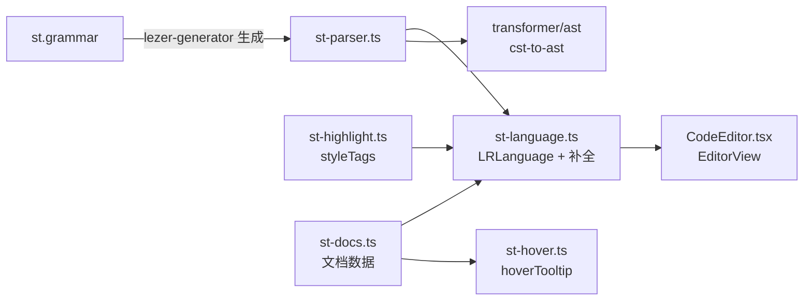
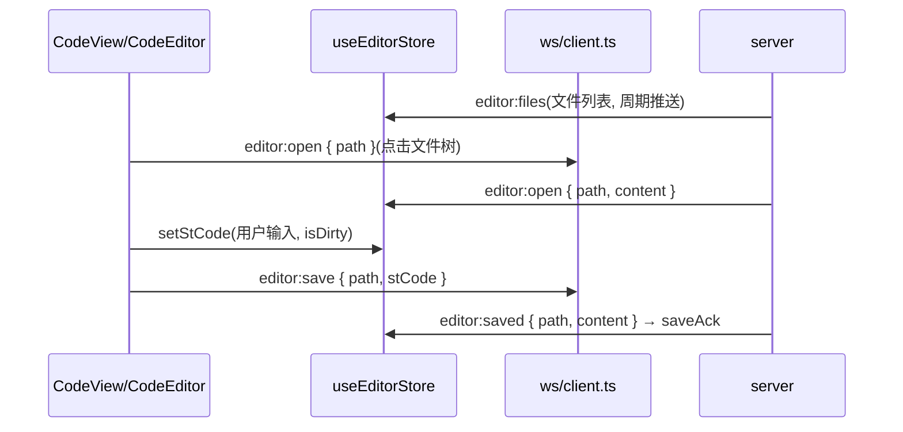

# ST 语言支持(编辑器)

前端用 CodeMirror 6 + 自研 Lezer 语法为 IEC 61131-3 Structured Text 提供完整的编辑体验:语法高亮、缩进、折叠、自动补全、内联文档。代码全部在 `sema-plc-web/src/lang/`,同一个 parser 同时被编辑器和 [ST → 梯形图转换器](wiki/web/ladder-transformer) 复用——高亮所见即转换器所解析。



## Lezer 语法:st.grammar 覆盖的子集

`src/lang/st.grammar` 是手写的 Lezer 语法(文件头自述「Simplified grammar to avoid token conflicts」),`st-parser.ts` 是 `lezer-generator` 的生成产物(不要手改)。覆盖范围:

| 类别 | 覆盖内容 |
|---|---|
| 顶层声明 | `PROGRAM` / `FUNCTION`(带返回类型)/ `FUNCTION_BLOCK` / `TYPE...END_TYPE`(STRUCT、ENUM);也允许裸语句与裸 `VAR` 块 |
| 变量块 | `VAR / VAR_INPUT / VAR_OUTPUT / VAR_IN_OUT / VAR_TEMP / VAR_GLOBAL / VAR_EXTERNAL`,限定符 `CONSTANT / RETAIN`,`AT %IX0.0` 直接地址,初值,多变量共列 |
| 类型 | `BOOL INT SINT DINT LINT UINT USINT UDINT ULINT REAL LREAL TIME DATE TIME_OF_DAY DATE_AND_TIME STRING BYTE WORD DWORD LWORD`,FB 类型 `TON TOF TP CTU CTD CTUD`,自定义标识符类型,`ARRAY[a..b, c..d] OF T` 多维数组 |
| 语句 | 赋值 `:=`、`IF/ELSIF/ELSE`、`CASE`(单值与 `a..b` 区间标签)、`FOR..TO..BY..DO`、`WHILE`、`REPEAT..UNTIL`、FB 调用 `T1(IN := x, PT := y)`、`RETURN / EXIT / CONTINUE` |
| 表达式 | 优先级链 `OR → AND → XOR → 比较 → 加减 → 乘除 MOD → 一元 NOT/- → ** → 基元`;点路径 `Timer.Q`、数组下标 `arr[i, j]`、函数调用、括号 |
| 字面量 | 十进制/小数、`16#FF`、`2#1010_0101`、`TRUE/FALSE`、单双引号字符串、`T#5s`、`D#2024-01-15`、`TOD#14:30:00`、`DT#...`、限定枚举值 `TrafficLight#Yellow` |
| 注释 | `// 行注释` 与 `(* 块注释 *)` |

关键实现细节:关键字通过 `kw<term> { @specialize<Identifier, term> }` 从标识符特化而来(ST 关键字不与标识符冲突);token 优先级显式声明(时间/日期字面量 > 十六进制/二进制 > 布尔 > 直接地址 > 数字 > 标识符),避免 `T#5s`、`16#FF` 被拆散。语法**不含** `CONFIGURATION` 块——所以梯形图路径在解析前会剥掉它(`LadderCanvas.stripConfigurationBlock`)。

## CodeMirror 集成:st-language.ts + st-highlight.ts

`st-language.ts` 用 `parser.configure({ props })` 给生成的 parser 挂三组元数据,再包成 `LRLanguage`:

- **高亮**(`st-highlight.ts`):`styleTags` 把 CST 节点映射到 `@lezer/highlight` 标准 tag——控制流关键字 → `controlKeyword`、声明关键字 → `definitionKeyword`、类型与 FB 类型 → `typeName`、`AND/OR/XOR/NOT/MOD` → `logicOperator`、`DirectAddress`(`%IX0.0`)单独给 `attributeName` 以便标红 IO 点位。实际配色在 `components/center/cmSetup.ts` 的 `stHighlightStyle` 中全部引用 CSS 变量(`--tk-*`),换主题不需重建 EditorView
- **缩进**:`indentNodeProp` 对 `ProgramDecl / VarBlock / IfStatement / CaseStatement / For / While / Repeat` 等块节点增加一级缩进
- **折叠**:`foldNodeProp.add({ ... foldInside })` 对 ProgramDecl / FunctionBlockDecl / VarBlock / If / Case / For / While / Repeat 块可折叠(不含缩进规则里额外的 ELSIF / ELSE / CaseClause 子句)
- **languageData**:注释 token(`//` 与 `(* *)`)、自动闭合括号

自动补全用 `completeFromList`,静态列表分两类:

1. **关键字/类型/常量**(约 50 项):`createCompletion()` 会查 `st-docs.ts`,命中则挂 `info` 回调渲染详细文档面板;
2. **代码片段**:`IF-THEN-END_IF`、`CASE-OF-END_CASE`、`FOR-DO-END_FOR`、`VAR-END_VAR`、`TON-timer`(`${TimerName}(IN := ${condition}, PT := T#${5}s);`)、`CTU-counter` 等,`apply` 内含占位符。

对外只导出一个工厂:

```ts
export function structuredText(): LanguageSupport {
  return new LanguageSupport(stLanguage, [stCompletions]);
}
```

`components/center/CodeEditor.tsx` 挂载 EditorView 时通过 `Compartment` 装配语言扩展:YAML/JSON/TOML 文件不启用 `structuredText()`(编辑器内为纯文本;聊天流里的代码块高亮由 `lib/codeHighlight` 的轻量行高亮处理),其余扩展名(含 `.st`,以及 `CodeView.langOf` 兜底归类的未知扩展名)都按 ST 处理。

## hover 文档:st-hover.ts 与 st-docs.ts

`st-docs.ts` 是纯数据模块,三张表:

| 表 | 内容 | 条目示例 |
|---|---|---|
| `FUNCTION_BLOCK_DOCS` | 定时器 TON/TOF/TP、计数器 CTU/CTD/CTUD、边沿 R_TRIG/F_TRIG、双稳态 SR/RS | 签名、参数表(IN/PT...)、输出表(Q/ET...)、可运行示例、seeAlso |
| `DATA_TYPE_DOCS` | BOOL/INT/DINT/UINT/REAL/TIME/STRING | 描述 + 取值范围 + 声明示例 |
| `KEYWORD_DOCS` | IF/CASE/FOR 等控制流关键字 | 签名 + 示例 |

`getSTDocumentation(symbol)` 按 `toUpperCase()` 依次查三张表;`formatDocumentationHTML()` 产出 hover 用 HTML(内容全部 `escapeHTML`),`formatDocumentationText()` 产出补全 info 面板用纯文本。同一份数据喂两个消费端,补全与 hover 的说明保持一致。

`st-hover.ts` 的 `stHoverTooltip()` 基于 CodeMirror `hoverTooltip`:

1. `syntaxTree(view.state).resolveInner(pos, side)` 取指针处语法节点,注释/字符串内直接跳过;
2. 用正则 `[a-zA-Z0-9_]` 找词边界(≥2 字符),查 `getSTDocumentation`;
3. 命中则返回 `.st-hover-tooltip` DOM,定位在词上方。

触发词典是静态的:只覆盖内置 FB、类型和关键字,不做用户变量的语义查询。注意:`stHoverTooltip` 目前只在 `st-hover.ts` 中定义导出,`CodeEditor.tsx` 的扩展列表尚未把它接入 EditorView(补全 info 面板已生效,悬停提示待挂载)。

## 编辑器与文件树 / 后端文件同步

编辑器状态由 `store/editor.ts`(zustand)持有,文件内容通过 WS 与后端同步(协议见 [实时通道与 WS 协议](wiki/web/realtime)):



关键设计(均在 `store/editor.ts` 有注释说明):

- **显示与运行解耦**:`currentPath/stCode` 是「当前显示的文件」,`stProgram/stProgramPath` 是「要运行的 .st 程序」。打开 `plan.json`、`scene.json` 等非 ST 文件只改前者,Run 按钮始终指向最近的真实 `.st` 程序。
- **`editor:open` 三路分流**(后端每秒重推当前文件):路径变了 → 整体切换;同路径但本地有草稿(`isDirty`)→ 只记 `onDiskUpdate`,不覆盖用户输入;不脏且内容未变 → no-op,避免每秒重置编辑器光标。
- **`diskChanged` 是 sticky 标志**:表示「磁盘相对上次已知磁盘内容变了」(通常是 Agent 改了文件),直到用户点「刷新」(`refresh`,丢弃草稿取磁盘版)或保存成功才复位。`CodeView` 把 `isDirty`/`diskChanged` 合成图签上的 修订状态格(草稿 / 磁盘变更 / 冲突)。
- **迟到的保存回执**:`saveAck` 校验 `path === currentPath`,用户已切走的文件回执直接丢弃。
- **外部变更不回灌**:`CodeEditor.tsx` 用 CodeMirror `Annotation`(`EXTERNAL`)标记程序性 setValue,`updateListener` 只对用户事务调用 `onChange`,防止磁盘应用/切文件触发假 `isDirty`。
- **工作区切换**:收到 `workspace:switching` 时 store 整体 `clear()`。

文件树(`CodeView.tsx` 的 `buildTree`)由 `editor:files` 的扁平路径列表构建,目录在前按名排序;用启发式正则标注生成文件(`globals/`、`gvl_`、`glue`、`.merged.` → ⚙)与单一事实来源文件(`io_map` → ★)。Agent 打开某文件时自动展开其祖先目录。「检查」按钮走 HTTP `POST /api/check` 做 rusty 语法检查(与 [语法检查与 IO 检测](wiki/tools/check-and-io) 同一套后端能力),结果写入 `store/logs`。

相关页面:[前端界面总览](wiki/web/frontend) · [ST → 梯形图转换器](wiki/web/ladder-transformer)
