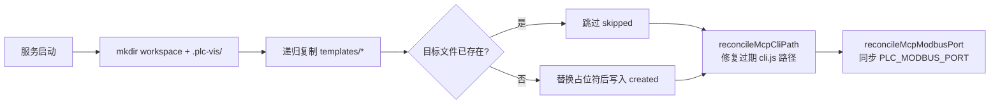

# 工作区与 Skills

Agent 不在仓库里干活,而是在一个独立的**工作区目录**中(默认 `~/plc-workspace`,`dev.sh` 下为 `/tmp/plc-ver-ws`;可用 `--workspace` 或 `$WORKSPACE` 指定)。后端启动时把 `sema-plc-web/templates/` 播种进工作区——AGENTS.md、MCP 配置和 4 个 skill 一起构成 Agent 的"出厂知识"。本页讲播种机制与这套知识各部分的内容。

## 播种逻辑(workspace-setup.ts)

源码:`sema-plc-web/server/workspace-setup.ts`。



要点:

- **幂等 + 不覆盖**:`setupWorkspaceIfNeeded()` 逐文件复制,已存在的文件一律跳过(返回值区分 `created` / `skipped`)。因此**模板更新后旧工作区拿不到新文件**——验收或复测要用全新 `WORKSPACE`,或调用 `cleanWorkspace()` 清空后重新播种。
- **占位符替换**(`substituteTokens()`):写入时把 `__WORKSPACE__` 替换为工作区绝对路径、`__PLC_TOOLS_CLI__` 替换为 `sema-plc-tools/dist/cli.js` 的绝对路径(按仓库兄弟目录布局解析,可用 `PLC_TOOLS_DIST` 环境变量覆盖)。解析失败时**保留占位符**并打印错误,而不是注入空串产生 `node  verify` 这种坏命令。
- **两个自愈钩子**(每次启动都跑,只针对 `.sema/.mcp.json`):
  - `reconcileMcpCliPath()` —— 旧工作区的 `args[0]` 可能指向已被移动的 cli.js(MCP spawn 报 MODULE_NOT_FOUND),启动时校正为当前模板的真实路径;绝不用未解析/不存在的路径去覆盖。
  - `reconcileMcpModbusPort()` —— 把服务进程的 `PLC_MODBUS_PORT` 环境变量同步进 MCP env 块(sema-core 启动 plc-tools 时**只**传这份 env,不继承父进程环境),unset 则删键。

播种后的工作区结构(约定写在 `templates/AGENTS.md` §工作区目录结构):

```
<workspace>/
├── AGENTS.md               # Agent 项目说明书(每轮常驻上下文)
├── plan.json               # verify 工况(Agent 运行时写)
├── src/programs/*.st       # ST 程序源(Agent 运行时写)
├── config/
│   ├── io_map.yaml         # 引脚语义提示层(种子)
│   └── scene.json          # 过程仿真 Scene(plc_buildSimulation 写,勿手改)
├── .plc-vis/               # plc-tools 状态缓存(state.json)
├── .plc-act/               # verify runner 工件(runs/force 台账)
└── .sema/
    ├── .mcp.json           # MCP 配置(种子,含占位符替换)
    └── skills/             # 4 个 PLC skill(种子)
```

`.sema`、`.plc-vis` 等点目录不进前端文件树(`workspace-setup.ts` 的 `walk()` 跳过);文件树只显示 `.st/.yaml/.yml/.json/.toml` 项目文件。

## AGENTS.md:给 Agent 的关键约定

`templates/AGENTS.md` 是 Agent 每轮都在上下文里的"项目说明书",核心约定提炼如下:

| 约定 | 内容 |
|---|---|
| 两通道工作方式 | **通道 A(默认)**:写/改/验证一律"写 ST + 写 plan.json + 跑 `node <cli> verify plan.json`",结论只从 stdout 的 JSON 信封读;**通道 B**:仅 6 个观测类 MCP 工具可直接调(`plc_status` / `plc_readVariables` / `plc_getLogs` / `plc_detectIO` / `plc_stop` / `plc_buildSimulation`),其余编译/运行/force 类工具已移除 |
| 起手加载 skill | 验证任务先 `skill plc-build-and-verify`;复杂需求(多互斥/长状态机)先 `skill plc-spec-review`;`stage=compile` 先 `skill plc-fix-compile-error`;写 scene 前先 `skill plc-build-simulation` |
| 逻辑自检门 | 首次 verify 前过一遍覆盖性/边界/互斥优先级/时序四问——一次 verify 约 20s,前置自检抓掉一条逻辑错就省一整轮迭代 |
| 失败分支表 | 按信封 `failure.stage` 路由处置:`compile`→修 ST(≤3 轮)、`caseSetup`→查 plan 驱动**勿改程序**、`assert`→先看 `stateTrace` 分诊"程序错 vs 工况错"、`plan` 同一错误 2 次不消→停手报告 |
| 版本绑定 | 改过 ST 后此前信封作废(`stHash` 变了),交付必须引用最后一次 `ok:true` 信封的 `stHash + summary` |
| ST 语法约束 | 必须有 `PROGRAM + CONFIGURATION`;`END_IF` 等块终结符**必带分号**;`AT` 定位变量**独占 VAR 段**(与 FB 实例/普通变量混段报 `invalid located variable declaration`);BOOL 位地址必须带点(`%IX0.0`);类型严格匹配需显式转换 |
| 扫描周期模型 | TON 的 Q 持续为 TRUE(不是单周期脉冲),按沿动作必配 `R_TRIG`;`timer(IN := NOT timer.Q)` 是正确的自激振荡而非 bug |
| 模拟输入 | 仿真环境 `%IX`/`%IW` 恒为 0,程序依赖输入就**必须在 plan 里驱动**;可 force 的是定位 elementary 变量,FB 内部变量不能进 `set` 但可断言 |
| 时序验证纪律 | 循环逻辑看"形状"(cycle/changed/range/settle),不用 sleep+单次读去猜精确 tick;`--only` 只重跑失败 case 提速,交付前再跑一次全量盖章 |
| 任务节奏 | 拿到任务直接开干不停下提问(缺省参数取合理默认并注明);用 `create_todo` 立阶段级计划驱动前端计划卡 |

## 4 个 Skill

Skill 是按需加载的结构化工作流(`skill <name>` 拉取正文,深档资料随 base path 带出)。AGENTS.md 是常驻骨架速记,skill 是完整配方。

### plc-build-and-verify(核心主流程)

路径:`templates/.sema/skills/plc-build-and-verify/SKILL.md`。触发:任何写/改/验证 PLC 程序的任务起手加载。教的流程:

1. **先查模式库**:复杂拓扑先 `view_file` 对应的 `./st-patterns/*.st` 骨架改写,不从零手写(见下表)。
2. **两个数据文件 + 一条命令**:ST 写到 `src/programs/<名>.st`、`plan.json` 写到工作区根、`run_shell` 跑 `node <cli> verify plan.json`——三个调用无依赖,一轮发齐;runner 自我限时 100s,不传 timeout。
3. **写 plan 前 5 行自查**:提取契约→覆盖性(每个 `%Q` 输出都有驱动来源,拦"死输出")→边界(`<` vs `<=`、CASE 带 ELSE)→互斥/优先级→周期语义。
4. **工况设计纪律**:只依据需求散文设计 1–3 个代表性工况;输入必须在 `set` 里驱动;移位寄存器验"持久后果"不追脉冲穿行;时序看形状不数精确值;连续量必加一条 `changed` 防死值;状态依赖 case 加 `resetBefore`。
5. **预算与止损**:总预算 100s、verify 重跑约 3 轮封顶;里程碑优先级是"编译通过 → 出图(`plc_buildSimulation`)→ 才是穷尽行为验证",防止死磕验证交不出仿真。

附带两份深档资料:

- **`plan-schema.md`** —— plan.json 的唯一权威契约:顶层 `program`/`options`(perCaseBudgetMs/stopAfter/failFast/skipBuild)/`cases`;四种 case 类型(`steady` force+断言末态、`trace` 按时间采样断形状、`record` 逐扫描录波、`sequence` 多步时序);`expectShape` 四种 kind(`cycle`/`range`/`settle`/`changed`);信封读法(`ok`/`summary`/`stHash`/`failure.stage` 10 个取值/`stateTrace`);以及高频写错对照(❌→✅)。与 [声明式验证 Runner](wiki/tools/verify-runner) 是同一契约的两端。
- **`st-patterns/`** —— 6 个已验证编译通过的可改写骨架:

| 模式文件 | 解决的控制问题 |
|---|---|
| `latch_priority.st` | 输入驱动锁存 + 优先级覆盖(电机/阀门启停):一行 RS 锁存 `motor := (start OR motor) AND NOT stop AND NOT estop`,急停在 AND 链末端天然最高优先 |
| `edge_counter.st` | R_TRIG 边沿计数 + 下限钳位 + 阈值比较输出(停车场/产线计数/批次) |
| `bangbang_plant.st` | 双位(bang-bang)回差控制 + 自驱 plant(水箱液位/温控):低于 LOW 开、高于 HIGH 关、中间保持 |
| `state_machine_timed.st` | N 状态机 + TON 定时器(红绿灯/顺序动作):1Hz 自激节拍 + 倒计时派生量,部署即自动循环 |
| `pid_level_with_plant.st` | 连续量闭环 + **内部 plant 自驱**(液位/温度 PID):反馈量必须是程序自驱的输出而非 `%IW` 输入,否则仿真死图 |
| `conveyor_shift_register.st` | 传送带工件追踪 + 移位寄存器分拣(最难):工件位置自驱量 + "验持久后果"的验证纪律 |

### plc-fix-compile-error(编译错误修复)

触发:verify 信封报 `failure.stage = compile / gcc / start`。教的流程是一棵决策树:

- **compile**:先判"死输出"(错误 `line:0` 带 `advice` = 声明了 `%Q` 却从不赋值);否则取 `failure.detail.errors[]` 按行升序**只修第一条**(后面常是连锁错误),用信封自带的 `sourceLine` 对照 message→修法表(漏分号/AT 混段/类型转换/`ELSE IF`→`ELSIF`/FB 输出用 `=>` 等),`patch_file` 只改一处立即重跑。
- **gcc**:先源头修正(从 C 报错反推 ST 写法),无效再按序简化(删自定义 FB→删位运算→删 ARRAY/STRUCT→只留基础结构)。
- **start**:调 `plc_getLogs` 读 `runtimeErrors[].advice` 改逻辑。
- **硬上限 3 轮**(轮数 = 对话里的信封个数,不凭感觉),超限报告 stuck 请人工介入;`caseSetup`/`assert` 不是编译错,不归本 skill。

### plc-spec-review(需求规格评审)

触发:实现/修改复杂逻辑后、写出最终 ST **之前**(常规任务用 plc-build-and-verify 内联的 5 行自查即可,复杂需求——多互斥条件/长状态机/多优先级抢占——才完整走)。核心是 8 段自检清单,逐条给出"通过/已修订":

1. 提取契约(全部输入/输出/分支/阈值);2. 覆盖性(每个输入被用到、每个 `%Q` 输出有驱动来源——拦"死输出");3. 边界纪律(`<` vs `≤`、相等归哪侧、"否则"覆盖全部剩余区间、CASE 必有 ELSE);4. 全局不变式(互斥/独热、急停最先判断压倒后续);5. 行为模型忠实(不擅自加锁存/状态机、输出真的赋到 `%Q` 定位变量);6. 周期/时序语义(该跨周期记忆的有复位条件、该每周期重算的在体开头显式赋初值——最高频缺陷区);7. 工程规范(非阻塞建议);8. 全过才写出最终文件。

明确禁止:为过清单去猜隐藏测试断言(benchmark 场景视为作弊)、借自检之名做需求外增强。

### plc-build-simulation(过程仿真搭建)

触发:程序 verify 通过后要出可视化(`plc_buildSimulation` 有**版本门**,未验证或改过 ST 未重验会被拒;`allowUnverified:true` 仅限用户明确要求)。教的流程:

1. `plc_detectIO` 同步变量指纹 → 2. **物理拓扑判定**(主轴是谁、附属件锚定哪个工位;有空间关系一律 `custom` 整图,散摆库部件是需论证的例外)→ 3. 安全信号覆盖检查(estop/alarm 不能在画面里"隐身")→ 4. 按 13 种库部件(lamp/tank/conveyor/slider/stack-light…)+ 效果系统(fill/text/translateX/rotate/class…)组装 Scene Spec → 5. `plc_buildSimulation` 校验生成,`ok:false` 则按 `errors[]` 修到 `ok:true`(反复失败按逃生条款降级为库部件 dashboard,**严禁直写 `config/scene.json` 绕过校验**)→ 6. 收尾必须具体说明"点哪个/拖哪个 = 看到什么"。

两条关键设计纪律:**连续过程量(液位/工件位置)必须在 ST 里建自驱量**(`%QW` 自增/饱和),仿真绑自驱量而非无人驱动的 `%IX` 输入;**自动循环演示要从自驱量派生内部到位布尔**门控顺序逻辑,否则序列永远卡在第一步。详见 [过程仿真与 Scene Spec](wiki/tools/simulation)。

## config/io_map.yaml:引脚语义提示层

种子文件本体是一份带注释的空模板(`templates/config/io_map.yaml`):键 = ST 里 `AT %…` 声明的符号名,值 = `{ component, label? }`,component 取 `lamp / sensor-button / valve / cylinder / motor / conveyor / tank / numeric-display` 之一。作用是在仿真选件前**偏置**部件选择——`plc_buildSimulation` 服务端合并它作兜底,最终绑定仍以 Scene Spec 为准。可选、可手写;`plc_detectIO` 不读它(返回不带 `component`)。

## .sema/.mcp.json:MCP 接线

`templates/.sema/.mcp.json` 定义唯一的 MCP server `plc-tools`:stdio transport,命令为 `node __PLC_TOOLS_CLI__ serve --lite`。`--lite` 只暴露通道 B 的 6 个观测类工具——编译/运行/force 全部收进 verify runner 单一入口(设计意图见 [MCP 工具参考](wiki/tools/mcp-tools))。env 块(sema-core 启动 plc-tools 时只传这一份):

```json
"env": {
  "PLC_URL": "https://localhost:8443",
  "PLC_CONTAINER": "openplc-plc-dev",
  "PLC_USER": "admin",
  "PLC_PASSWORD": "admin123",
  "PLC_STATE_FILE": "__WORKSPACE__/.plc-vis/state.json",
  "PLC_SCENE_FILE": "__WORKSPACE__/config/scene.json",
  "PLC_IO_MAP_FILE": "__WORKSPACE__/config/io_map.yaml",
  "PLC_WORKSPACE": "__WORKSPACE__"
}
```

(`admin/admin123` 是 [OpenPLC 运行时环境](wiki/tools/runtime) 的公开默认凭据。)两个占位符在播种时替换;此后每次启动还有 `reconcileMcpCliPath` / `reconcileMcpModbusPort` 两个自愈钩子维护这份文件(见上文播种逻辑)。

## 文件同步

后端 sema-bridge 用 `fs.watch`(轮询兜底)监视工作区的 `.st` 文件,变更实时推送到前端编辑器;Agent 内联构建的 ST 代码也会镜像到 `src/programs/_running.st` 供 UI 展示。详见 [SemaBridge:内嵌 Agent 集成](wiki/web/sema-bridge)。
